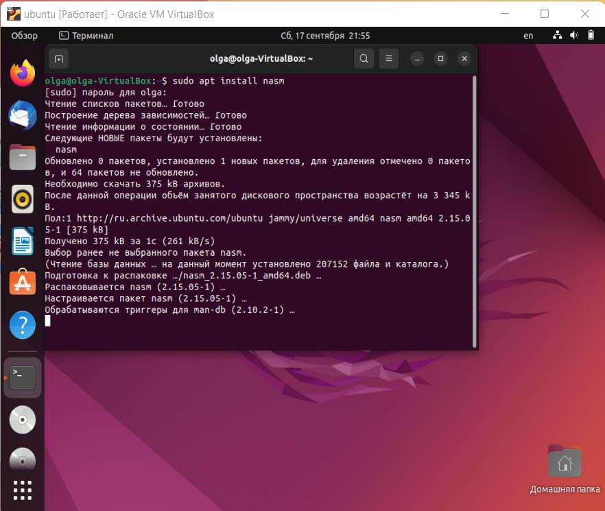

---
## Front matter
title: "Лабораторная работа №1"
subtitle: "Дисциплина: операционные системы"
author: "Пронякова Ольга Максимовна"

## Generic otions
lang: ru-RU
toc-title: "Содержание"

## Bibliography
bibliography: bib/cite.bib
csl: pandoc/csl/gost-r-7-0-5-2008-numeric.csl

## Pdf output format
toc: true # Table of contents
toc-depth: 2
lof: true # List of figures
lot: true # List of tables
fontsize: 12pt
linestretch: 1.5
papersize: a4
documentclass: scrreprt
## I18n polyglossia
polyglossia-lang:
  name: russian
  options:
	- spelling=modern
	- babelshorthands=true
polyglossia-otherlangs:
  name: english
## I18n babel
babel-lang: russian
babel-otherlangs: english
## Fonts
mainfont: PT Serif
romanfont: PT Serif
sansfont: PT Sans
monofont: PT Mono
mainfontoptions: Ligatures=TeX
romanfontoptions: Ligatures=TeX
sansfontoptions: Ligatures=TeX,Scale=MatchLowercase
monofontoptions: Scale=MatchLowercase,Scale=0.9
## Biblatex
biblatex: true
biblio-style: "gost-numeric"
biblatexoptions:
  - parentracker=true
  - backend=biber
  - hyperref=auto
  - language=auto
  - autolang=other*
  - citestyle=gost-numeric
## Pandoc-crossref LaTeX customization
figureTitle: "Рис."
tableTitle: "Таблица"
listingTitle: "Листинг"
lofTitle: "Список иллюстраций"
lotTitle: "Список таблиц"
lolTitle: "Листинги"
## Misc options
indent: true
header-includes:
  - \usepackage{indentfirst}
  - \usepackage{float} # keep figures where there are in the text
  - \floatplacement{figure}{H} # keep figures where there are in the text
---

# Цель работы

Целью данной работы является приобретение практических навыков установки
операционной системы на виртуальную машину, настройки минимально необходимых
для дальнейшей работы сервисов.

# Задание

1. Настройка VirtualBox
2. Запуск виртуальной машины и установка системы
3. Завершение установки
4. Задания для самостоятельной работы
5. Выполнение домашней работы
6. Ответы на контрольные вопросы

# Теоретическое введение

## Введение в GNU Linux

Операционная система (ОС) — это комплекс взаимосвязанных программ,
предназначенных для управления ресурсами компьютера и организации
взаимодействия с пользователем. Сегодня наиболее известными операционными
системами являются ОС семейства Microsoft Windows и UNIX-подобные системы.
GNU Linux — семейство переносимых, многозадачных и многопользовательских
операционных систем, на базе ядра Linux, включающих тот или иной набор утилит и
программ проекта GNU, и, возможно, другие компоненты. Как и ядро Linux, системы
на его основе, как правило, создаются и распространяются в соответствии с моделью
разработки свободного и открытого программного обеспечения (Open-Source Software).
Linux-системы распространяются в основном бесплатно в виде различных
дистрибутивов.
Дистрибутив GNU Linux — общее определение ОС, использующих ядро Linux и
набор библиотек и утилит, выпускаемых в рамках проекта GNU, а также графическую
оконную подсистему X Window System. Дистрибутив готов для конечной установки на
пользовательское оборудование. Кроме ядра и, собственно, операционной системы
дистрибутивы обычно содержат широкий набор приложений, таких как редакторы
документов и таблиц, мультимедийные проигрыватели, системы для работы с базами
данных и т.д. Существуют дистрибутивы, разрабатываемые как при коммерческой
поддержке (Red Hat / Fedora, SLED / OpenSUSE, Ubuntu), так и исключительно
усилиями добровольцев (Debian, Slackware, Gentoo, ArchLinux).

## Введение в командную строку GNU Linux

Работу ОС GNU Linux можно представить в виде функционирования множества
взаимосвязанных процессов. При загрузке системы сначала запускается ядро, которое,
в свою очередь, запускает оболочку ОС (от англ. shell «оболочка»). Взаимодействие
пользователя с системой Linux (работа с данными и управление работающими в
системе процессами) происходит в интерактивном режиме посредством командного
языка. Оболочка операционной системы (или командная оболочка, интерпретатор
команд) — интерпретирует (т.е. переводит на машинный язык) вводимые
пользователем команды, запускает соответствующие программы (процессы),
формирует и выводит ответные сообщения. Кроме того, на языке командной оболочки
можно писать небольшие программы для выполнения ряда последовательных
операций с файлами и содержащимися в них данными — сценарии (скрипты).
Из командных оболочек GNU Linux наиболее популярны bash, csh, ksh, zsh. Команда
echo $SHELL позволяет проверить, какая оболочка используется. В качестве
предустановленной командной оболочки GNU Linux используется одна из наиболее
распространённых разновидностей командной оболочки — bash (Bourne again shell).
В GNU Linux доступ пользователя к командной оболочке обеспечивается через
терминал (или консоль). Запуск терминала можно осуществить через главное меню
Приложения Стандартные Терминал (или Консоль) или нажав Ctrl + Alt + t . Интерфейс
командной оболочки очень прост. Обычно он состоит из приглашения командной
строки (строки, оканчивающейся символом $), по которому пользователь вводит
команды:
iivanova@dk4n31:~$
Это приглашение командной оболочки, которое несёт в себе информацию об имени
пользователя iivanova, имени компьютера dk4n31 и текущем каталоге, в котором
находится пользователь, в данном случае это домашний каталог пользователя,
обозначенный как ~).
Команды могут быть использованы с ключами (или опциями) — указаниями,
модифицирующими поведение команды. Ключи обычно начинаются с символа (-) или
(--) и часто состоят из одной буквы. Кроме ключей после команды могут быть
использованы аргументы (параметры) — названия объектов, для которых нужно
выполнить команду (например, имена файлов и каталогов). Например, для подробного
просмотра содержимого каталога documents может быть использована команда ls с
ключом -l: iivanova@dk4n31:
~$ ls -l documents
В данном случае ls – это имя команды, l – ключ, documents – аргумент. Команды,
ключи и аргументы должны быть отделены друг от друга пробелом.
Ввод команды завершается нажатием клавиши Enter , после чего команда передаётся
оболочке на исполнение. Результатом выполнения команды могут являться сообщения
о ходе выполнения команды или об ошибках. Появление приглашения командной
строки говорит о том, что выполнение команды завершено.
Иногда в GNU Linux имена программ и команд слишком длинные, однако bash
может завершать имена при их вводе в терминале. Нажав клавишу Tab , можно
завершить имя команды, программы или каталога. Например, предположим, что нужно
использовать программу mcedit. Для этого наберите в командной строке mc, затем
нажмите один раз клавишу Tab . Если ничего не происходит, то это означает, что
существует несколько возможных вариантов завершения команды. Нажав клавишу Tab
ещё раз, можно получить список имён, начинающихся с mc: iivanova@dk4n31:~$ mc
mc mcd mcedit mclasserase mcookie mcview
mcat mcdiff mcheck mcomp mcopy
iivanova@dk4n31:~$ mc

# Выполнение лабораторной работы

## Настройка VirtualBox

Загрузила в дисплейном классе операционную систему Linux. Вошла в систему.
Запустила терминал (через главное меню Приложения Стандартные Терминал (или
Консоль) или нажав Ctrl + Alt + t ) и перешла в каталог /var/tmp cd /var/tmp Создала
каталог с моим именем пользователя.
Проверила в свойствах VirtualBox месторасположение каталога для виртуальных
машин. Для этого в VirtualBox выбрала Файл Свойства , вкладка Общие.
Также сменила комбинацию для хост-клавиши, которая используется для
освобождения курсора мыши, который может захватить виртуальная машина. Файл
Свойства , вкладка Ввод Виртуальная машина.
Создала новую виртуальную машину. Для этого в VirtualBox выбрала Машина
Создать . Указала имя виртуальной машины (мой логин в дисплейном классе), тип
операционной системы – Linux, Ubuntu(рис. [-@fig:pic1]).

{ #fig:pic1 width=100% }

Указала размер основной памяти виртуальной машины – 2048 МБ.
Задала конфигурацию жёсткого диска – загрузочный, VDI (BirtualBox Disk Image), динамический виртуальный диск.
Задала размер диска – 80 ГБ, его расположение – в данном случае
/var/tmp/ompronyakova/ubuntu.vdi
В настройках виртуальной машины во вкладке Дисплей Экран увеличила
доступный объем видеопамяти до 128 МБ(рис. [-@fig:pic2]).

{ #fig:pic2 width=100% }

В настройках виртуальной машины во вкладке Носители добавила новый
привод оптических дисков(рис. [-@fig:pic3]).

{ #fig:pic3 width=100% }

При установке на собственную технику использовала скачанный образ
операционной системы Ubuntu:

[1. скачанный образ операционной системы Ubuntu](https://ubuntu.com/download/desktop)

## Запуск виртуальной машины и установка системы

Запустила виртуальную машину (Машина Запустить ). После загрузки с
виртуального оптического диска я увидела окно с двумя вариантами и выбрала
установить Ubuntu(рис. [-@fig:pic4]).

{ #fig:pic4 width=100% }

Выбрала язык и скорректировала часовой пояс(рис. [-@fig:pic5]). Место установки ОС
оставила без изменения. Далее «Тип установки» выбрала «Стереть диск и установить
Ubuntu»).

{ #fig:pic5 width=100% }

Затем нужно было зарегистрироваться(рис. [-@fig:pic6]).

{ #fig:pic6 width=100% }

Затем началась установка Ubuntu. После установки требовалось подтвердить
подлинность и ввести пароль, который создавался мною ранее(рис. [-@fig:pic7]).

{ #fig:pic7 width=100% }

## Завершение установки

После окончания установки закрыла окно установщика и выключила систему(рис. [-@fig:pic8]).

{ #fig:pic8 width=100% }

После того, как виртуальная машина отключилась, следовало изъять образ диска
из дисковода. Нажала на значок диска и выбрала пункт изъять. После извлечения в
дисководе стало пусто(рис. [-@fig:pic9]).

{ #fig:pic9 width=100% }

# Задания для самостоятельной работы

1. Запустила установленную в VirtualBox ОС
2. Нашла в меню приложений и запустите браузер Firefox. Все хорошо
открывается(рис. [-@fig:pic10]).

{ #fig:pic10 width=100% }

3. Запустила терминал (консоль).
4. Установила основное программное обеспечение необходимое для дальнейшей
работы. Программы, которые я вводила:
 1) Midninght Commander (mc): :~$ sudo apt install mc(рис. [-@fig:pic11]).
 2)Git: ~$ sudo apt install git(рис. [-@fig:pic12]).
 3)Nasm (Netwide Assembler): ~$ sudo apt install nasm(рис. [-@fig:pic13]).

{ #fig:pic11 width=100% }

{ #fig:pic12 width=100% }

{ #fig:pic13 width=100% }

# Выполнение домашней работы

Открыла терминал. В окне терминала проанализировала последовательность загрузки системы, выполнив команду dmesg(рис. [-@fig:pic14]) (рис. [-@fig:pic15]).

{ #fig:pic14 width=100% }

{ #fig:pic15 width=100% }

Использовала поиск с помощью grep, чтобы получить следующую информацию:

Версия ядра Linux (Linux version); Частота процессора (Detected Mhz processor); Модель процессора (CPU0)(рис. [-@fig:pic16]);
    
{ #fig:pic16 width=100% }

Объём доступной оперативной памяти (Memory available)(рис. [-@fig:pic17]) (рис. [-@fig:pic18]);
    
{ #fig:pic17 width=100% }

{ #fig:pic18 width=100% }

Тип обнаруженного гипервизора (Hypervisor detected)(рис. [-@fig:pic19]);
    
{ #fig:pic19 width=100% }

Тип файловой системы корневого раздела(рис. [-@fig:pic20]);
    
{ #fig:pic20 width=100% }

Последовательность монтирования файловых систем(рис. [-@fig:pic21]);

{ #fig:pic21 width=100% }

# Ответы на контрольные вопросы

1. Какую информацию содержит учётная запись пользователя?
Имя пользователя, зашифрованный пароль пользователя, идентификационный номер пользователя, идентификационный номер группы пользователя, домашний каталог пользователя, командный интерпретатор пользователя.
2. Укажите команды терминала и приведите примеры: – для получения справки по команде; – для перемещения по файловой системе; – для просмотра содержимого каталога; – для определения объёма каталога; – для создания / удаления каталогов / файлов; – для задания определённых прав на файл / каталог; – для просмотра истории команд.
a) для получения справки по команде: man <название команды>
b) для перемещения по файловой системе: cd
c) для просмотра содержимого каталога: ls
d) для определения объёма каталога: du <имя каталога>
e) для создания каталогов: mkdir <имя каталога>
f) для создания файлов: touch <имя файла>
g) для удаления каталогов: rm <имя каталога>
h) для удаления файлов: rm –r <имя фйала>
i) для задания определённых прав на файл / каталог: chmod + x <имя файла/каталога>
j) для просмотра истории команд: history
3. Что такое файловая система? Приведите примеры с краткой характеристикой.
Файловая система — это часть операционной системы, назначение которой состоит в
том, чтобы обеспечить пользователю удобный интерфейс при работе с данными,
хранящимися на диске, и обеспечить совместное использование файлов несколькими
пользователями и процессами.
Примеры файловых систем:
• Ext2, Ext3, Ext4 или Extended Filesystem – стандартная файловая система для Linux. 
• JFS или Journaled File System была разработана в IBM для AIX UNIX и
использовалась в качестве альтернативы для файловых систем ext. Она используется
там, где необходима высокая стабильность и минимальное потребление ресурсов.
• ReiserFS – была разработана намного позже, но в качестве альтернативы ext3 с
улучшенной производительностью и расширенными возможностями.
• XFS – это высокопроизводительная файловая система. Преимущества: высокая
скорость работы с большими файлами, отложенное выделение места, увеличение
разделов на лету и незначительный размер служебной информации. 
4. Как посмотреть, какие файловые системы подмонтированы в ОС?
С помощью команды mount.
5. Как удалить зависший процесс?
С помощью команды kill.

# Выводы

В ходе данной лабораторной работы я приобрела практические навыки
установки операционной системы на виртуальную машину, настройки минимально
необходимых для дальнейшей работы сервисов.

# Список литературы{.unnumbered}

[1. Архитектура ЭВМ](https://esystem.rudn.ru/pluginfile.php/1584615/mod_resource/content/2/Лабораторная%20работа%20№1.pdf)

[2. Youtube(Как установить Ubuntu на VirtualBox)](https://www.youtube.com/watch?v=jF59zYTVbZE&t=1s)

::: {#refs}
:::
