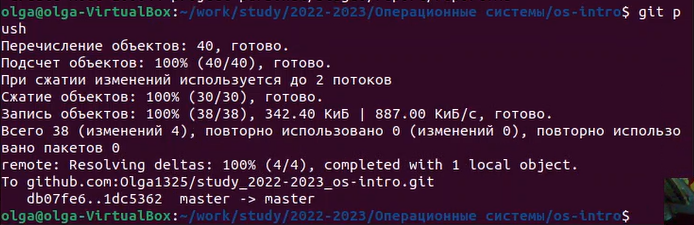

---
## Front matter
title: "Лабораторная работа №2"
subtitle: "Дисциплина: операционные системы"
author: "Пронякова Ольга Максимовна"

## Generic otions
lang: ru-RU
toc-title: "Содержание"

## Bibliography
bibliography: bib/cite.bib
csl: pandoc/csl/gost-r-7-0-5-2008-numeric.csl

## Pdf output format
toc: true # Table of contents
toc-depth: 2
lof: true # List of figures
lot: true # List of tables
fontsize: 12pt
linestretch: 1.5
papersize: a4
documentclass: scrreprt
## I18n polyglossia
polyglossia-lang:
  name: russian
  options:
	- spelling=modern
	- babelshorthands=true
polyglossia-otherlangs:
  name: english
## I18n babel
babel-lang: russian
babel-otherlangs: english
## Fonts
mainfont: PT Serif
romanfont: PT Serif
sansfont: PT Sans
monofont: PT Mono
mainfontoptions: Ligatures=TeX
romanfontoptions: Ligatures=TeX
sansfontoptions: Ligatures=TeX,Scale=MatchLowercase
monofontoptions: Scale=MatchLowercase,Scale=0.9
## Biblatex
biblatex: true
biblio-style: "gost-numeric"
biblatexoptions:
  - parentracker=true
  - backend=biber
  - hyperref=auto
  - language=auto
  - autolang=other*
  - citestyle=gost-numeric
## Pandoc-crossref LaTeX customization
figureTitle: "Рис."
tableTitle: "Таблица"
listingTitle: "Листинг"
lofTitle: "Список иллюстраций"
lotTitle: "Список таблиц"
lolTitle: "Листинги"
## Misc options
indent: true
header-includes:
  - \usepackage{indentfirst}
  - \usepackage{float} # keep figures where there are in the text
  - \floatplacement{figure}{H} # keep figures where there are in the text
---

# Цель работы

Целью работы является изучить идеологию и применение средств контроля
версий. Приобрести практические навыки по работе с системой git.

# Выполнение лабораторной работы

Создаем учётную запись на сайте https://github.com/ и заполните основные данные. (рис. [-@fig:pic1])

{ #fig:pic1 width=100% }

Сначала сделаем предварительную конфигурацию git. Открываем терминал и
вводим следующие команды, указав имя и email владельца репозитория (рис. [-@fig:pic2]).

{ #fig:pic2 width=100% }

Для последующей идентификации пользователя на сервере репозиториев
необходимо сгенерировать пару ключей (приватный и открытый) (рис. [-@fig:pic3]).

{ #fig:pic3 width=100% }

Далее необходимо загрузить сгенерённый открытый ключ. Для этого заходим на
сайт http://github.org/ под своей учётной записью и переходим в меню Setting . После
этого выбирвем в боковом меню SSH and GPG keys и нажимаем кнопку New SSH key .
Скопировав из локальной консоли ключ в буфер обмена (рис. [-@fig:pic4])
И (рис. [-@fig:pic5]).

{ #fig:pic4 width=100% }

{ #fig:pic5 width=100% }

Создаю рабочее пространство(репозиторий) по предмету "Операционные системы"(рис. [-@fig:pic6]) (рис. [-@fig:pic7]) (рис. [-@fig:pic8]).

{ #fig:pic6 width=100% }

{ #fig:pic7 width=100% }

{ #fig:pic8 width=100% }

Далее перехожу в каталог курса и удаляю лишние файлы. Затем создаю необходимые каталоги(рис. [-@fig:pic9])

{ #fig:pic9 width=100% }

Отправляю файлы на сервер(рис. [-@fig:pic10]) (рис. [-@fig:pic11]) (рис. [-@fig:pic12]).

{ #fig:pic10 width=100% }

{ #fig:pic11 width=100% }

{ #fig:pic12 width=100% }

Проверяю наличие данного репозитория и изменения в нем на Github(рис. [-@fig:pic13]) (рис. [-@fig:pic14]).

{ #fig:pic13 width=100% }

{ #fig:pic14 width=100% }

# Ответы на контрольные вопросы:

1. Что такое системы контроля версий (VCS) и для решения каких задач они предназначаются?
Система контроля версий — программное обеспечение для облегчения работы с изменяющейся информацией. Система управления версиями позволяет хранить несколько версий одного и того же документа, при необходимости возвращаться к более ранним версиям, определять, кто и когда сделал то или иное изменение, и многое другое.
Системы контроля версий (Version Control System, VCS) применяются для:
  1)Хранение полной истории изменений
  2)причин всех производимых изменений
  3)Откат изменений, если что-то пошло не так
  4)Поиск причины и ответственного за появления ошибок в программе
  5)Совместная работа группы над одним проектом
  6)Возможность изменять код, не мешая работе других пользователей

2. Объясните следующие понятия VCS и их отношения: хранилище, commit, история, рабочая копия.
Репозиторий - хранилище версий - в нем хранятся все документы вместе с историей их изменения и другой служебной информацией.
Commit — отслеживание изменений, сохраняет разницу в изменениях
Рабочая копия - копия проекта, связанная с репозиторием (текущее состояние файлов проекта, основанное на версии из хранилища (обычно на последней))
История хранит все изменения в проекте и позволяет при необходимости обратиться к нужным данным.

3. Что представляют собой и чем отличаются централизованные и децентрализованные VCS? Приведите примеры VCS каждого вида.
Централизованные VCS (Subversion; CVS; TFS; VAULT; AccuRev):

	Одно основное хранилище всего проекта

	Каждый пользователь копирует себе необходимые ему файлы из этого репозитория, изменяет и, затем, добавляет свои изменения обратно

	Децентрализованные VCS (Git; Mercurial; Bazaar):

	У каждого пользователя свой вариант (возможно не один) репозитория

	Присутствует возможность добавлять и забирать изменения из любого репозитория 

В классических системах контроля версий используется централизованная модель, предполагающая наличие единого репозитория для хранения файлов. Выполнение большинства функций по управлению версиями осуществляется специальным сервером. В отличие от классических, в распределённых системах контроля версий центральный репозиторий не является обязательным. 

4. Опишите действия с VCS при единоличной работе с хранилищем.
Сначала создаем и подключаем удаленный репозиторий. Затем по мере изменения проекта отправлять эти изменения на сервер.

5. Опишите порядок работы с общим хранилищем VCS.
Участник проекта (пользователь) перед началом работы посредством определённых команд получает нужную ему версию файлов. После внесения изменений, пользователь размещает новую версию в хранилище. При этом предыдущие версии не удаляются из центрального хранилища и к ним можно вернуться в любой момент.

6. Каковы основные задачи, решаемые инструментальным средством git?
Первая — хранить информацию о всех изменениях в вашем коде, начиная с самой первой строчки, а вторая — обеспечение удобства командной работы над кодом.

7. Назовите и дайте краткую характеристику командам git.
Наиболее часто используемые команды git:
  1) создание основного дерева репозитория: git init
  2) получение обновлений (изменений) текущего дерева из центрального репозитория: git pull
  3) отправка всех произведённых изменений локального дерева в центральный репозиторий: git push
  4) просмотр списка изменённых файлов в текущей директории: git status
  5) просмотр текущих изменения: git diff
  6) сохранение текущих изменений:
    – добавить все изменённые и/или созданные файлы и/или каталоги: git add.
    – добавить конкретные изменённые и/или созданные файлы и/или каталоги: git add имена_файлов
  1)удалить файл и/или каталог из индекса репозитория (при этом файл и/или каталог остаётся в локальной директории): git rm имена_файлов
  2)сохранение добавленных изменений:
    – сохранить все добавленные изменения и все изменённые файлы: git commit -am 'Описание коммита'
    – сохранить добавленные изменения с внесением комментария через встроенный редактор git commit
  1) создание новой ветки, базирующейся на текущей: git checkout -b имя_ветки
  2) переключение на некоторую ветку: git checkout имя_ветки (при переключении на ветку, которой ещё нет в локальном репозитории, она будет создана и связана с удалённой)
  3) отправка изменений конкретной ветки в центральный репозиторий: git push origin имя_ветки
  4) слияние ветки с текущим деревом: git merge --no-ff имя_ветки
  5) удаление ветки:
    – удаление локальной уже слитой с основным деревом ветки: git branch -d имя_ветки
    – принудительное удаление локальной ветки: git branch -D имя_ветки
    – удаление ветки с центрального репозитория: git push origin :имя_ветки

8. Приведите примеры использования при работе с локальным и удалённым репозиториями.
git push –all (push origin master/любой branch)

9. Что такое и зачем могут быть нужны ветви (branches)?
Ветвление («ветка», branch) — один из параллельных участков истории в одном хранилище, исходящих из одной версии (точки ветвления). 

• Обычно есть главная ветка (master), или ствол (trunk).
• Между ветками, то есть их концами, возможно слияние.
Используются для разработки новых функций.

10. Как и зачем можно игнорировать некоторые файлы при commit?
Во время работы над проектом так или иначе могут создаваться файлы, которые не требуется добавлять в последствии в репозиторий. Например, временные файлы, создаваемые редакторами, или объектные файлы, создаваемые компиляторами. Можно прописать шаблоны игнорируемых при добавлении в репозиторий типов файлов в файл .gitignore с помощью сервисов.

# Выводы

Изучила идеологию и применение средств контроля версий. Приобрела практические навыки по работе с системой git.

# Список литературы{.unnumbered}

[1. Архитектура ЭВМ](https://esystem.rudn.ru/pluginfile.php/1584622/mod_resource/content/1/Лабораторная%20работа%20№3.pdf)

[2. Лабораторная работа №2](https://esystem.rudn.ru/mod/page/view.php?id=970819#orgc96c791)

::: {#refs}
:::
