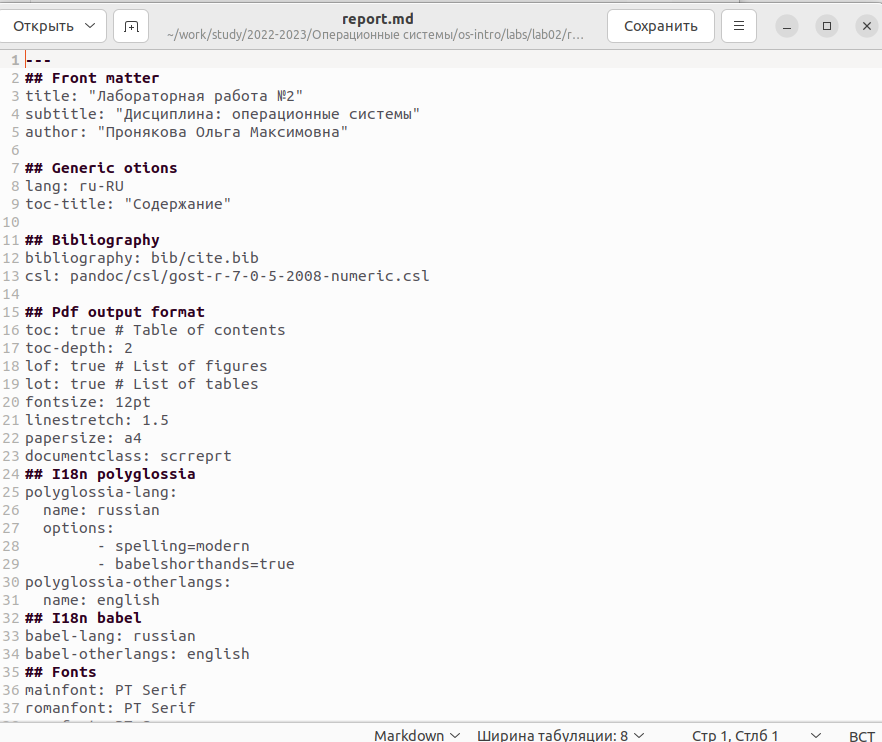
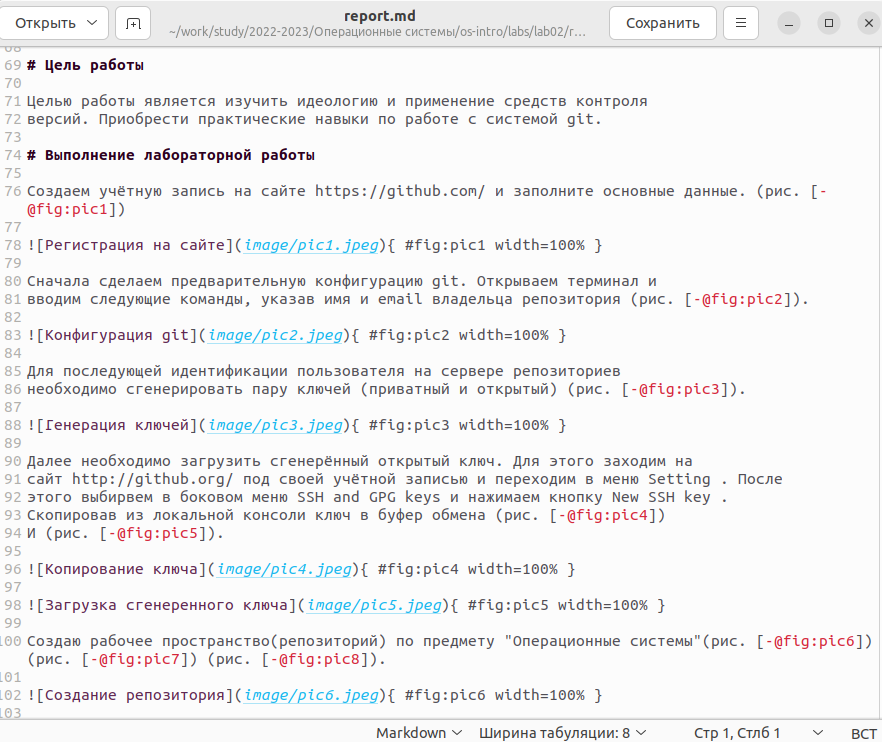
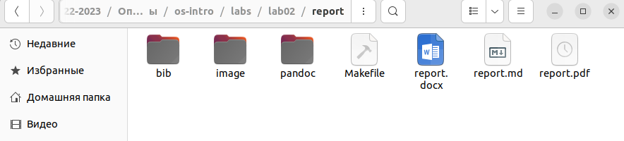
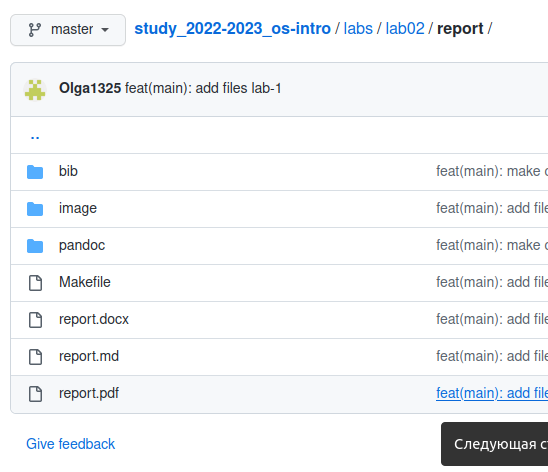

---
## Front matter
lang: ru-RU
title: Лабораторная работа №3
subtitle: Дисциплина - операционные системы
author:
  - Пронякова О.М.
institute:
  - Российский университет дружбы народов, Москва, Россия
date: 23 февраля  2023

## i18n babel
babel-lang: russian
babel-otherlangs: english

## Formatting pdf
toc: false
toc-title: Содержание
slide_level: 2
aspectratio: 169
section-titles: true
theme: metropolis
header-includes:
 - \metroset{progressbar=frametitle,sectionpage=progressbar,numbering=fraction}
 - '\makeatletter'
 - '\beamer@ignorenonframefalse'
 - '\makeatother'
---

# Информация

## Докладчик

:::::::::::::: {.columns align=center}
::: {.column width="70%"}

  * Пронякова Ольга Максимовна
  * студент НКАбд-02-22
  * факультет физико-математических и естественных наук
  * Российский университет дружбы народов

:::
::: {.column width="30%"}

:::
::::::::::::::

# Создание презентации

## Цель работы

 - Научиться оформлять отчёты с помощью легковесного языка разметки Markdown.

## Основные задачи

1. Сделать отчёт по предыдущей лабораторной работе в формате Markdown.

2. В качестве отчёта предоставить отчёты в 3 форматах: pdf, docx и md (в архиве,
поскольку он должен содержать скриншоты, Makefile и т.д,)

## Что такое Markdown?

 - Markdown — облегчённый язык разметки, созданный с целью обозначения форматирования в простом тексте, с максимальным сохранением его читаемости человеком, и пригодный для машинного преобразования в языки для продвинутых публикаций.

## Выполнение лабораторной работы

### Установление необходимого ПО
 - Установка TexLive
 - Распаковываю архив и перехожу в распакованную папку с помощью cd. Запускаю скрипт install-tl-* с правами root, используя sudo в начале команды
 - Добавляю /usr/local/texlive/2022/bin/x86_64-linux в свой PATH для текущей и будущих сессий
 
### Установка pandoc и pandoc-crossref
 - Скачиваю архив pandoc версии 2.19.2
 - Скачиваю архив pandoc-crossref и распаковываю его
 - Копирую файлы pandoc и pandoc-crossref в каталог /usr/local/bin/ с правами пользователя root с помощью sudo
 - Проверяю корректность выполненных действий
 
## Заполнение отчета по выполнению лабораторной работы №2 с помощтю языка разметки Markdown

Захожу в каталог второй лабораторной работы, открываю файл report и открываю файл report.md. Начинаю заполнять его(рис. 1) (рис. 2).

{ #fig:pic1 width=100% }

## Заполнение отчета по выполнению лабораторной работы №2 с помощтю языка разметки Markdown

{ #fig:pic2 width=100% }

## Заполнение отчета по выполнению лабораторной работы №2 с помощтю языка разметки Markdown

Компилирую файл с отчетом(рис. 3).

{ #fig:pic3 width=100% }

## Заполнение отчета по выполнению лабораторной работы №2 с помощтю языка разметки Markdown

Загружаю на Github(рис. 4).

{ #fig:pic4 width=100% }

## Выводы

 - Освоила процедуры оформления отчетов с помощью легковесного языка разметки Markfown.
 
