---
## Front matter
lang: ru-RU
title: Лабораторная работа №4
subtitle: Дисциплина - операционные системы
author:
  - Пронякова О.М.
institute:
  - Российский университет дружбы народов, Москва, Россия
date: 03 марта 2023

## i18n babel
babel-lang: russian
babel-otherlangs: english

## Formatting pdf
toc: false
toc-title: Содержание
slide_level: 2
aspectratio: 169
section-titles: true
theme: metropolis
header-includes:
 - \metroset{progressbar=frametitle,sectionpage=progressbar,numbering=fraction}
 - '\makeatletter'
 - '\beamer@ignorenonframefalse'
 - '\makeatother'
---

# Информация

## Докладчик

:::::::::::::: {.columns align=center}
::: {.column width="70%"}

  * Пронякова Ольга Максимовна
  * студент НКАбд-02-22
  * факультет физико-математических и естественных наук
  * Российский университет дружбы народов

:::
::::::::::::::

# Создание презентации

## Цель работы

 - Приобретение практических навыков взаимодействия пользователя с системой по-
средством командной строки.

## Основные задачи

1. Определите полное имя вашего домашнего каталога. Далее относительно этого ката-
лога будут выполняться последующие упражнения.
2. Выполните следующие действия:
2.1. Перейдите в каталог /tmp.
2.2. Выведите на экран содержимое каталога /tmp. Для этого используйте команду ls
с различными опциями. Поясните разницу в выводимой на экран информации.
2.3. Определите, есть ли в каталоге /var/spool подкаталог с именем cron?
2.4. Перейдите в Ваш домашний каталог и выведите на экран его содержимое. Опре-
делите, кто является владельцем файлов и подкаталогов?

## Основные задачи

3. Выполните следующие действия:
3.1. В домашнем каталоге создайте новый каталог с именем newdir.
3.2. В каталоге ~/newdir создайте новый каталог с именем morefun.
3.3. В домашнем каталоге создайте одной командой три новых каталога с именами
letters, memos, misk. Затем удалите эти каталоги одной командой.
3.4. Попробуйте удалить ранее созданный каталог ~/newdir командой rm. Проверьте,
был ли каталог удалён.
3.5. Удалите каталог ~/newdir/morefun из домашнего каталога. Проверьте, был ли
каталог удалён.
4. С помощью команды man определите, какую опцию команды ls нужно использо-
вать для просмотра содержимое не только указанного каталога, но и подкаталогов,
входящих в него.

## Основные задачи

5. С помощью команды man определите набор опций команды ls, позволяющий отсорти-
ровать по времени последнего изменения выводимый список содержимого каталога
с развёрнутым описанием файлов.
6. Используйте команду man для просмотра описания следующих команд: cd, pwd, mkdir,
rmdir, rm. Поясните основные опции этих команд.
7. Используя информацию, полученную при помощи команды history, выполните мо-
дификацию и исполнение нескольких команд из буфера команд.

## Теоретическое введение

 - Командой в операционной системе называется записанный по
специальным правилам текст (возможно с аргументами), представляющий собой ука-
зание на выполнение какой-либо функций (или действий) в операционной системе.
Обычно первым словом идёт имя команды, остальной текст — аргументы или опции,
конкретизирующие действие.
Общий формат команд можно представить следующим образом:
<имя_команды><разделитель><аргументы>

## Выполнение лабораторной работы

1. Определяю полное имя своего домашнего каталога. Далее относительно этого ката-
лога будут выполняться последующие упражнения(рис.1).

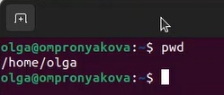{ #fig:pic1 width=100% }

## Выполнение лабораторной работы

2. Перешла в каталог /tmp. Надо вывести на экран содержимое каталога /tmp. Для этого использую команду ls с различными опциями. ls используется для просмотра содержимого каталога(рис.2).

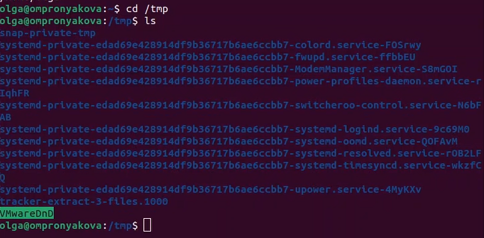{ #fig:pic2 width=100% }

## Выполнение лабораторной работы

Применяю команду ls -a, она используется для просмотра скрытых файлов, которые начинаются с точки(рис.3) (рис.4).

{ #fig:pic3 width=100% }

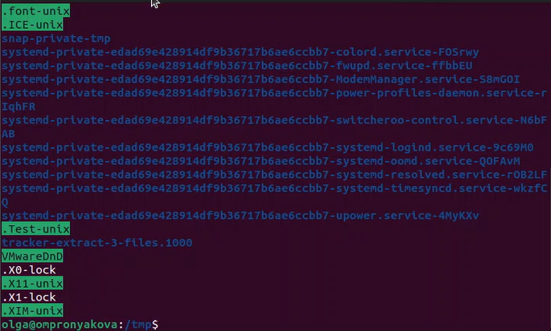{ #fig:pic4 width=100% }

## Выполнение лабораторной работы

Применяю команду ls -l, она используется для просмотра подробной информации о файлах(рис.5) (рис.6).

{ #fig:pic5 width=100% }

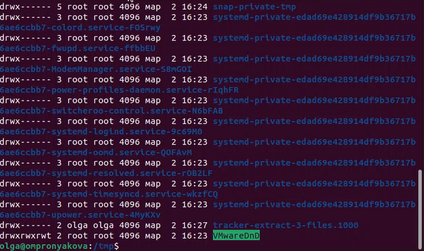{ #fig:pic6 width=100% }

## Выполнение лабораторной работы

Применяю команду ls -alf(рис.7) (рис.8).

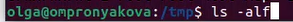{ #fig:pic7 width=100% }

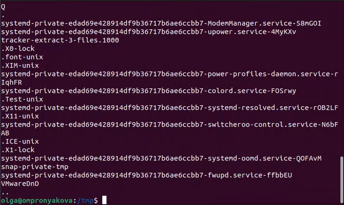{ #fig:pic8 width=100% }

## Выполнение лабораторной работы

Определяю, есть ли в каталоге /var/spool подкаталог с именем cron. Для этого перехожу в этот каталог и использую команду ls. На картинке видно, что данный подкаталог есть(рис.9).

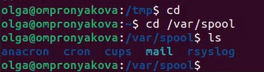{ #fig:pic9 width=100% }

## Выполнение лабораторной работы

Перехожу в свой домашний каталог и вывожу на экран его содержимое с помощью команд cd и ls -l. можно заметить, что я являюсь владельцем файлов и подкаталогов(рис.10).

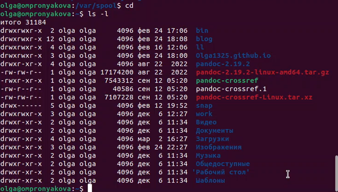{ #fig:pic10 width=100% }

## Выполнение лабораторной работы

3. Далее нужно в домашнем каталоге создать новый каталог с именем newdir. В каталоге ~/newdir создаю новый каталог с именем morefun с помощью команды mkdir(рис.11).

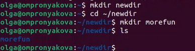{ #fig:pic11 width=100% }

## Выполнение лабораторной работы

В домашнем каталоге создаю одной командой три новых каталога с именами
letters, memos, misk с помощью команды mkdir(рис.12).

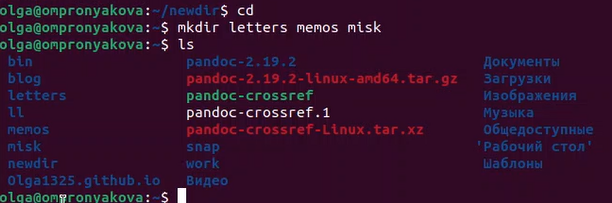{ #fig:pic12 width=100% }

## Выполнение лабораторной работы

Затем удаляю эти каталоги одной командой rmdir(рис.13).

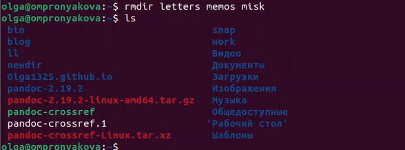{ #fig:pic13 width=100% }

## Выполнение лабораторной работы

Пробую удалить ранее созданный каталог ~/newdir командой rm. Он не удалился(рис.14).

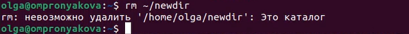{ #fig:pic14 width=100% }

## Выполнение лабораторной работы

Удаляю каталог ~/newdir/morefun из домашнего каталога с помощью команды rmdir и проверяю(рис.15).

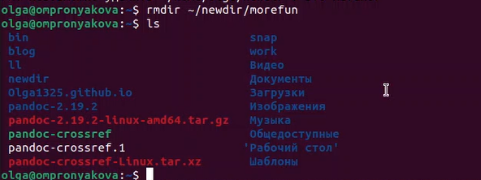{ #fig:pic15 width=100% }

## Выполнение лабораторной работы

4. С помощью команды man определяю, какую опцию команды ls нужно использо-
вать для просмотра содержимое не только указанного каталога, но и подкаталогов,
входящих в него(рис.16) (рис.17).

{ #fig:pic16 width=100% }

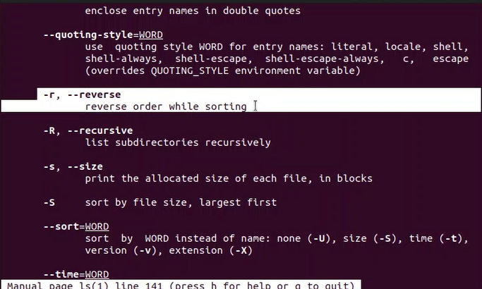{ #fig:pic17 width=100% }

## Выполнение лабораторной работы

5. С помощью команды man определяю набор опций команды ls, позволяющий отсорти-
ровать по времени последнего изменения выводимый список содержимого каталога
с развёрнутым описанием файлов(рис.18).

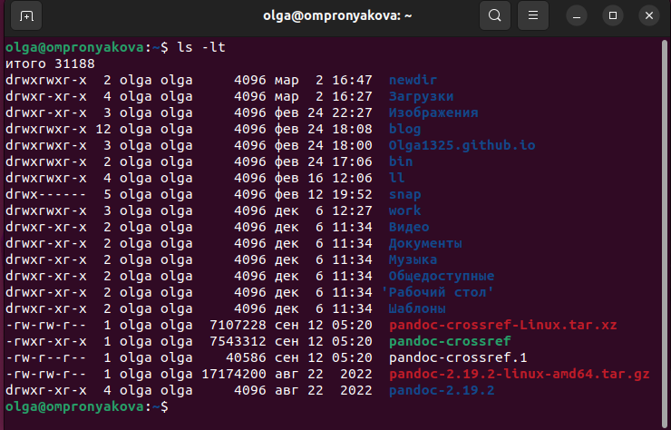{ #fig:pic18 width=100% }

## Выполнение лабораторной работы

6. Использую команду man для просмотра описания следующих команд: cd, pwd, mkdir,
rmdir, rm. Использование команд cd, pwd(рис.19) (рис.20).

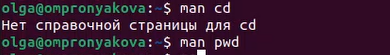{ #fig:pic19 width=100% }

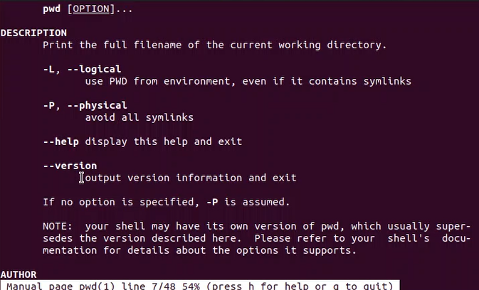{ #fig:pic20 width=100% }

## Выполнение лабораторной работы

Использование команды mkdir(рис.21) (рис.22).

{ #fig:pic21 width=100% }

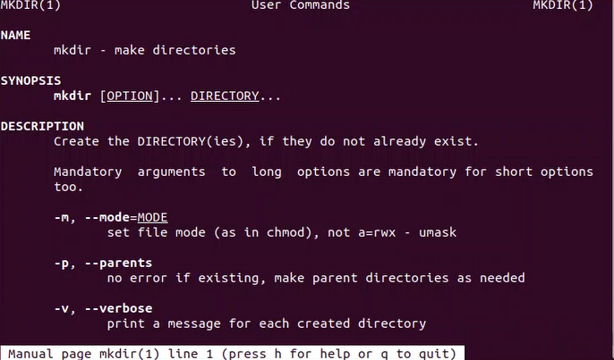{ #fig:pic22 width=100% }

## Выполнение лабораторной работы

Использование команды rmdir(рис.23) (рис.24).

{ #fig:pic23 width=100% }

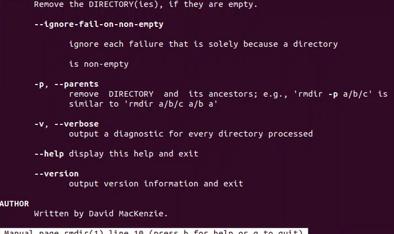{ #fig:pic24 width=100% }

## Выполнение лабораторной работы

Использование команды rm(рис.25) (рис.26).

{ #fig:pic25 width=100% }

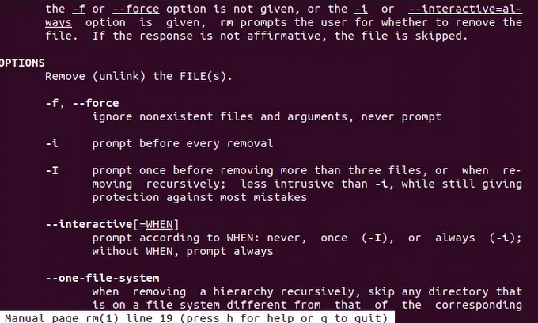{ #fig:pic26 width=100% }

## Выполнение лабораторной работы

7. Ввожу в терминал команду history(рис.27) (рис.28).

{ #fig:pic27 width=100% }

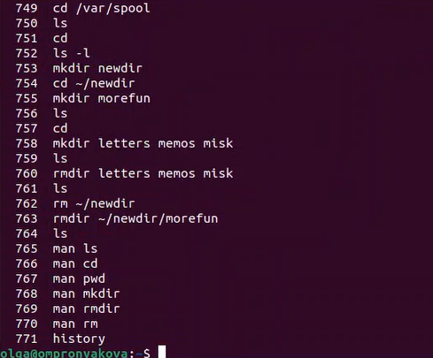{ #fig:pic28 width=100% }

## Выполнение лабораторной работы

Используя информацию, полученную при помощи предыдущей команды, выполнила модификацию и исполнение нескольких команд из буфера команд(рис.29) (рис.30) (рис.31).

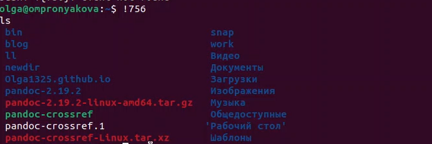{ #fig:pic29 width=100% }

## Выполнение лабораторной работы

{ #fig:pic30 width=100% }

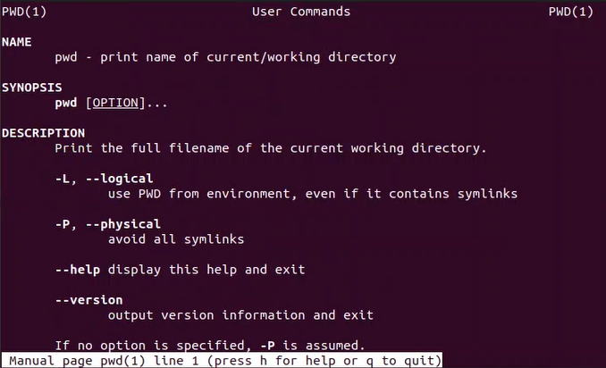{ #fig:pic31 width=100% }

## Выводы

Приобрела практические навыки взаимодействия пользователя с системой по-
средством командной строки.

