---
## Front matter
title: "Лабораторная работа №4"
subtitle: "Дисципоина: операционные системы"
author: "Пронякова Ольга Максимовна"

## Generic otions
lang: ru-RU
toc-title: "Содержание"

## Bibliography
bibliography: bib/cite.bib
csl: pandoc/csl/gost-r-7-0-5-2008-numeric.csl

## Pdf output format
toc: true # Table of contents
toc-depth: 2
lof: true # List of figures
lot: true # List of tables
fontsize: 12pt
linestretch: 1.5
papersize: a4
documentclass: scrreprt
## I18n polyglossia
polyglossia-lang:
  name: russian
  options:
	- spelling=modern
	- babelshorthands=true
polyglossia-otherlangs:
  name: english
## I18n babel
babel-lang: russian
babel-otherlangs: english
## Fonts
mainfont: PT Serif
romanfont: PT Serif
sansfont: PT Sans
monofont: PT Mono
mainfontoptions: Ligatures=TeX
romanfontoptions: Ligatures=TeX
sansfontoptions: Ligatures=TeX,Scale=MatchLowercase
monofontoptions: Scale=MatchLowercase,Scale=0.9
## Biblatex
biblatex: true
biblio-style: "gost-numeric"
biblatexoptions:
  - parentracker=true
  - backend=biber
  - hyperref=auto
  - language=auto
  - autolang=other*
  - citestyle=gost-numeric
## Pandoc-crossref LaTeX customization
figureTitle: "Рис."
tableTitle: "Таблица"
listingTitle: "Листинг"
lofTitle: "Список иллюстраций"
lotTitle: "Список таблиц"
lolTitle: "Листинги"
## Misc options
indent: true
header-includes:
  - \usepackage{indentfirst}
  - \usepackage{float} # keep figures where there are in the text
  - \floatplacement{figure}{H} # keep figures where there are in the text
---

# Цель работы

Приобрести практические навыки взаимодействия пользователя с системой по-
средством командной строки.

# Задание

1. Определите полное имя вашего домашнего каталога. Далее относительно этого ката-
лога будут выполняться последующие упражнения.
2. Выполните следующие действия:
2.1. Перейдите в каталог /tmp.
2.2. Выведите на экран содержимое каталога /tmp. Для этого используйте команду ls
с различными опциями. Поясните разницу в выводимой на экран информации.
2.3. Определите, есть ли в каталоге /var/spool подкаталог с именем cron?
2.4. Перейдите в Ваш домашний каталог и выведите на экран его содержимое. Опре-
делите, кто является владельцем файлов и подкаталогов?
3. Выполните следующие действия:
3.1. В домашнем каталоге создайте новый каталог с именем newdir.
3.2. В каталоге ~/newdir создайте новый каталог с именем morefun.
3.3. В домашнем каталоге создайте одной командой три новых каталога с именами
letters, memos, misk. Затем удалите эти каталоги одной командой.
3.4. Попробуйте удалить ранее созданный каталог ~/newdir командой rm. Проверьте,
был ли каталог удалён.
3.5. Удалите каталог ~/newdir/morefun из домашнего каталога. Проверьте, был ли
каталог удалён.
4. С помощью команды man определите, какую опцию команды ls нужно использо-
вать для просмотра содержимое не только указанного каталога, но и подкаталогов,
входящих в него.
5. С помощью команды man определите набор опций команды ls, позволяющий отсорти-
ровать по времени последнего изменения выводимый список содержимого каталога
с развёрнутым описанием файлов.
6. Используйте команду man для просмотра описания следующих команд: cd, pwd, mkdir,
rmdir, rm. Поясните основные опции этих команд.
7. Используя информацию, полученную при помощи команды history, выполните мо-
дификацию и исполнение нескольких команд из буфера команд.

# Теоретическое введение

Командой в операционной системе называется записанный по
специальным правилам текст (возможно с аргументами), представляющий собой ука-
зание на выполнение какой-либо функций (или действий) в операционной системе.
Обычно первым словом идёт имя команды, остальной текст — аргументы или опции,
конкретизирующие действие.
Общий формат команд можно представить следующим образом:
<имя_команды><разделитель><аргументы>

# Выполнение лабораторной работы

Определяю полное имя своего домашнего каталога. Далее относительно этого ката-
лога будут выполняться последующие упражнения(рис. [-@fig:pic1]).

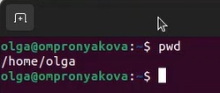{ #fig:pic1 width=100% }

Перешла в каталог /tmp. Надо вывести на экран содержимое каталога /tmp. Для этого использую команду ls с различными опциями. ls используется для просмотра содержимого каталога(рис. [-@fig:pic2]).

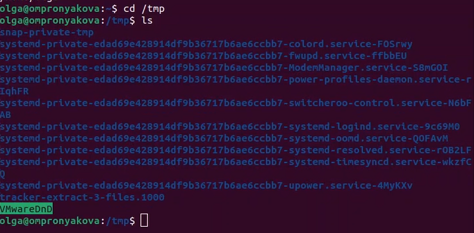{ #fig:pic2 width=100% }

Применяю команду ls -a, она используется для просмотра скрытых файлов, которые начинаются с точки(рис. [-@fig:pic3]) (рис. [-@fig:pic4]).

{ #fig:pic3 width=100% }

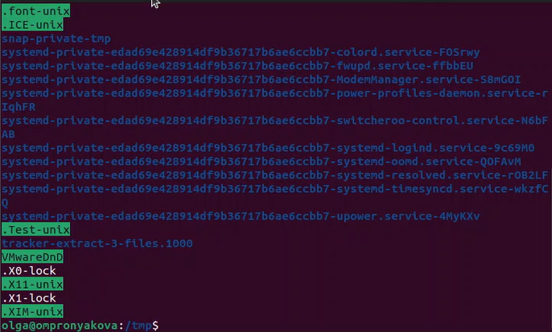{ #fig:pic4 width=100% }

Применяю команду ls -l, она используется для просмотра подробной информации о файлах(рис. [-@fig:pic5]) (рис. [-@fig:pic6]).

{ #fig:pic5 width=100% }

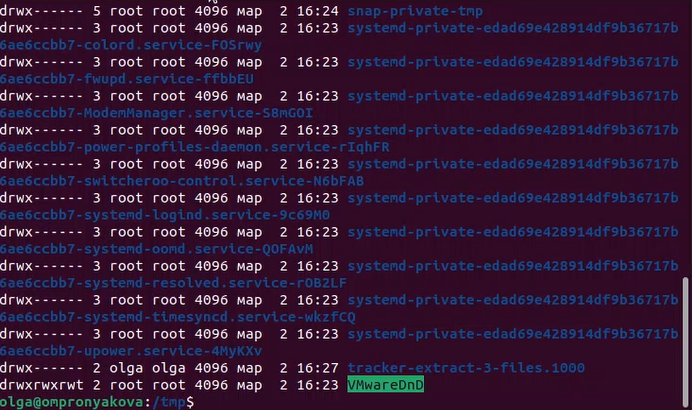{ #fig:pic6 width=100% }

Применяю команду ls -alf(рис. [-@fig:pic7]) (рис. [-@fig:pic8]).

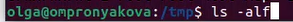{ #fig:pic7 width=100% }

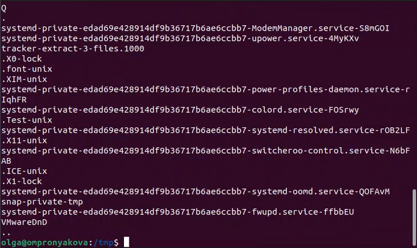{ #fig:pic8 width=100% }

Определяю, есть ли в каталоге /var/spool подкаталог с именем cron. Для этого перехожу в этот каталог и использую команду ls. На картинке видно, что данный подкаталог есть(рис. [-@fig:pic9]).

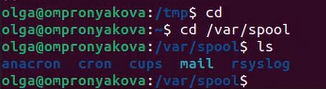{ #fig:pic9 width=100% }

Перехожу в свой домашний каталог и вывожу на экран его содержимое с помощью команд cd и ls -l. можно заметить, что я являюсь владельцем файлов и подкаталогов(рис. [-@fig:pic10]).

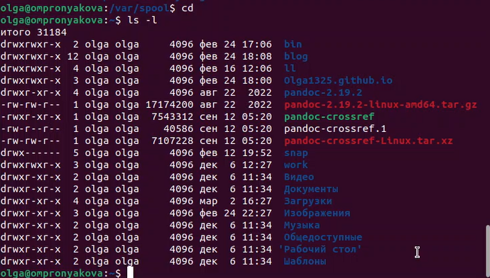{ #fig:pic10 width=100% }

Далее нужно в домашнем каталоге создать новый каталог с именем newdir. В каталоге ~/newdir создаю новый каталог с именем morefun с помощью команды mkdir(рис. [-@fig:pic11]).

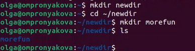{ #fig:pic11 width=100% }

В домашнем каталоге создаю одной командой три новых каталога с именами
letters, memos, misk с помощью команды mkdir(рис. [-@fig:pic12]).

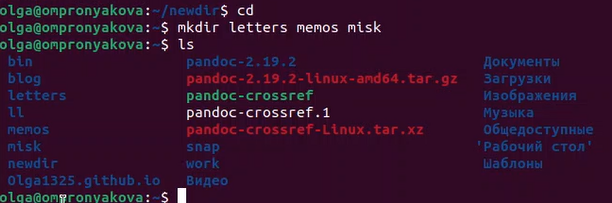{ #fig:pic12 width=100% }

Затем удаляю эти каталоги одной командой rmdir(рис. [-@fig:pic13]).

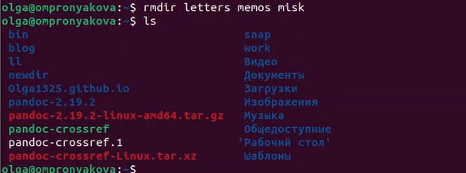{ #fig:pic13 width=100% }

Пробую удалить ранее созданный каталог ~/newdir командой rm. Он не удалился(рис. [-@fig:pic14]).

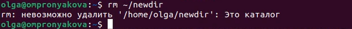{ #fig:pic14 width=100% }

Удаляю каталог ~/newdir/morefun из домашнего каталога с помощью команды rmdir и проверяю(рис. [-@fig:pic15]).

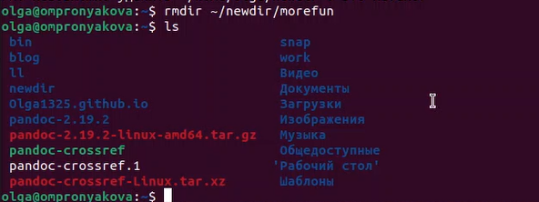{ #fig:pic15 width=100% }

С помощью команды man определяю, какую опцию команды ls нужно использо-
вать для просмотра содержимое не только указанного каталога, но и подкаталогов,
входящих в него(рис. [-@fig:pic16]) (рис. [-@fig:pic17]).

{ #fig:pic16 width=100% }

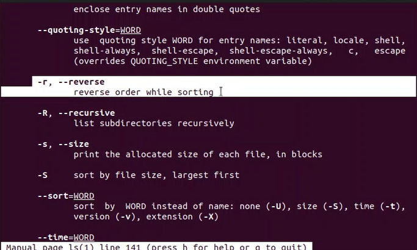{ #fig:pic17 width=100% }

С помощью команды man определяю набор опций команды ls, позволяющий отсорти-
ровать по времени последнего изменения выводимый список содержимого каталога
с развёрнутым описанием файлов(рис. [-@fig:pic18]).

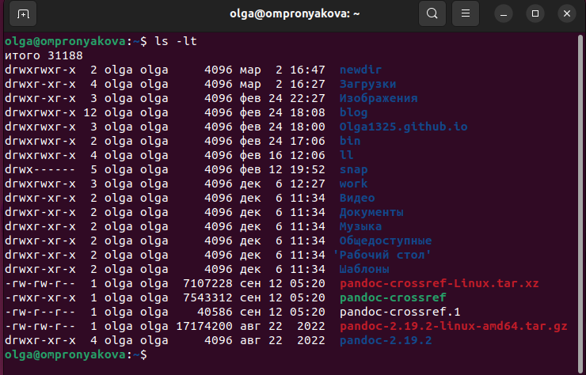{ #fig:pic18 width=100% }

Использую команду man для просмотра описания следующих команд: cd, pwd, mkdir,
rmdir, rm. Использование команд cd, pwd(рис. [-@fig:pic19]) (рис. [-@fig:pic20]).

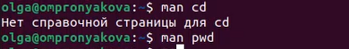{ #fig:pic19 width=100% }

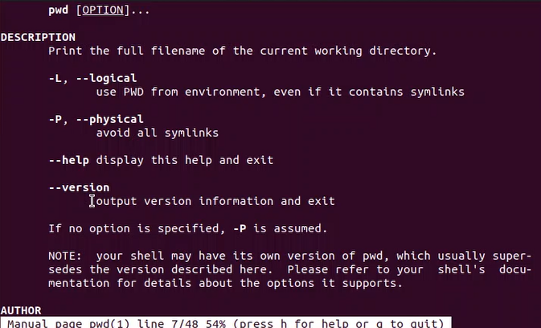{ #fig:pic20 width=100% }

Использование команды mkdir(рис. [-@fig:pic21]) (рис. [-@fig:pic22]).

{ #fig:pic21 width=100% }

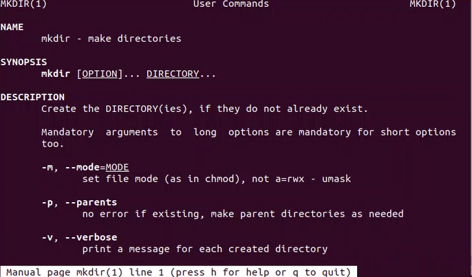{ #fig:pic22 width=100% }

Использование команды rmdir(рис. [-@fig:pic23]) (рис. [-@fig:pic24]).

{ #fig:pic23 width=100% }

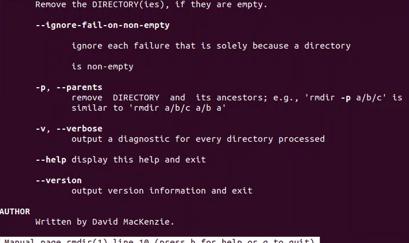{ #fig:pic24 width=100% }

Использование команды rm(рис. [-@fig:pic25]) (рис. [-@fig:pic26]).

{ #fig:pic25 width=100% }

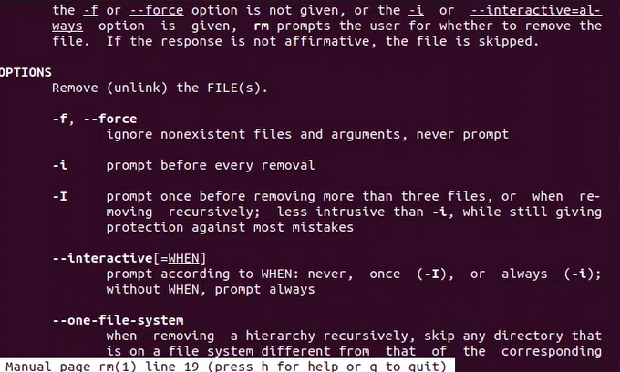{ #fig:pic26 width=100% }

Ввожу в терминал команду history(рис. [-@fig:pic27]) (рис. [-@fig:pic28]).

{ #fig:pic27 width=100% }

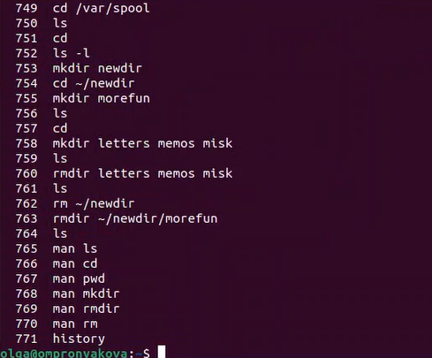{ #fig:pic28 width=100% }

Используя информацию, полученную при помощи предыдущей команды, выполнила модификацию и исполнение нескольких команд из буфера команд(рис. [-@fig:pic29]) (рис. [-@fig:pic30]) (рис. [-@fig:pic31]).

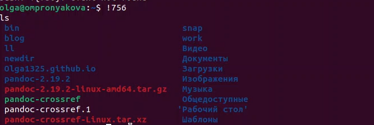{ #fig:pic29 width=100% }

{ #fig:pic30 width=100% }

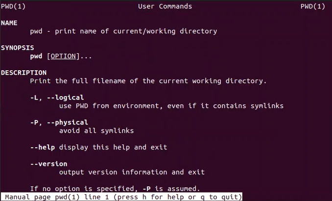{ #fig:pic31 width=100% }

# Ответы на контрольные вопросы

1. Что такое командная строка? Командная строка (или «консоль») – это текстовый
интерфейс между человеком и компьютером, в котором инструкции компьютеру
даются путём ввода с клавиатуры текстовых строк (команд). Интерфейс командной
строки противопоставляется управлению программами на основе меню, а также
различным реализациям графического интерфейса. Команды, введённые
пользователем, интерпретируются и выполняются специальной программой —
командной оболочкой (или «shell» по-английски).
2. При помощи какой команды можно определить абсолютный путь текущего
каталога? Приведите пример. Для определения абсолютного пути к текущему
каталогу используется команда pwd (print working directory). Пример (абсолютное
имя текущего каталога пользователя dharma): (pwd результат:
/afs/dk.sci.pfu.edu.ru/home/d/h/dharma)
3. При помощи какой команды и каких опций можно определить только тип файлов и
их имена в текущем каталоге? Приведите примеры. При помощи команды ls -F. (ls -
F install-tl-unx/ newdir/ work/ Видео/ Документы/ Загрузки/ Изображения/ Музыка/
Общедоступные/ ‘Рабочий стол’/ Шаблоны/)
4. Каким образом отобразить информацию о скрытых файлах? Приведите примеры. С
помощью команды ls -a. (ls -a . .bash_logout .cache .gnupg .local .pki .var .vboxclient-
draganddrop.pid .wget-hsts Документы Музыка Шаблоны .. .bash_profile .config
install-tl-unx .mozilla .ssh .vboxclient-clipboard.pid .vboxclient-seamless.pid work
Загрузки Общедоступные .bash_history .bashrc .gitconfig .lesshst newdir .texlive2022
.vboxclient-display-svga-x11.pid .vscode Видео Изображения ‘Рабочий стол’)
5. При помощи каких команд можно удалить файл и каталог? Можно ли это сделать
одной и той же командой? Приведите примеры. Команда rm используется для
удаления файлов и/или каталогов. Чтобы удалить каталог, содержащий файлы,
нужно использовать опцию r. Без указания этой опции команда не будет
выполняться (rm -r abc). Если каталог пуст, то можно воспользоваться командой
rmdir. Если удаляемый каталог содержит файлы, то команда не будет выполнена —
нужно использовать rm - r имя_каталога.
6. Каким образом можно вывести информацию о последних выполненных
пользователем командах? работы? С помощью команды history.
7. Как воспользоваться историей команд для их модифицированного выполнения?
Приведите примеры. Можно модифицировать команду из выведенного на экран
списка при помощи следующей конструкции: !:s// (!3:s/a/F ls -F)
8. Приведите примеры запуска нескольких команд в одной строке. Если требуется
выполнить последовательно несколько команд, записанный в одной строке, то для
этого используется символ точка с запятой. (cd; ls)
9. Дайте определение и приведите примера символов экранирования. Если в
заданном контексте встречаются специальные символы (типа «.», «/», «*» и т.д.),
надо перед ними поставить символ экранирования  (обратный слэш).
10. Охарактеризуйте вывод информации на экран после выполнения команды ls с
опцией
l. Чтобы вывести на экран подробную информацию о файлах и каталогах,
необходимо использовать опцию l. При этом о каждом файле и каталоге будет

выведена следующая информация: – тип файла, – право доступа, – число ссылок, –
владелец, – размер, – дата последней ревизии, – имя файла или каталога.
11. Что такое относительный путь к файлу? Приведите примеры использования
относительного и абсолютного пути при выполнении какой-либо команды.
Относительный путь — это ссылка, указывающая на другие страницы вашего сайта
относительно веб-страницы, на которой эта ссылка уже находится. Пример
относительно пути: ./docs/files/file.txt Пример абсолютного пути: cd
/home/dmbelicheva/work/study
12. Как получить информацию об интересующей вас команде? С помощью команды
hepl.
13. Какая клавиша или комбинация клавиш служит для автоматического дополнения
вводимых команд? Клавиша Tab.

# Выводы

Приобрела практические навыки взаимодействия пользователя с системой по-
средством командной строки.

# Список литературы{.unnumbered}

[1. Лабораторная работа №4](file:///home/olga/%D0%97%D0%B0%D0%B3%D1%80%D1%83%D0%B7%D0%BA%D0%B8/004-lab_shell-2.pdf)

::: {#refs}
:::
