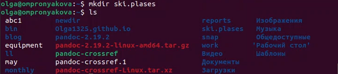
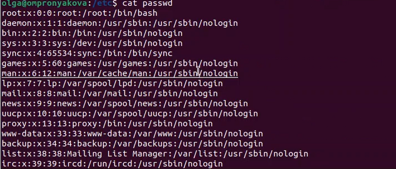

---
## Front matter
lang: ru-RU
title: Лабораторная работа №5
subtitle: Дисциплина - операционные системы
author:
  - Пронякова О.М.
institute:
  - Российский университет дружбы народов, Москва, Россия
date: 11 марта 2023

## i18n babel
babel-lang: russian
babel-otherlangs: english

## Formatting pdf
toc: false
toc-title: Содержание
slide_level: 2
aspectratio: 169
section-titles: true
theme: metropolis
header-includes:
 - \metroset{progressbar=frametitle,sectionpage=progressbar,numbering=fraction}
 - '\makeatletter'
 - '\beamer@ignorenonframefalse'
 - '\makeatother'
---

# Информация

## Докладчик

:::::::::::::: {.columns align=center}
::: {.column width="70%"}

  * Пронякова Ольга Максимовна
  * студент НКАбд-02-22
  * факультет физико-математических и естественных наук
  * Российский университет дружбы народов
  
:::
::::::::::::::

# Создание презентации

## Цель работы

 - Ознакомление с файловой системой Linux, её структурой, именами и содержанием
каталогов. Приобретение практических навыков по применению команд для работы
с файлами и каталогами, по управлению процессами (и работами), по проверке исполь-
зования диска и обслуживанию файловой системы.

## Основные задачи

1. Выполните все примеры, приведённые в первой части описания лабораторной работы.
2. Выполните следующие действия, зафиксировав в отчёте по лабораторной работе
используемые при этом команды и результаты их выполнения:
 2.1. Скопируйте файл /usr/include/sys/io.h в домашний каталог и назовите его
equipment. Если файла io.h нет, то используйте любой другой файл в каталоге
/usr/include/sys/ вместо него.
 2.2. В домашнем каталоге создайте директорию ~/ski.plases.
 2.3. Переместите файл equipment в каталог ~/ski.plases.
 2.4. Переименуйте файл ~/ski.plases/equipment в ~/ski.plases/equiplist.
 
## Основные задачи
 
 2.5. Создайте в домашнем каталоге файл abc1 и скопируйте его в каталог
~/ski.plases, назовите его equiplist2.
 2.6. Создайте каталог с именем equipment в каталоге ~/ski.plases.
 2.7. Переместите файлы ~/ski.plases/equiplist и equiplist2 в каталог
~/ski.plases/equipment.
 2.8. Создайте и переместите каталог ~/newdir в каталог ~/ski.plases и назовите
его plans.

## Основные задачи

3. Определите опции команды chmod, необходимые для того, чтобы присвоить перечис-
ленным ниже файлам выделенные права доступа, считая, что в начале таких прав
нет:
 3.1. drwxr--r-- ... australia
 3.2. drwx--x--x ... play
 3.3. -r-xr--r-- ... my_os
 3.4. -rw-rw-r-- ... feathers
При необходимости создайте нужные файлы.

## Основные задачи

4. Проделайте приведённые ниже упражнения, записывая в отчёт по лабораторной
работе используемые при этом команды:
 4.1. Просмотрите содержимое файла /etc/password.
 4.2. Скопируйте файл ~/feathers в файл ~/file.old.
 4.3. Переместите файл ~/file.old в каталог ~/play.
 4.4. Скопируйте каталог ~/play в каталог ~/fun.
 4.5. Переместите каталог ~/fun в каталог ~/play и назовите его games.
 4.6. Лишите владельца файла ~/feathers права на чтение.

## Основные задачи

 4.7. Что произойдёт, если вы попытаетесь просмотреть файл ~/feathers командой
cat?
 4.8. Что произойдёт, если вы попытаетесь скопировать файл ~/feathers?
 4.9. Дайте владельцу файла ~/feathers право на чтение.
 4.10. Лишите владельца каталога ~/play права на выполнение.
 4.11. Перейдите в каталог ~/play. Что произошло?
 4.12. Дайте владельцу каталога ~/play право на выполнение.
5. Прочитайте man по командам mount, fsck, mkfs, kill и кратко их охарактеризуйте,
приведя примеры.

## Выполнение лабораторной работы

1. Выполняю все примеры, приведённые в первой части описания лабораторной работы.
2. Копируйте файл /usr/include/аio.h в домашний каталог и называю его equipment(рис. 1) (рис. 2) (рис. 3).

{ #fig:pic17 width=100% }

## Выполнение лабораторной работы

{ #fig:pic18 width=100% }

{ #fig:pic19 width=100% }

## Выполнение лабораторной работы

В домашнем каталоге создаю директорию ~/ski.plases(рис. 4).

{ #fig:pic20 width=100% }

## Выполнение лабораторной работы

Перемещаю файл equipment в каталог ~/ski.plases(рис. 5).

{ #fig:pic21 width=100% }

## Выполнение лабораторной работы

Переимещаю файл ~/ski.plases/equipment в ~/ski.plases/equiplist(рис. 6).

{ #fig:pic22 width=100% }

## Выполнение лабораторной работы

Создаю в домашнем каталоге файл abc1 и копирую его в каталог ~/ski.plases, назовите его equiplist2(рис. 7).

{ #fig:pic23 width=100% }

## Выполнение лабораторной работы

Создаю каталог с именем equipment в каталоге ~/ski.plases(рис. 8).

{ #fig:pic24 width=100% }

## Выполнение лабораторной работы

Перемещаю файлы ~/ski.plases/equiplist и equiplist2 в каталог ~/ski.plases/equipment(рис. 9).

{ #fig:pic25 width=100% }

## Выполнение лабораторной работы

Создаю и перемещаю каталог ~/newdir в каталог ~/ski.plases и называю его plans(рис. 10).

{ #fig:pic26 width=100% }

## Выполнение лабораторной работы

Создаю некоторые файлы и каталоги(рис. 11).

{ #fig:pic27 width=100% }

## Выполнение лабораторной работы

3. Определяю опции команды chmod, необходимые для того, чтобы присвоить создвнным файлам выделенные права доступа, считая, что в начале таких прав нет(рис. 12) (рис. 13).

{ #fig:pic28 width=100% }

## Выполнение лабораторной работы

{ #fig:pic29 width=100% }

## Выполнение лабораторной работы

4. Просмотриваю содержимое файла /etc/passwd(рис. 14) (рис. 15).

{ #fig:pic30 width=100% }

## Выполнение лабораторной работы

{ #fig:pic31 width=100% }

## Выполнение лабораторной работы

Копирую файл ~/feathers в файл ~/file.old(рис. 16).

{ #fig:pic32 width=100% }

## Выполнение лабораторной работы

Перемещаю файл ~/file.old в каталог ~/play(рис. 17).

{ #fig:pic33 width=100% }

## Выполнение лабораторной работы

Копирую каталог ~/play в каталог ~/fun(рис. 18).

{ #fig:pic34 width=100% }

## Выполнение лабораторной работы

Перемещаю каталог ~/fun в каталог ~/play и называю его games(рис. 19).

{ #fig:pic35 width=100% }

## Выполнение лабораторной работы

Лишаю владельца файла ~/feathers права на чтение(рис. 20).

{ #fig:pic36 width=100% }

## Выполнение лабораторной работы

Смотрю, что произойдёт, если я попытаюсь просмотреть файл ~/feathers командой cat(рис. 21).

{ #fig:pic37 width=100% }

## Выполнение лабораторной работы

Смотрю, что произойдёт, если я попытаюсь скопировать файл ~/feathers(рис. 22).

{ #fig:pic38 width=100% }

## Выполнение лабораторной работы

Даю владельцу файла ~/feathers право на чтение(рис. 23).

{ #fig:pic39 width=100% }

## Выполнение лабораторной работы

Лишаю владельца каталога ~/play права на выполнение. Далее перехожу в каталог ~/play. Даю владельцу каталога ~/play право на выполнение(рис. 24).

{ #fig:pic40 width=100% }

## Выполнение лабораторной работы

5. Читаю man по командам и кратко их охарактеризовываю. Выполнение команды man mount(рис. 25) (рис. 26).

{ #fig:pic41 width=100% }

{ #fig:pic42 width=100% }

## Выполнение лабораторной работы

Выполнение команды man fsck(рис. 27) (рис. 28).

{ #fig:pic43 width=100% }

{ #fig:pic44 width=100% }

## Выполнение лабораторной работы

Выполнение команды man mkfs(рис. 29) (рис. 30).

{ #fig:pic45 width=100% }

{ #fig:pic46 width=100% }

## Выполнение лабораторной работы

Выполнение команды man kill(рис. 31) (рис. 32).

{ #fig:pic47 width=100% }

{ #fig:pic48 width=100% }

## Выводы

 - Ознакомилась с файловой системой Linux, её структурой, именами и содержанием
каталогов. Приобрела практические навыки по применению команд для работы
с файлами и каталогами, по управлению процессами (и работами), по проверке исполь-
зования диска и обслуживанию файловой системы.

