---
## Front matter
title: "Лабораторная работа №5"
subtitle: "Дисциплина: операционные системы"
author: "Пронякова Ольга Максимовна"

## Generic otions
lang: ru-RU
toc-title: "Содержание"

## Bibliography
bibliography: bib/cite.bib
csl: pandoc/csl/gost-r-7-0-5-2008-numeric.csl

## Pdf output format
toc: true # Table of contents
toc-depth: 2
lof: true # List of figures
lot: true # List of tables
fontsize: 12pt
linestretch: 1.5
papersize: a4
documentclass: scrreprt
## I18n polyglossia
polyglossia-lang:
  name: russian
  options:
	- spelling=modern
	- babelshorthands=true
polyglossia-otherlangs:
  name: english
## I18n babel
babel-lang: russian
babel-otherlangs: english
## Fonts
mainfont: PT Serif
romanfont: PT Serif
sansfont: PT Sans
monofont: PT Mono
mainfontoptions: Ligatures=TeX
romanfontoptions: Ligatures=TeX
sansfontoptions: Ligatures=TeX,Scale=MatchLowercase
monofontoptions: Scale=MatchLowercase,Scale=0.9
## Biblatex
biblatex: true
biblio-style: "gost-numeric"
biblatexoptions:
  - parentracker=true
  - backend=biber
  - hyperref=auto
  - language=auto
  - autolang=other*
  - citestyle=gost-numeric
## Pandoc-crossref LaTeX customization
figureTitle: "Рис."
tableTitle: "Таблица"
listingTitle: "Листинг"
lofTitle: "Список иллюстраций"
lotTitle: "Список таблиц"
lolTitle: "Листинги"
## Misc options
indent: true
header-includes:
  - \usepackage{indentfirst}
  - \usepackage{float} # keep figures where there are in the text
  - \floatplacement{figure}{H} # keep figures where there are in the text
---

# Цель работы

Ознакомление с файловой системой Linux, её структурой, именами и содержанием
каталогов. Приобретение практических навыков по применению команд для работы
с файлами и каталогами, по управлению процессами (и работами), по проверке исполь-
зования диска и обслуживанию файловой системы.

# Задание

1. Выполните все примеры, приведённые в первой части описания лабораторной работы.
2. Выполните следующие действия, зафиксировав в отчёте по лабораторной работе
используемые при этом команды и результаты их выполнения:
 2.1. Скопируйте файл /usr/include/sys/io.h в домашний каталог и назовите его
equipment. Если файла io.h нет, то используйте любой другой файл в каталоге
/usr/include/sys/ вместо него.
 2.2. В домашнем каталоге создайте директорию ~/ski.plases.
 2.3. Переместите файл equipment в каталог ~/ski.plases.
 2.4. Переименуйте файл ~/ski.plases/equipment в ~/ski.plases/equiplist.
 2.5. Создайте в домашнем каталоге файл abc1 и скопируйте его в каталог
~/ski.plases, назовите его equiplist2.
 2.6. Создайте каталог с именем equipment в каталоге ~/ski.plases.
 2.7. Переместите файлы ~/ski.plases/equiplist и equiplist2 в каталог
~/ski.plases/equipment.
 2.8. Создайте и переместите каталог ~/newdir в каталог ~/ski.plases и назовите
его plans.
3. Определите опции команды chmod, необходимые для того, чтобы присвоить перечис-
ленным ниже файлам выделенные права доступа, считая, что в начале таких прав
нет:
 3.1. drwxr--r-- ... australia
 3.2. drwx--x--x ... play
 3.3. -r-xr--r-- ... my_os
 3.4. -rw-rw-r-- ... feathers
При необходимости создайте нужные файлы.
4. Проделайте приведённые ниже упражнения, записывая в отчёт по лабораторной
работе используемые при этом команды:
 4.1. Просмотрите содержимое файла /etc/password.
 4.2. Скопируйте файл ~/feathers в файл ~/file.old.
 4.3. Переместите файл ~/file.old в каталог ~/play.
 4.4. Скопируйте каталог ~/play в каталог ~/fun.
 4.5. Переместите каталог ~/fun в каталог ~/play и назовите его games.
 4.6. Лишите владельца файла ~/feathers права на чтение.
 4.7. Что произойдёт, если вы попытаетесь просмотреть файл ~/feathers командой
cat?
 4.8. Что произойдёт, если вы попытаетесь скопировать файл ~/feathers?
 4.9. Дайте владельцу файла ~/feathers право на чтение.
 4.10. Лишите владельца каталога ~/play права на выполнение.
 4.11. Перейдите в каталог ~/play. Что произошло?
 4.12. Дайте владельцу каталога ~/play право на выполнение.
5. Прочитайте man по командам mount, fsck, mkfs, kill и кратко их охарактеризуйте,
приведя примеры.

# Теоретическое введение

Для создания текстового файла можно использовать команду touch.
Формат команды: touch имя-файла
Для просмотра файлов небольшого размера можно использовать команду cat.
Формат команды: cat имя-файла
Для просмотра файлов постранично удобнее использовать команду less.
Формат команды: less имя-файла
Следующие клавиши используются для управления процессом просмотра:
– Space — переход к следующей странице,
– ENTER — сдвиг вперёд на одну строку,
– b — возврат на предыдущую страницу,
– h — обращение за подсказкой,
– q — выход из режима просмотра файла.
Команда head выводит по умолчанию первые 10 строк файла.
Формат команды: head [-n] имя-файла,
где n — количество выводимых строк.
Команда tail выводит умолчанию 10 последних строк файла.
Формат команды: tail [-n] имя-файла, где n — количество выводимых строк.

# Выполнение лабораторной работы

Выполняю все примеры, приведённые в первой части описания лабораторной работы. Копирую файл в текущем каталоге ~/abc1 в файл april и в файл may(рис. [-@fig:pic1]).

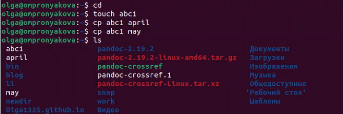{ #fig:pic1 width=100% }

Копирую нескольких файлов(april и may) в каталог monthly(рис. [-@fig:pic2]).

{ #fig:pic2 width=100% }

Копирование файлов monthly/may в произвольном каталоге с именем june(рис. [-@fig:pic3]).

{ #fig:pic3 width=100% }

Копирую каталог monthly в каталог monthly.00(рис. [-@fig:pic4]).

{ #fig:pic4 width=100% }

Копирую каталог monthly.00
в каталог /tmp(рис. [-@fig:pic5]) (рис. [-@fig:pic6]).

{ #fig:pic5 width=100% }

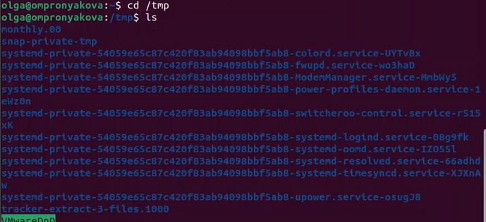{ #fig:pic6 width=100% }

Изменяю название файла april на july в домашнем каталоге(рис. [-@fig:pic7]).

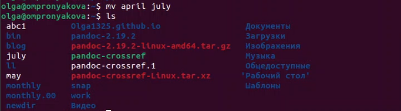{ #fig:pic7 width=100% }

Перемещаю файл july в каталог monthly.00(рис. [-@fig:pic8]).

{ #fig:pic8 width=100% }

Переименовываю каталог monthly.00 в monthly.01(рис. [-@fig:pic9]).

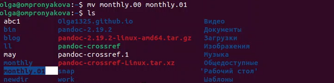{ #fig:pic9 width=100% }

Перемещаю каталог monthly.01в каталог reports(рис. [-@fig:pic10]).

{ #fig:pic10 width=100% }

Создаю файл ~/may с правом выполнения для владельца(рис. [-@fig:pic11]).

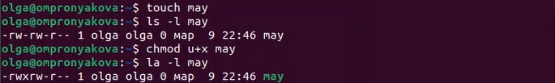{ #fig:pic11 width=100% }

Создаю каталог monthly с запретом на чтение для членов группы и всех остальных пользователей(рис. [-@fig:pic12]) (рис. [-@fig:pic13]).

{ #fig:pic12 width=100% }

{ #fig:pic13 width=100% }

Создаю файл ~/abc1 с правом записи для членов группы(рис. [-@fig:pic14]).

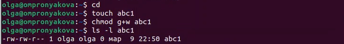{ #fig:pic14 width=100% }

Для просмотра используемых в операционной системе файловых систем можно воспользоваться командой mount без параметров(рис. [-@fig:pic15]).

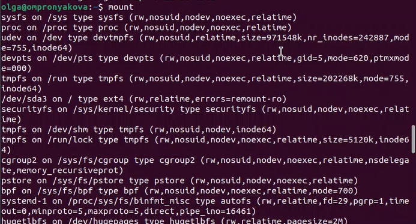{ #fig:pic15 width=100% }

Для определения объёма свободного пространства на файловой системе можно вос-
пользоваться командой df, которая выведет на экран список всех файловых систем
в соответствии с именами устройств, с указанием размера и точки монтирования(рис. [-@fig:pic16]).

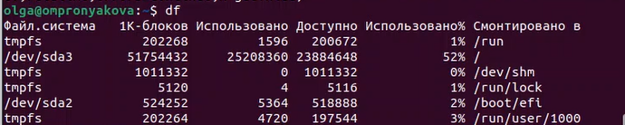{ #fig:pic16 width=100% }

Копируйте файл /usr/include/аio.h в домашний каталог и называю его equipment(рис. [-@fig:pic17]) (рис. [-@fig:pic18]) (рис. [-@fig:pic19]).

{ #fig:pic17 width=100% }

{ #fig:pic18 width=100% }

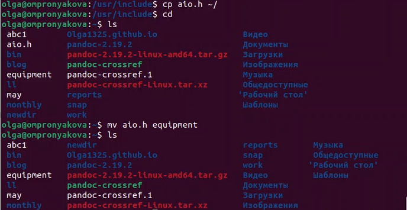{ #fig:pic19 width=100% }

В домашнем каталоге создаю директорию ~/ski.plases(рис. [-@fig:pic20]).

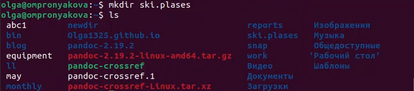{ #fig:pic20 width=100% }

Перемещаю файл equipment в каталог ~/ski.plases(рис. [-@fig:pic21]).

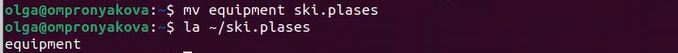{ #fig:pic21 width=100% }

Переимещаю файл ~/ski.plases/equipment в ~/ski.plases/equiplist(рис. [-@fig:pic22]).

{ #fig:pic22 width=100% }

Создаю в домашнем каталоге файл abc1 и копирую его в каталог ~/ski.plases, назовите его equiplist2(рис. [-@fig:pic23]).

{ #fig:pic23 width=100% }

Создаю каталог с именем equipment в каталоге ~/ski.plases(рис. [-@fig:pic24]).

{ #fig:pic24 width=100% }

Перемещаю файлы ~/ski.plases/equiplist и equiplist2 в каталог ~/ski.plases/equipment(рис. [-@fig:pic25]).

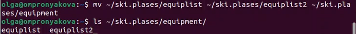{ #fig:pic25 width=100% }

Создаю и перемещаю каталог ~/newdir в каталог ~/ski.plases и называю его plans(рис. [-@fig:pic26]).

{ #fig:pic26 width=100% }

Создаю некоторые файлы и каталоги(рис. [-@fig:pic27]).

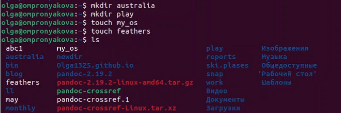{ #fig:pic27 width=100% }

Определяю опции команды chmod, необходимые для того, чтобы присвоить создвнным файлам выделенные права доступа, считая, что в начале таких прав нет(рис. [-@fig:pic28]) (рис. [-@fig:pic29]).

{ #fig:pic28 width=100% }

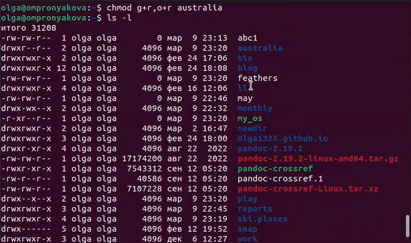{ #fig:pic29 width=100% }

Просмотриваю содержимое файла /etc/passwd(рис. [-@fig:pic30]) (рис. [-@fig:pic31]).

{ #fig:pic30 width=100% }

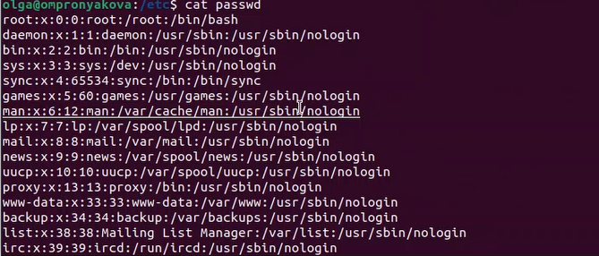{ #fig:pic31 width=100% }

Копирую файл ~/feathers в файл ~/file.old(рис. [-@fig:pic32]).

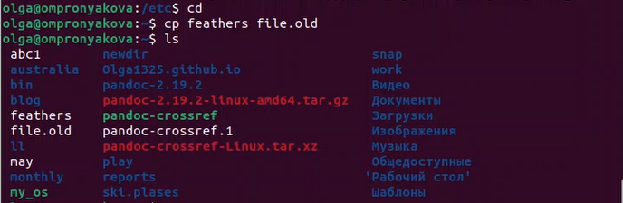{ #fig:pic32 width=100% }

Перемещаю файл ~/file.old в каталог ~/play(рис. [-@fig:pic33]).

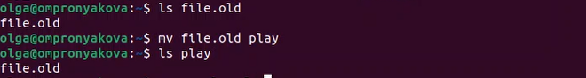{ #fig:pic33 width=100% }

Копирую каталог ~/play в каталог ~/fun(рис. [-@fig:pic34]).

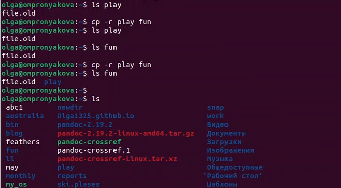{ #fig:pic34 width=100% }

Перемещаю каталог ~/fun в каталог ~/play и называю его games(рис. [-@fig:pic35]).

{ #fig:pic35 width=100% }

Лишаю владельца файла ~/feathers права на чтение(рис. [-@fig:pic36]).

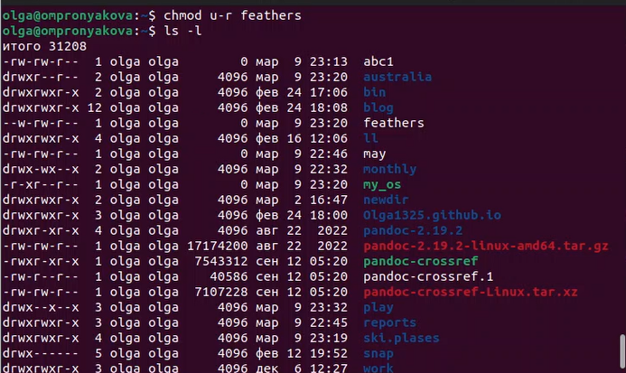{ #fig:pic36 width=100% }

Смотрю, что произойдёт, если я попытаюсь просмотреть файл ~/feathers командой cat(рис. [-@fig:pic37]).

{ #fig:pic37 width=100% }

Смотрю, что произойдёт, если я попытаюсь скопировать файл ~/feathers(рис. [-@fig:pic38]).

{ #fig:pic38 width=100% }

Даю владельцу файла ~/feathers право на чтение(рис. [-@fig:pic39]).

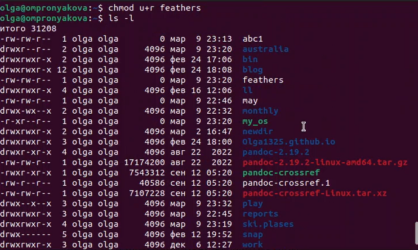{ #fig:pic39 width=100% }

Лишаю владельца каталога ~/play права на выполнение. Далее перехожу в каталог ~/play. Даю владельцу каталога ~/play право на выполнение(рис. [-@fig:pic40]).

{ #fig:pic40 width=100% }

Читаю man по командам и кратко их охарактеризовываю. Выполнение команды man mount(рис. [-@fig:pic41]) (рис. [-@fig:pic42]).

{ #fig:pic41 width=100% }

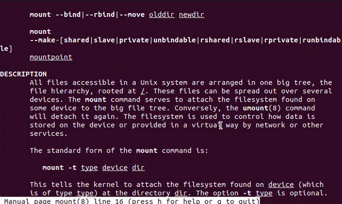{ #fig:pic42 width=100% }

Выполнение команды man fsck(рис. [-@fig:pic43]) (рис. [-@fig:pic44]).

{ #fig:pic43 width=100% }

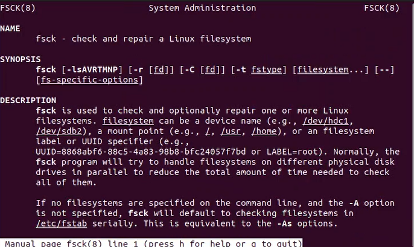{ #fig:pic44 width=100% }

Выполнение команды man mkfs(рис. [-@fig:pic45]) (рис. [-@fig:pic46]).

{ #fig:pic45 width=100% }

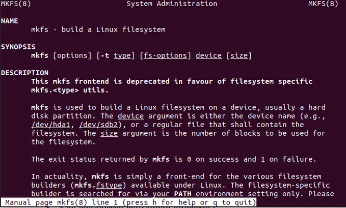{ #fig:pic46 width=100% }

Выполнение команды man kill(рис. [-@fig:pic47]) (рис. [-@fig:pic48]).

{ #fig:pic47 width=100% }

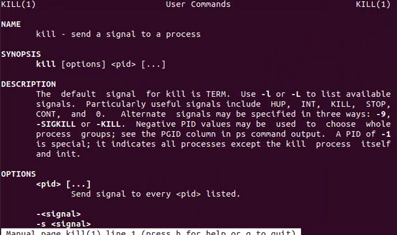{ #fig:pic48 width=100% }

# Ответы на контрольные вопросы

1. Дайте характеристику каждой файловой системе, существующей на жёстком диске компьютера, на котором вы выполняли лабораторную работу.

Ext2, Ext3, Ext4 или Extended Filesystem - это стандартная файловая система для Linux. Она была разработана еще для Minix. Она самая стабильная из всех существующих, кодовая база изменяется очень редко и эта файловая система содержит больше всего функций. Версия ext2 была разработана уже именно для Linux и получила много улучшений. В 2001 году вышла ext3, которая добавила еще больше стабильности благодаря использованию журналирования. В 2006 была выпущена версия ext4, которая используется во всех дистрибутивах Linux до сегодняшнего дня. В ней было внесено много улучшений, в том числе увеличен максимальный размер раздела до одного экзабайта.

Btrfs или B-Tree File System - это совершенно новая файловая система, которая сосредоточена на отказоустойчивости, легкости администрирования и восстановления данных. Файловая система объединяет в себе очень много новых интересных возможностей, таких как размещение на нескольких разделах, поддержка подтомов, изменение размера не лету, создание мгновенных снимков, а также высокая производительность. Но многими пользователями файловая система Btrfs считается нестабильной. Тем не менее, она уже используется как файловая система по умолчанию в OpenSUSE и SUSE Linux.

2. Приведите общую структуру файловой системы и дайте характеристику каждой директории первого уровня этой структуры.

/ — root каталог. Содержит в себе всю иерархию системы;

/bin — здесь находятся двоичные исполняемые файлы. Основные общие команды, хранящиеся отдельно от других программ в системе (прим.: pwd, ls, cat, ps);

/boot — тут расположены файлы, используемые для загрузки системы (образ initrd, ядро vmlinuz);

/dev — в данной директории располагаются файлы устройств (драйверов). С помощью этих файлов можно взаимодействовать с устройствами. К примеру, если это жесткий диск, можно подключить его к файловой системе. В файл принтера же можно написать напрямую и отправить задание на печать;

/etc — в этой директории находятся файлы конфигураций программ. Эти файлы позволяют настраивать системы, сервисы, скрипты системных демонов;

/home — каталог, аналогичный каталогу Users в Windows. Содержит домашние каталоги учетных записей пользователей (кроме root). При создании нового пользователя здесь создается одноименный каталог с аналогичным именем и хранит личные файлы этого пользователя;

/lib — содержит системные библиотеки, с которыми работают программы и модули ядра;

/lost+found — содержит файлы, восстановленные после сбоя работы системы. Система проведет проверку после сбоя и найденные файлы можно будет посмотреть в данном каталоге;

/media — точка монтирования внешних носителей. Например, когда вы вставляете диск в дисковод, он будет автоматически смонтирован в директорию /media/cdrom;

/mnt — точка временного монтирования. Файловые системы подключаемых устройств обычно монтируются в этот каталог для временного использования;

/opt — тут расположены дополнительные (необязательные) приложения. Такие программы обычно не подчиняются принятой иерархии и хранят свои файлы в одном подкаталоге (бинарные, библиотеки, конфигурации);

/proc — содержит файлы, хранящие информацию о запущенных процессах и о состоянии ядра ОС;

/root — директория, которая содержит файлы и личные настройки суперпользователя;

/run — содержит файлы состояния приложений. Например, PID-файлы или UNIX-сокеты;

/sbin — аналогично /bin содержит бинарные файлы. Утилиты нужны для настройки и администрирования системы суперпользователем;

/srv — содержит файлы сервисов, предоставляемых сервером (прим. FTP или Apache HTTP);

/sys — содержит данные непосредственно о системе. Тут можно узнать информацию о ядре, драйверах и устройствах;

/tmp — содержит временные файлы. Данные файлы доступны всем пользователям на чтение и запись. Стоит отметить, что данный каталог очищается при перезагрузке;

/usr — содержит пользовательские приложения и утилиты второго уровня, используемые пользователями, а не системой. Содержимое доступно только для чтения (кроме root). Каталог имеет вторичную иерархию и похож на корневой;

/var — содержит переменные файлы. Имеет подкаталоги, отвечающие за отдельные переменные. Например, логи будут храниться в /var/log, кэш в /var/cache, очереди заданий в /var/spool/ и так далее.

3. Какая операция должна быть выполнена, чтобы содержимое некоторой файловой системы было доступно операционной системе?

Монтирование тома.

4. Назовите основные причины нарушения целостности файловой системы. Как устранить повреждения файловой системы?

Отсутствие синхронизации между образом файловой системы в памяти и ее данными на диске в случае аварийного останова может привести к появлению следующих ошибок:

1) Один блок адресуется несколькими mode (принадлежит нескольким файлам).

2) Блок помечен как свободный, но в то же время занят (на него ссылается onode).

3) Блок помечен как занятый, но в то же время свободен (ни один inode на него не ссылается).

4) Неправильное число ссылок в inode (недостаток или избыток ссылающихся записей в каталогах).

5) Несовпадение между размером файла и суммарным размером адресуемых inode блоков.

6) Недопустимые адресуемые блоки (например, расположенные за пределами файловой системы).

7) “Потерянные” файлы (правильные inode, на которые не ссылаются записи каталогов).

8) Недопустимые или неразмещенные номера inode в записях каталогов.

5. Как создаётся файловая система?

mkfs - позволяет создать файловую систему Linux.

6. Дайте характеристику командам для просмотра текстовых файлов.

Cat - выводит содержимое файла на стандартное устройство вывода

7. Приведите основные возможности команды cp в Linux.

Cp – копирует или перемещает директорию, файлы.

8. Приведите основные возможности команды mv в Linux.

Mv - переименовать или переместить файл или директорию

9. Что такое права доступа? Как они могут быть изменены?

Права доступа к файлу или каталогу можно изменить, воспользовавшись командой chmod. Сделать это может владелец файла (или каталога) или пользователь с правами администратора.

# Выводы

Ознакомилась с файловой системой Linux, её структурой, именами и содержанием
каталогов. Приобрела практические навыки по применению команд для работы
с файлами и каталогами, по управлению процессами (и работами), по проверке исполь-
зования диска и обслуживанию файловой системы.

# Список литературы{.unnumbered}

[1. Лабораторная работа №5](https://esystem.rudn.ru/pluginfile.php/1975769/mod_resource/content/4/005-lab_files.pdf)

::: {#refs}
:::
