---
## Front matter
lang: ru-RU
title: Лабораторная работа №6
subtitle: Дисциплина - операционные системы
author:
  - Пронякова О.М.
institute:
  - Российский университет дружбы народов, Москва, Россия
date: 16 марта 2023

## i18n babel
babel-lang: russian
babel-otherlangs: english

## Formatting pdf
toc: false
toc-title: Содержание
slide_level: 2
aspectratio: 169
section-titles: true
theme: metropolis
header-includes:
 - \metroset{progressbar=frametitle,sectionpage=progressbar,numbering=fraction}
 - '\makeatletter'
 - '\beamer@ignorenonframefalse'
 - '\makeatother'
---

# Информация

## Докладчик

:::::::::::::: {.columns align=center}
::: {.column width="70%"}

  * Пронякова Ольга Максимовна
  * студент НКАбд-02-22
  * факультет физико-математических и естественных наук
  * Российский университет дружбы народов

:::
::::::::::::::

# Создание презентации

## Цель работы

Ознакомиться с инструментами поиска файлов и фильтрации текстовых данных.
Приобрести практические навыки: по управлению процессами (и заданиями), по
проверке использования диска и обслуживанию файловых систем.

## Основные задачи

1. Осуществите вход в систему, используя соответствующее имя пользователя.
2. Запишите в файл file.txt названия файлов, содержащихся в каталоге /etc. Допи-
шите в этот же файл названия файлов, содержащихся в вашем домашнем каталоге.
3. Выведите имена всех файлов из file.txt, имеющих расширение .conf, после чего
запишите их в новый текстовой файл conf.txt.
4. Определите, какие файлы в вашем домашнем каталоге имеют имена, начинавшиеся
с символа c? Предложите несколько вариантов, как это сделать.

## Основные задачи

5. Выведите на экран (по странично) имена файлов из каталога /etc, начинающиеся
с символа h.
6. Запустите в фоновом режиме процесс, который будет записывать в файл ~/logfile
файлы, имена которых начинаются с log.
7. Удалите файл ~/logfile.
8. Запустите из консоли в фоновом режиме редактор gedit.

## Основные задачи

9. Определите идентификатор процесса gedit, используя команду ps, конвейер и фильтр
grep. Как ещё можно определить идентификатор процесса?
10. Прочтите справку (man) команды kill, после чего используйте её для завершения
процесса gedit.
11. Выполните команды df и du, предварительно получив более подробную информацию
об этих командах, с помощью команды man.
12. Воспользовавшись справкой команды find, выведите имена всех директорий, имею-
щихся в вашем домашнем каталоге.

## Выполнение лабораторной работы

1. Вхожу в систему, используя соответствующее имя пользователя(рис. 1).

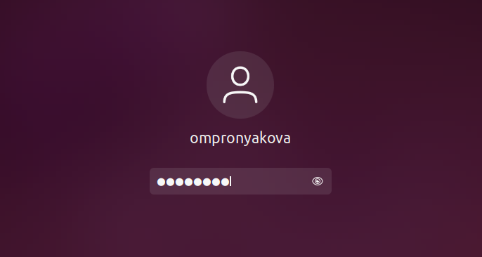{ #fig:pic1 width=100% }

## Выполнение лабораторной работы

2. Создаю файл file.txt и записываю в него названия файлов, содержащихся в каталоге /etc и в моем домашнем каталоге(рис. 2) (рис. 3).

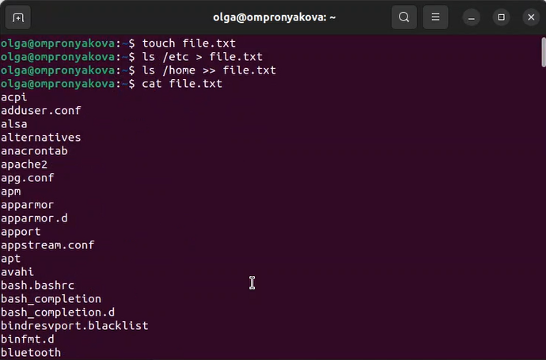{ #fig:pic2 width=100% }

## Выполнение лабораторной работы

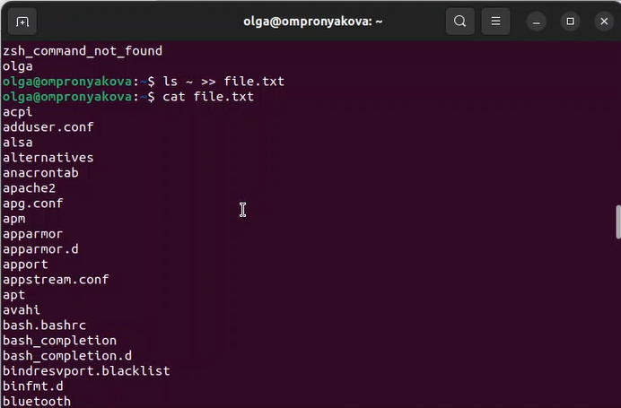{ #fig:pic3 width=100% }

## Выполнение лабораторной работы

3. Вывожу имена всех файлов из file.txt, имеющих расширение .conf, после чего
записываю их в новый текстовой файл conf.txt(рис. 4).

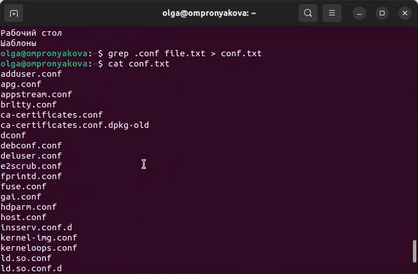{ #fig:pic4 width=100% }

## Выполнение лабораторной работы

4. Определяю, какие файлы в моем домашнем каталоге имеют имена, начинавшиеся
с символа c(рис. 5).

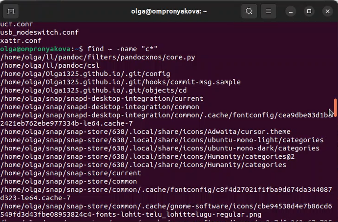{ #fig:pic5 width=100% }

## Выполнение лабораторной работы

5. Вывожу на экран имена файлов из каталога /etc, начинающиеся с символа h(рис. 6).

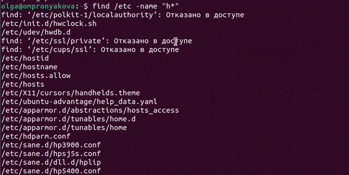{ #fig:pic6 width=100% }

## Выполнение лабораторной работы

6 - 7. Запускаю в фоновом режиме процесс, который будет записывать в файл ~/logfile
файлы, имена которых начинаются с log. Далее удаляю файл ~/logfile(рис. 7).

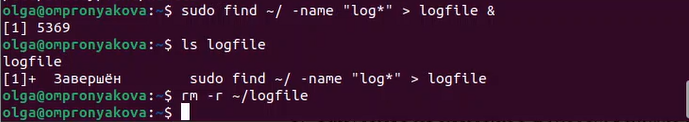{ #fig:pic7 width=100% }

## Выполнение лабораторной работы

8.Запускаю из консоли в фоновом режиме редактор gedit(рис. 8).

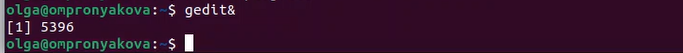{ #fig:pic8 width=100% }

## Выполнение лабораторной работы

9.Определяю идентификатор процесса gedit, используя команду ps, конвейер и фильтр
grep(рис. 9) (рис. 10).

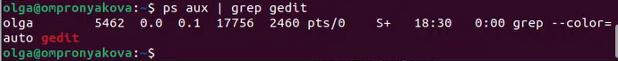{ #fig:pic9 width=100% }

## Выполнение лабораторной работы

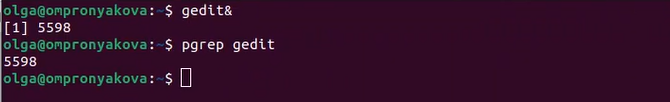{ #fig:pic10 width=100% }

## Выполнение лабораторной работы

10. Прочитала справку (man) команды kill, после чего использую её для завершения
процесса gedit(рис. 11).

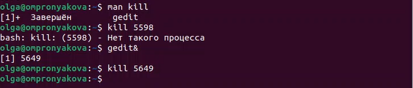{ #fig:pic11 width=100% }

## Выполнение лабораторной работы

11. Выполняю команды df и du, предварительно получив более подробную информацию
об этих командах, с помощью команды man(рис. 12).

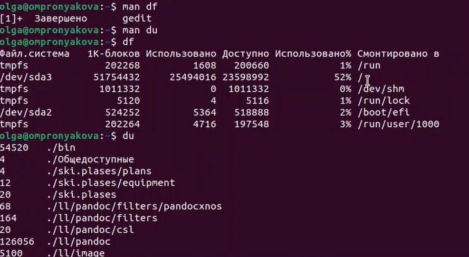{ #fig:pic12 width=100% }

## Выполнение лабораторной работы

12. Воспользовавшись справкой команды find, вывела имена всех директорий, имею-
щихся в моем домашнем каталоге(рис. 13) (рис. 14).

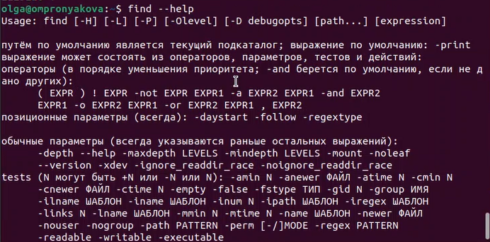{ #fig:pic13 width=100% }

## Выполнение лабораторной работы

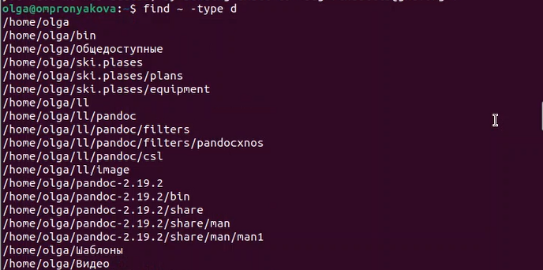{ #fig:pic14 width=100% }

## Выводы

Ознакомилась с инструментами поиска файлов и фильтрации текстовых данных.
Приобрела практические навыки: по управлению процессами (и заданиями), по
проверке использования диска и обслуживанию файловых систем.

