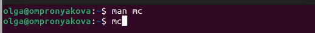

---
## Front matter
lang: ru-RU
title: Лабораторная работа №7
subtitle: Дисциплина - операционные системы
author:
  - Пронякова О.М.
institute:
  - Российский университет дружбы народов, Москва, Россия
date: 22 марта 2023

## i18n babel
babel-lang: russian
babel-otherlangs: english

## Formatting pdf
toc: false
toc-title: Содержание
slide_level: 2
aspectratio: 169
section-titles: true
theme: metropolis
header-includes:
 - \metroset{progressbar=frametitle,sectionpage=progressbar,numbering=fraction}
 - '\makeatletter'
 - '\beamer@ignorenonframefalse'
 - '\makeatother'
---

# Информация

## Докладчик

:::::::::::::: {.columns align=center}
::: {.column width="70%"}

  * Пронякова Ольга Максимовна
  * студент НКАбд-02-22
  * факультет физико-математических и естественных наук
  * Российский университет дружбы народов

:::
::::::::::::::

# Создание презентации

## Цель работы

Освоить основные возможности командной оболочки Midnight Commander. Приобрести навыки практической работы по просмотру каталогов и файлов; манипуляций.

## Основные задачи

1. Изучите информацию о mc, вызвав в командной строке man mc.
2. Запустите из командной строки mc, изучите его структуру и меню.
3. Выполните несколько операций в mc, используя управляющие клавиши (операции
с панелями; выделение/отмена выделения файлов, копирование/перемещение фай-
лов, получение информации о размере и правах доступа на файлы и/или каталоги
и т.п.)
4. Выполните основные команды меню левой (или правой) панели. Оцените степень
подробности вывода информации о файлах.

## Основные задачи

5. Используя возможности подменю Файл , выполните:
– просмотр содержимого текстового файла;
– редактирование содержимого текстового файла (без сохранения результатов
редактирования);
– создание каталога;
– копирование в файлов в созданный каталог.
6. С помощью соответствующих средств подменю Команда осуществите:
– поиск в файловой системе файла с заданными условиями (например, файла
с расширением .c или .cpp, содержащего строку main);
– выбор и повторение одной из предыдущих команд;
– переход в домашний каталог;
– анализ файла меню и файла расширений.

## Основные задачи

7. Вызовите подменю Настройки . Освойте операции, определяющие структуру экрана mc
(Full screen, Double Width, Show Hidden Files и т.д.)ю
8. Создайте текстовой файл text.txt.
9. Откройте этот файл с помощью встроенного в mc редактора.
10. Вставьте в открытый файл небольшой фрагмент текста, скопированный из любого
другого файла или Интернета.
11. Проделайте с текстом следующие манипуляции, используя горячие клавиши:
11.1. Удалите строку текста.
11.2. Выделите фрагмент текста и скопируйте его на новую строку.
11.3. Выделите фрагмент текста и перенесите его на новую строку.
11.4. Сохраните файл.
11.5. Отмените последнее действие.

## Основные задачи

11.6. Перейдите в конец файла (нажав комбинацию клавиш) и напишите некоторый
текст.
11.7. Перейдите в начало файла (нажав комбинацию клавиш) и напишите некоторый
текст.
11.8. Сохраните и закройте файл.
12. Откройте файл с исходным текстом на некотором языке программирования (напри-
мер C или Java)
13. Используя меню редактора, включите подсветку синтаксиса, если она не включена,
или выключите, если она включена.

## Выполнение лабораторной работы

Изучаю информацию о mc, вызвав в командной строке man mc. Запускаю из командной строки mc и изучаю его структуру и меню. Выполняю несколько операций в mc, используя управляющие клавиши. Оцениваю степень подробности вывода информации о файлах. Освоила операции, определяющие структуру экрана mc(рис. 1) (рис. 2).

{ #fig:pic1 width=100% }

## Выполнение лабораторной работы

{ #fig:pic2 width=100% }

## Выполнение лабораторной работы

Создаю текстовой файл text.txt. Открываю этот файл с помощью встроенного в mc редактора(рис. 3).

{ #fig:pic3 width=100% }

## Выполнение лабораторной работы

Вставляю в открытый файл небольшой фрагмент текста, скопированный из любого другого файла или Интернета(рис. 4).

{ #fig:pic4 width=100% }

## Выполнение лабораторной работы

Удаляю строку текста(рис. 5).

{ #fig:pic5 width=100% }

## Выполнение лабораторной работы

Выделяю фрагмент текста и копирую его на новую строку(рис. 6).

{ #fig:pic6 width=100% }

## Выполнение лабораторной работы

Выделяю фрагмент текста и переношу его на новую строку(рис. 7).

{ #fig:pic7 width=100% }

## Выполнение лабораторной работы

Сохраняю файл. Отменяю последнее действие. Перехожу в конец файла (нажав комбинацию клавиш) и пишу некоторый текст. Перехожу в начало файла (нажав комбинацию клавиш) и пишу некоторый текст.
Сохраняю и закрываю файл(рис. 8).

{ #fig:pic8 width=100% }

## Выполнение лабораторной работы

Создаю файл c.cpp на языке программирования С(рис. 9).

{ #fig:pic9 width=100% }

## Выполнение лабораторной работы

Открываю файл с исходным текстом в созданном файле c.cpp на языке программирования С(рис. 10).

{ #fig:pic10 width=100% }

## Выполнение лабораторной работы

Используя меню редактора, включаю подсветку синтаксиса(рис. 11).

{ #fig:pic11 width=100% }

## Выводы

Освоила основные возможности командной оболочки Midnight Commander. Приобрела навыки практической работы по просмотру каталогов и файлов; манипуляций
с ними.

