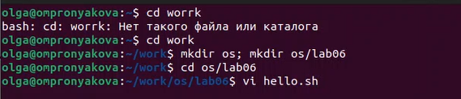
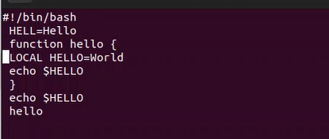
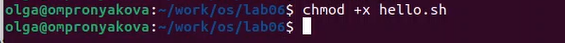
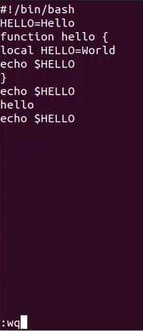

---
## Front matter
lang: ru-RU
title: Лабораторная работа №8
subtitle: Дисциплина - операционные системы
author:
  - Пронякова О.М.
institute:
  - Российский университет дружбы народов, Москва, Россия
date: 27 марта 2023

## i18n babel
babel-lang: russian
babel-otherlangs: english

## Formatting pdf
toc: false
toc-title: Содержание
slide_level: 2
aspectratio: 169
section-titles: true
theme: metropolis
header-includes:
 - \metroset{progressbar=frametitle,sectionpage=progressbar,numbering=fraction}
 - '\makeatletter'
 - '\beamer@ignorenonframefalse'
 - '\makeatother'
---

# Информация

## Докладчик

:::::::::::::: {.columns align=center}
::: {.column width="70%"}

  * Пронякова Ольга Максимовна
  * студент НКАбд-02-22
  * факультет физико-математических и естественных наук
  * Российский университет дружбы народов

:::
::::::::::::::

# Создание презентации

## Цель работы

Познакомиться с операционной системой Linux. Получить практические навыки работы с редактором vi, установленным по умолчанию практически во всех дистрибутивах.

## Основные задачи

1. Ознакомиться с теоретическим материалом.
2. Ознакомиться с редактором vi.
3. Выполнить упражнения, используя команды vi.
4. Создайте каталог с именем ~/work/os/lab06.
5. Перейдите во вновь созданный каталог.
6. Вызовите vi и создайте файл hello.sh

## Основные задачи

7. Нажмите клавишу i и вводите следующий текст.
8. Нажмите клавишу Esc для перехода в командный режим после завершения ввода
екста.
9. Нажмите : для перехода в режим последней строки и внизу вашего экрана появится
приглашение в виде двоеточия.
10. Нажмите w (записать) и q (выйти), а затем нажмите клавишу Enter для сохранения
вашего текста и завершения работы.
11. Сделайте файл исполняемым

## Основные задачи

12. Вызовите vi на редактирование файла
13. Установите курсор в конец слова HELL второй строки.
14. Перейдите в режим вставки и замените на HELLO. Нажмите Esc для возврата в команд-
ный режим.
15. Установите курсор на четвертую строку и сотрите слово LOCAL.
16. Перейдите в режим вставки и наберите следующий текст: local, нажмите Esc для
возврата в командный режим.

## Основные задачи

17. Установите курсор на последней строке файла. Вставьте после неё строку, содержащую
следующий текст: echo $HELLO.
18. Нажмите Esc для перехода в командный режим.
19. Удалите последнюю строку.
20. Введите команду отмены изменений u для отмены последней команды.
21. Введите символ : для перехода в режим последней строки. Запишите произведённые
изменения и выйдите из vi.

## Выполнение лабораторной работы

Создаю каталог с именем ~/work/os/lab06. Перехожу во вновь созданный каталог. Вызовите vi и создайте файл hello.sh(рис. 1).

## Выполнение лабораторной работы

{ #fig:pic1 width=100% }

## Выполнение лабораторной работы

Нажимаю клавишу i и ввожу текст. Нажимаю клавишу Esc для перехода в командный режим после завершения ввода текста. Нажимаю : для перехода в режим последней строки. Нажимаю w и q, а затем клавишу Enter для сохранения моего текста и завершения работы(рис. 2).

## Выполнение лабораторной работы

{ #fig:pic2 width=100% }

## Выполнение лабораторной работы

Сделала файл исполняемым(рис. 3).

{ #fig:pic3 width=100% }

## Выполнение лабораторной работы

Вызываю vi на редактирование файла(рис. 4).

{ #fig:pic4 width=100% }

## Выполнение лабораторной работы

Останавливаю курсор в конец слова HELL второй строки. Перехожу в режим вставки и заменяю на HELLO. Нажимаю Esc для возврата в командный режим. Устанавливаю курсор на четвертую строку и стираю слово LOCAL. Перехожу в режим вставки и набираю следующий текст: local, нажимаю Esc для возврата в командный режим. Устанавливаю курсор на последней строке файла. Вставляю после неё строку, содержащую следующий текст: echo $HELLO. Нажимаю Esc для перехода в командный режим. Удаляю последнюю строку. Ввожу команду отмены изменений u для отмены последней команды. Ввожу символ : для перехода в режим последней строки. Записываю произведённые изменения и выхожу из vi(рис. 5).

## Выполнение лабораторной работы

{ #fig:pic5 width=100% }

## Выводы

Познакомилась с операционной системой Linux. Получила практические навыки работы с редактором vi, установленным по умолчанию практически во всех дистрибутивах.

