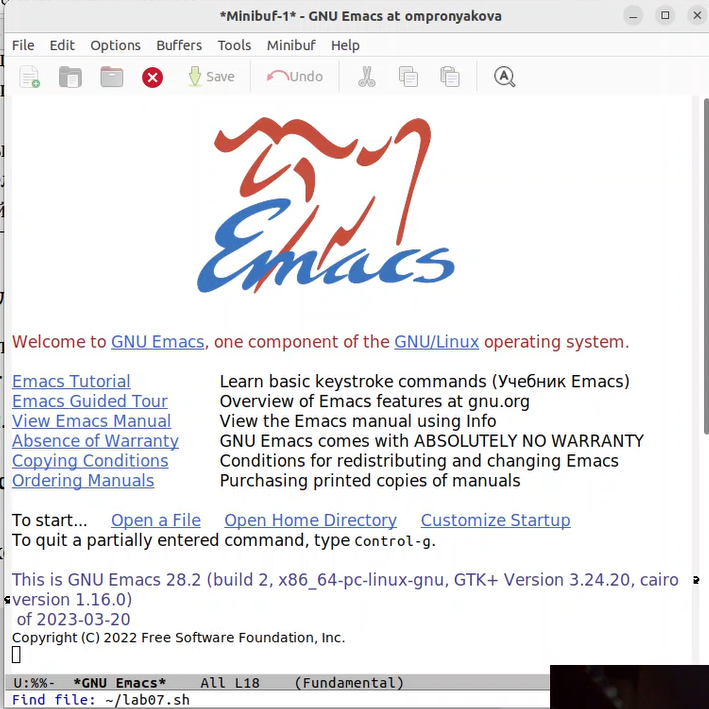
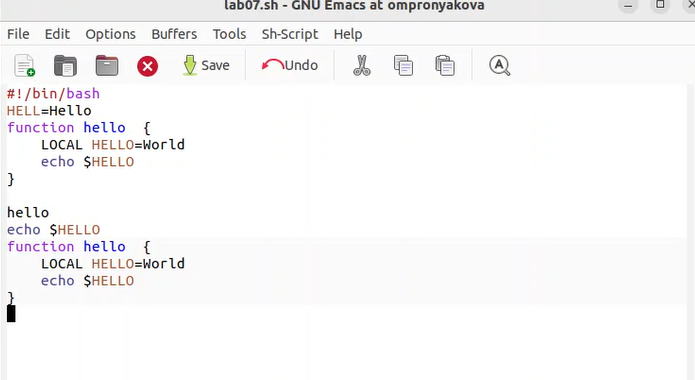
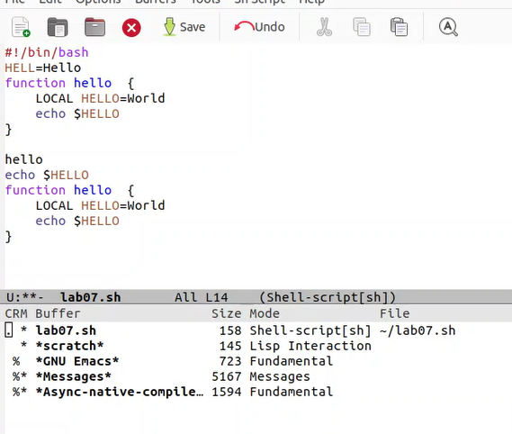
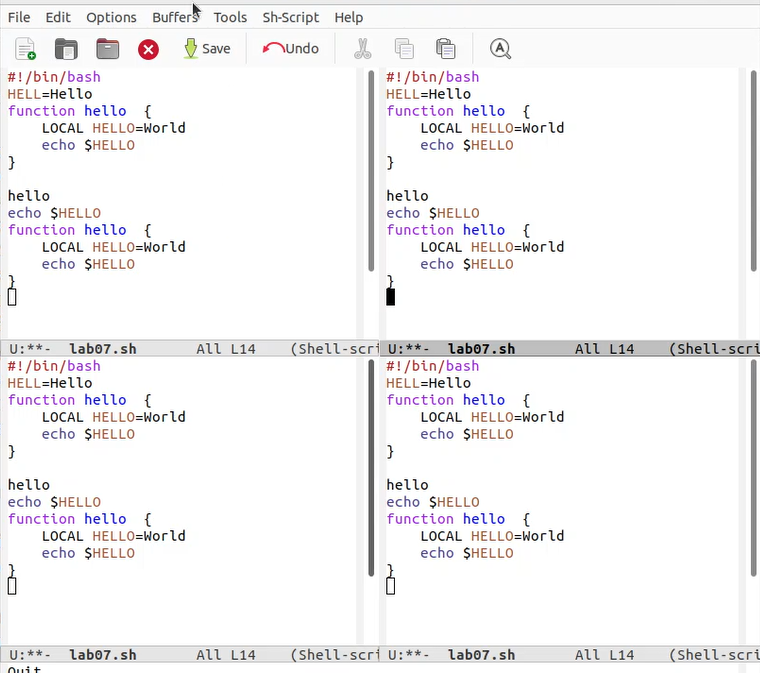
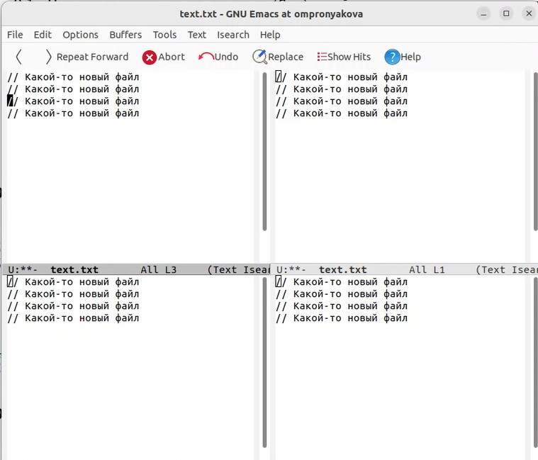
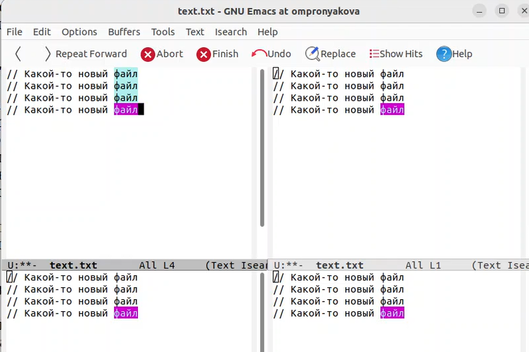
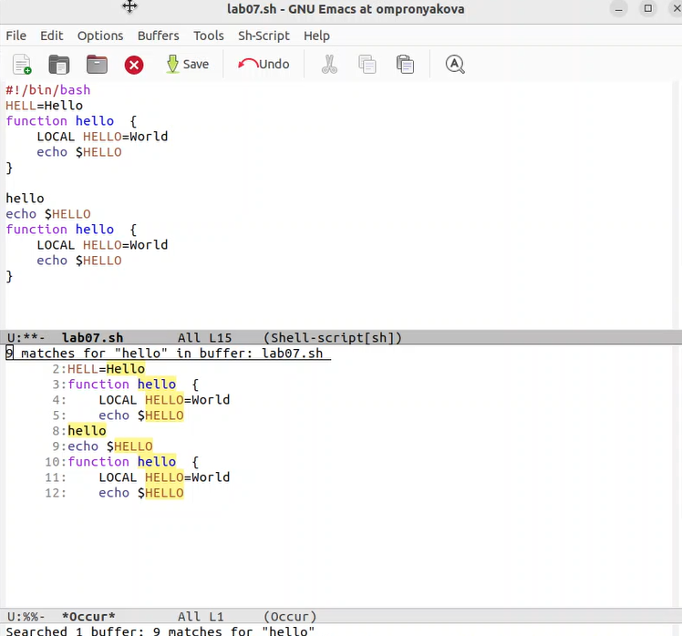

---
## Front matter
lang: ru-RU
title: Лабораторная работа №9
subtitle: Дисциплина - операционные системы
author:
  - Пронякова О.М.
institute:
  - Российский университет дружбы народов, Москва, Россия
date: 30 марта 2023

## i18n babel
babel-lang: russian
babel-otherlangs: english

## Formatting pdf
toc: false
toc-title: Содержание
slide_level: 2
aspectratio: 169
section-titles: true
theme: metropolis
header-includes:
 - \metroset{progressbar=frametitle,sectionpage=progressbar,numbering=fraction}
 - '\makeatletter'
 - '\beamer@ignorenonframefalse'
 - '\makeatother'
---

# Информация

## Докладчик

:::::::::::::: {.columns align=center}
::: {.column width="70%"}

  * Пронякова Ольга Максимовна
  * студент НКАбд-02-22
  * факультет физико-математических и естественных наук
  * Российский университет дружбы народов

:::
::::::::::::::

# Создание презентации

## Цель работы

Познакомиться с операционной системой Linux. Получить практические навыки работы с редактором Emacs.

## Основные задачи

1. Открыть emacs.
2. Создать файл lab07.sh с помощью комбинации Ctrl-x Ctrl-f (C-x C-f).
3. Наберите текст
4. Сохранить файл с помощью комбинации Ctrl-x Ctrl-s (C-x C-s).
5. Проделать с текстом стандартные процедуры редактирования, каждое действие долж-
но осуществляться комбинацией клавиш.
5.1. Вырезать одной командой целую строку (С-k).
5.2. Вставить эту строку в конец файла (C-y).

## Основные задачи

5.3. Выделить область текста (C-space).
5.4. Скопировать область в буфер обмена (M-w).
5.5. Вставить область в конец файла.
5.6. Вновь выделить эту область и на этот раз вырезать её (C-w).
5.7. Отмените последнее действие (C-/).
6. Научитесь использовать команды по перемещению курсора.
6.1. Переместите курсор в начало строки (C-a).
6.2. Переместите курсор в конец строки (C-e).
6.3. Переместите курсор в начало буфера (M-<).
6.4. Переместите курсор в конец буфера (M->).

## Основные задачи

7. Управление буферами.
7.1. Вывести список активных буферов на экран (C-x C-b).
7.2. Переместитесь во вновь открытое окно (C-x) o со списком открытых буферов
и переключитесь на другой буфер.
7.3. Закройте это окно (C-x 0).
7.4. Теперь вновь переключайтесь между буферами, но уже без вывода их списка на
экран (C-x b).
8. Управление окнами.
8.1. Поделите фрейм на 4 части: разделите фрейм на два окна по вертикали (C-x 3),
а затем каждое из этих окон на две части по горизонтали (C-x 2)
8.2. В каждом из четырёх созданных окон откройте новый буфер (файл) и введите
несколько строк текста.

## Основные задачи

9. Режим поиска
9.1. Переключитесь в режим поиска (C-s) и найдите несколько слов, присутствующих
в тексте.
9.2. Переключайтесь между результатами поиска, нажимая C-s.
9.3. Выйдите из режима поиска, нажав C-g.
9.4. Перейдите в режим поиска и замены (M-%), введите текст, который следует найти
и заменить, нажмите Enter , затем введите текст для замены. После того как будут
подсвечены результаты поиска, нажмите ! для подтверждения замены.
9.5. Испробуйте другой режим поиска, нажав M-s o. Объясните, чем он отличается от
обычного режима?

## Выполнение лабораторной работы

Открываю emacs. Создаю файл lab07.sh с помощью комбинации Ctrl-x Ctrl-f (C-x C-f)(рис. 1).

## Выполнение лабораторной работы

{ #fig:pic1 width=100% }

## Выполнение лабораторной работы

Набираю определенный текст. Сохранz. файл с помощью комбинации Ctrl-x Ctrl-s (C-x C-s). Проделываю с текстом стандартные процедуры редактирования. Вырезаю одной командой целую строку (С-k). Вставляю эту строку в конец файла (C-y). Выделяю область текста (C-space). Копирую область в буфер обмена (M-w). Вставляю область в конец файла. Вновь выделяю эту область и на этот раз вырезаю её (C-w). Отменяю последнее действие (C-/). Использую команды по перемещению курсора. Перемещаю курсор в начало строки (C-a). Перемещаю курсор в конец строки (C-e). Перемещаю курсор в начало буфера (M-<). Перемещаю курсор в конец буфера (M->)(рис. 2).

## Выполнение лабораторной работы

{ #fig:pic2 width=100% }

## Выполнение лабораторной работы

Вывожу список активных буферов на экран (C-x C-b). Перемещаюсь во вновь открытое окно (C-x) o со списком открытых буферов и переключаюсь на другой буфер. Закрываю это окно (C-x 0). Теперь вновь переключаюсь между буферами, но уже без вывода их списка на экран (C-x b)(рис. 3).

## Выполнение лабораторной работы

{ #fig:pic3 width=100% }

## Выполнение лабораторной работы

Делю фрейм на 4 части: разделяю фрейм на два окна по вертикали (C-x 3), а затем каждое из этих окон на две части по горизонтали (C-x 2)(рис. 4).

## Выполнение лабораторной работы

{ #fig:pic4 width=100% }

## Выполнение лабораторной работы

В каждом из четырёх созданных окон открываю новый буфер (файл) и ввожу несколько строк текста(рис. 5).

## Выполнение лабораторной работы

{ #fig:pic5 width=100% }

## Выполнение лабораторной работы

Переключаюсь в режим поиска (C-s) и нахожу несколько слов, присутствующих в тексте. Переключаюсь между результатами поиска, нажимая C-s. Выхожу из режима поиска, нажав C-g(рис. 6).

## Выполнение лабораторной работы

{ #fig:pic6 width=100% }

## Выполнение лабораторной работы

Перехожу в режим поиска и замены (M-%), ввожу текст, который следует найти и заменить, нажимаю Enter, затем ввожу текст для замены. После того как будут подсвечены результаты поиска, нажимаю ! для подтверждения замены. Пробую другой режим поиска, нажав M-s o.(рис. 7).

## Выполнение лабораторной работы

{ #fig:pic7 width=100% }

## Выводы

Познакомилась с операционной системой Linux. Получила практические навыки работы с редактором Emacs.

