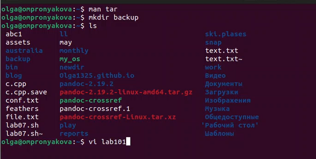
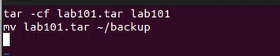
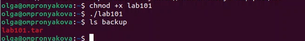
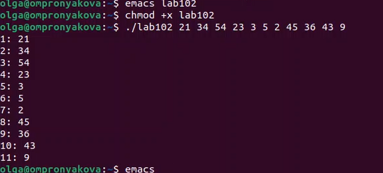
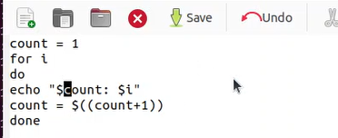
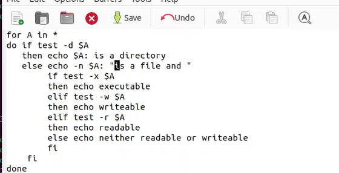
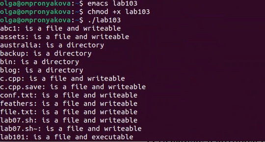
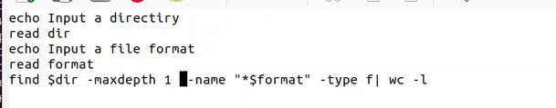
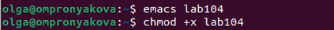
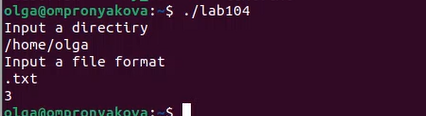

---
## Front matter
lang: ru-RU
title: Лабораторная работа №10
subtitle: Дисциплина - операционные системы
author:
  - Пронякова О.М.
institute:
  - Российский университет дружбы народов, Москва, Россия
date: 13 апреля 2023

## i18n babel
babel-lang: russian
babel-otherlangs: english

## Formatting pdf
toc: false
toc-title: Содержание
slide_level: 2
aspectratio: 169
section-titles: true
theme: metropolis
header-includes:
 - \metroset{progressbar=frametitle,sectionpage=progressbar,numbering=fraction}
 - '\makeatletter'
 - '\beamer@ignorenonframefalse'
 - '\makeatother'
---

# Информация

## Докладчик

:::::::::::::: {.columns align=center}
::: {.column width="70%"}

  * Пронякова Ольга Максимовна
  * студент НКАбд-02-22
  * факультет физико-математических и естественных наук
  * Российский университет дружбы народов

:::
::::::::::::::

# Создание презентации

## Цель работы

Изучить основы программирования в оболочке ОС UNIX/Linux. Научиться писать небольшие командные файлы.

## Основные задачи

1. Написать скрипт, который при запуске будет делать резервную копию самого себя (то
есть файла, в котором содержится его исходный код) в другую директорию backup
в вашем домашнем каталоге. При этом файл должен архивироваться одним из ар-
хиваторов на выбор zip, bzip2 или tar. Способ использования команд архивации
необходимо узнать, изучив справку.
2. Написать пример командного файла, обрабатывающего любое произвольное число
аргументов командной строки, в том числе превышающее десять. Например, скрипт
может последовательно распечатывать значения всех переданных аргументов.

## Основные задачи

3. Написать командный файл — аналог команды ls (без использования самой этой ко-
манды и команды dir). Требуется, чтобы он выдавал информацию о нужном каталоге
и выводил информацию о возможностях доступа к файлам этого каталога.
4. Написать командный файл, который получает в качестве аргумента командной строки
формат файла (.txt, .doc, .jpg, .pdf и т.д.) и вычисляет количество таких файлов
в указанной директории. Путь к директории также передаётся в виде аргумента ко-
мандной строки.

## Выполнение лабораторной работы

Способ использования команд архивации узнаю, изучив справку. Пишу скрипт, который при запуске будет делать резервную копию самого себя (то есть файла, в котором содержится его исходный код) в другую директорию backup в моем домашнем каталоге. При этом файл архивируется фрхиватором tar(рис. 1) (рис. 2).

{ #fig:pic1 width=100% }

## Выполнение лабораторной работы

{ #fig:pic2 width=100% }

## Выполнение лабораторной работы

Результат выполнения команд(рис. 3).

{ #fig:pic3 width=100% }

## Выполнение лабораторной работы

Пишу пример командного файла, обрабатывающего любое произвольное число аргументов командной строки, в том числе превышающее десять(рис. 4) (рис. 5).

{ #fig:pic4 width=100% }

## Выполнение лабораторной работы

{ #fig:pic5 width=100% }

## Выполнение лабораторной работы

Пишу командный файл — аналог команды ls (без использования самой этой команды и команды dir). Требуется, чтобы он выдавал информацию о нужном каталоге и выводил информацию о возможностях доступа к файлам этого каталога(рис. 6) (рис. 7).

{ #fig:pic6 width=100% }

## Выполнение лабораторной работы

{ #fig:pic7 width=100% }

## Выполнение лабораторной работы

Пишу командный файл, который получает в качестве аргумента командной строки формат файла (.txt, .doc, .jpg, .pdf и т.д.) и вычисляет количество таких файлов в указанной директории. Путь к директории также передаётся в виде аргумента командной строки(рис. 8) (рис. 9) (рис. 10).

{ #fig:pic8 width=100% }

## Выполнение лабораторной работы

{ #fig:pic9 width=100% }

{ #fig:pic10 width=100% }

## Выводы

Изучила основы программирования в оболочке ОС UNIX/Linux. Научилась писать небольшие командные файлы.

