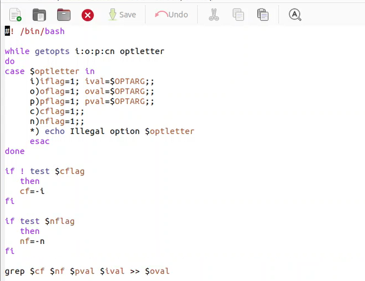
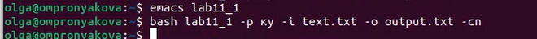
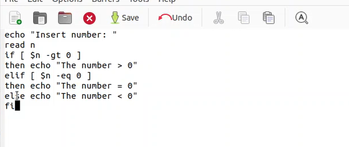
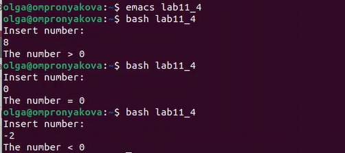
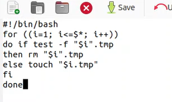
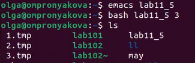
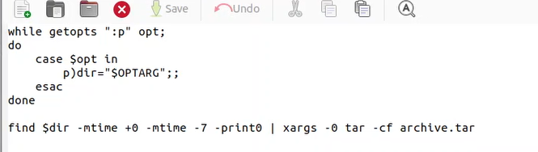
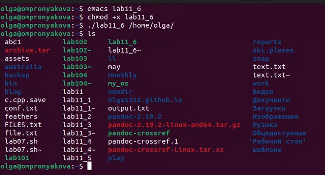
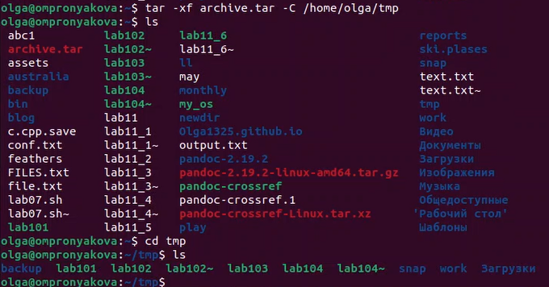

---
## Front matter
lang: ru-RU
title: Лабораторная работа №11
subtitle: Дисциплина - операционные системы
author:
  - Пронякова О.М.
institute:
  - Российский университет дружбы народов, Москва, Россия
date: 17 апреля 2023

## i18n babel
babel-lang: russian
babel-otherlangs: english

## Formatting pdf
toc: false
toc-title: Содержание
slide_level: 2
aspectratio: 169
section-titles: true
theme: metropolis
header-includes:
 - \metroset{progressbar=frametitle,sectionpage=progressbar,numbering=fraction}
 - '\makeatletter'
 - '\beamer@ignorenonframefalse'
 - '\makeatother'
---

# Информация

## Докладчик

:::::::::::::: {.columns align=center}
::: {.column width="70%"}

  * Пронякова Ольга Максимовна
  * студент НКАбд-02-22
  * факультет физико-математических и естественных наук
  * Российский университет дружбы народов

:::
::::::::::::::

# Создание презентации

## Цель работы

Изучить основы программирования в оболочке ОС UNIX. Научится писать более сложные командные файлы с использованием логических управляющих конструкций и циклов.

## Основные задачи

1. Используя команды getopts grep, написать командный файл, который анализирует
командную строку с ключами:
– -iinputfile — прочитать данные из указанного файла;
– -ooutputfile — вывести данные в указанный файл;
– -pшаблон — указать шаблон для поиска;
– -C — различать большие и малые буквы;
– -n — выдавать номера строк.
а затем ищет в указанном файле нужные строки, определяемые ключом -p.
2. Написать на языке Си программу, которая вводит число и определяет, является ли оно
больше нуля, меньше нуля или равно нулю. Затем программа завершается с помощью
функции exit(n), передавая информацию в о коде завершения в оболочку. Команд-
ный файл должен вызывать эту программу и, проанализировав с помощью команды
$?, выдать сообщение о том, какое число было введено.

## Основные задачи

3. Написать командный файл, создающий указанное число файлов, пронумерованных
последовательно от 1 до 𝑁 (например 1.tmp, 2.tmp, 3.tmp,4.tmp и т.д.). Число файлов,
которые необходимо создать, передаётся в аргументы командной строки. Этот же ко-
мандный файл должен уметь удалять все созданные им файлы (если они существуют).
4. Написать командный файл, который с помощью команды tar запаковывает в архив
все файлы в указанной директории. Модифицировать его так, чтобы запаковывались
только те файлы, которые были изменены менее недели тому назад (использовать
команду find).

## Выполнение лабораторной работы

Используя команды getopts grep, пишу командный файл, который анализирует командную строку с ключами:
– -iinputfile — прочитать данные из указанного файла;
– -ooutputfile — вывести данные в указанный файл;
– -pшаблон — указать шаблон для поиска;
– -C — различать большие и малые буквы;
– -n — выдавать номера строк.
а затем ищет в указанном файле нужные строки, определяемые ключом -p.(рис. 1) (рис. 2).

## Выполнение лабораторной работы

{ #fig:pic1 width=100% }

## Выполнение лабораторной работы

{ #fig:pic2 width=100% }

## Выполнение лабораторной работы

Пишу на языке Си программу, которая вводит число и определяет, является ли оно больше нуля, меньше нуля или равно нулю. Затем программа завершается с помощью функции exit(n), передавая информацию в о коде завершения в оболочку. Командный файл вызывает эту программу и, проанализировав с помощью команды $?, выдает сообщение о том, какое число было введено(рис. 3) (рис. 4).

## Выполнение лабораторной работы

{ #fig:pic3 width=100% }

## Выполнение лабораторной работы

{ #fig:pic4 width=100% }

## Выполнение лабораторной работы

Пишу командный файл, создающий указанное число файлов, пронумерованных последовательно от 1 до 𝑁 (например 1.tmp, 2.tmp, 3.tmp,4.tmp и т.д.). Число файлов, которые необходимо создать, передаётся в аргументы командной строки. Этот же командный файл удаляет все созданные им файлы (если они существуют)(рис. 5) (рис. 6).

## Выполнение лабораторной работы

{ #fig:pic5 width=100% }

## Выполнение лабораторной работы

{ #fig:pic6 width=100% }

## Выполнение лабораторной работы

Пишу командный файл, который с помощью команды tar запаковывает в архив все файлы в указанной директории. Модифицирую его так, чтобы запаковывались только те файлы, которые были изменены менее недели тому назад(рис. 7) (рис. 8) (рис. 9) (рис. 10).

## Выполнение лабораторной работы

{ #fig:pic7 width=100% }

## Выполнение лабораторной работы

{ #fig:pic8 width=100% }

## Выполнение лабораторной работы

{ #fig:pic9 width=100% }

## Выполнение лабораторной работы

{ #fig:pic10 width=100% }

## Выводы

Изучила основы программирования в оболочке ОС UNIX. Научилась писать более сложные командные файлы с использованием логических управляющих конструкций и циклов.

