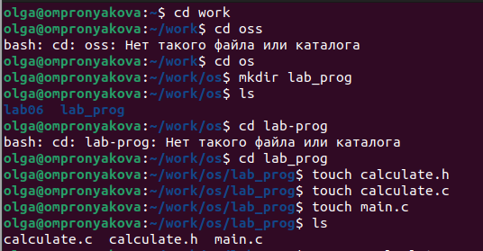
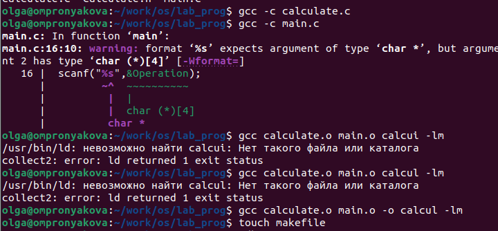
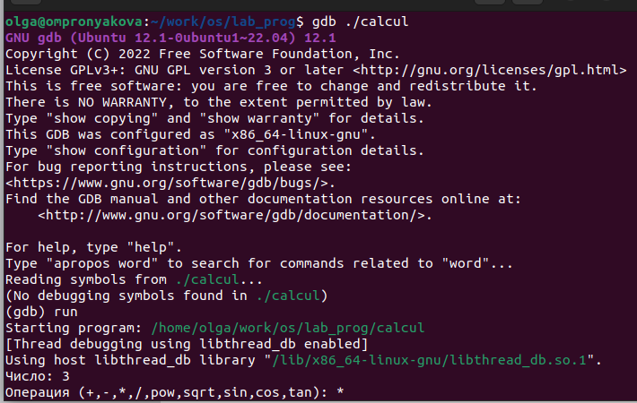
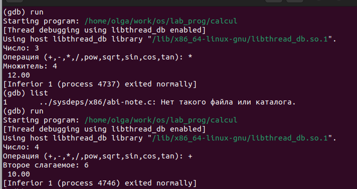
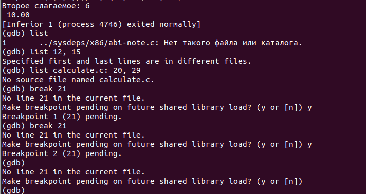

---
## Front matter
lang: ru-RU
title: Лабораторная работа №13
subtitle: Дисциплина - операционные системы
author:
  - Пронякова О.М.
institute:
  - Российский университет дружбы народов, Москва, Россия
date: 4 мая 2023

## i18n babel
babel-lang: russian
babel-otherlangs: english

## Formatting pdf
toc: false
toc-title: Содержание
slide_level: 2
aspectratio: 169
section-titles: true
theme: metropolis
header-includes:
 - \metroset{progressbar=frametitle,sectionpage=progressbar,numbering=fraction}
 - '\makeatletter'
 - '\beamer@ignorenonframefalse'
 - '\makeatother'
---

# Информация

## Докладчик

:::::::::::::: {.columns align=center}
::: {.column width="70%"}

  * Пронякова Ольга Максимовна
  * студент НКАбд-02-22
  * факультет физико-математических и естественных наук
  * Российский университет дружбы народов

:::
::::::::::::::

# Создание презентации

## Цель работы

Приобрести простейшие навыки разработки, анализа, тестирования и отладки приложений в ОС типа UNIX/Linux на примере создания на языке программирования С калькулятора с простейшими функциями.

## Основные задачи

1. В домашнем каталоге создайте подкаталог ~/work/os/lab_prog.
2. Создайте в нём файлы: calculate.h, calculate.c, main.c.
3. Выполните компиляцию программы посредством gcc
4. При необходимости исправьте синтаксические ошибки.
5. Создайте Makefile
6. С помощью gdb выполните отладку программы calcul (перед использованием gdb
исправьте Makefile):
– Запустите отладчик GDB, загрузив в него программу для отладки
7. С помощью утилиты splint попробуйте проанализировать коды файлов calculate.c
и main.c

## Выполнение лабораторной работы

В домашнем каталоге создаю подкаталог ~/work/os/lab_prog. Создаю в нём файлы: calculate.h, calculate.c, main.c. Это будет примитивнейший калькулятор, способный складывать, вычитать, умножать и делить, возводить число в степень, брать квадратный корень, вычислять sin, cos, tan.
При запуске он будет запрашивать первое число, операцию, второе число. После этого
программа выведет результат и остановится(рис. 1).

## Выполнение лабораторной работы

{ #fig:pic1 width=100% }

## Выполнение лабораторной работы

Выполняю компиляцию программы посредством gcc. Создаю Makefile(рис. 2).

## Выполнение лабораторной работы

{ #fig:pic2 width=100% }

## Выполнение лабораторной работы

С помощью gdb выполнияю отладку программы calcul (перед использованием gdb
исправляю Makefile):
– Запускаю отладчик GDB, загрузив в него программу для отладки. ля запуска программы внутри отладчика ввожу команду run(рис. 3) (рис. 4).

## Выполнение лабораторной работы

{ #fig:pic3 width=100% }

## Выполнение лабораторной работы

{ #fig:pic4 width=100% }

## Выполнение лабораторной работы

Для постраничного (по 9 строк) просмотра исходного код использую команду
list. Для просмотра строк с 12 по 15 основного файла использую list с параметрами. Для просмотра определённых строк не основного файла использую list с параметрами. становлю точку останова в файле calculate.c на строке номер 21. Вывожу информацию об имеющихся в проекте точка останова. Запускаю программу внутри отладчика и убеждаюсь, что программа остановится в момент прохождения точки останова. Команда backtrace покажет весь стек вызываемых функций от начала программы до текущего места. Убераю точки останова. С помощью утилиты splint(рис. 5).

## Выполнение лабораторной работы

{ #fig:pic5 width=100% }

## Выводы

Приобрела простейшие навыки разработки, анализа, тестирования и отладки приложений в ОС типа UNIX/Linux на примере создания на языке программирования С калькулятора с простейшими функциями.

