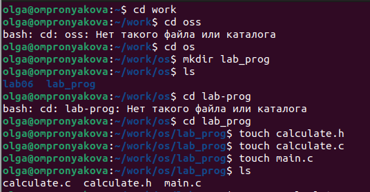
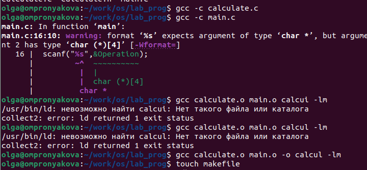
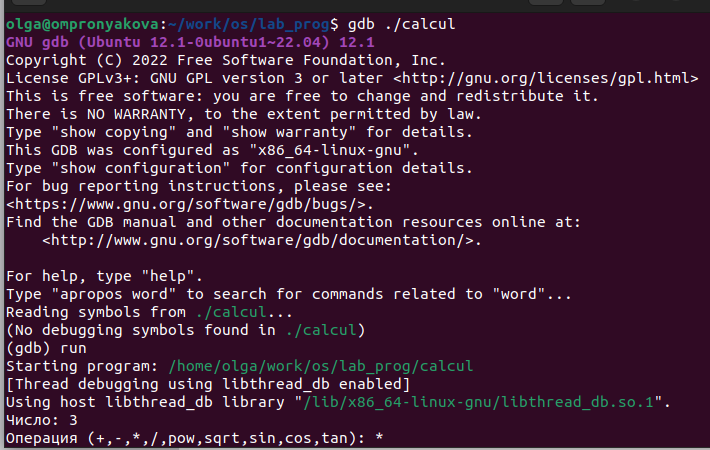
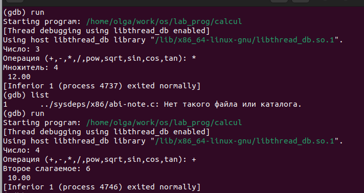
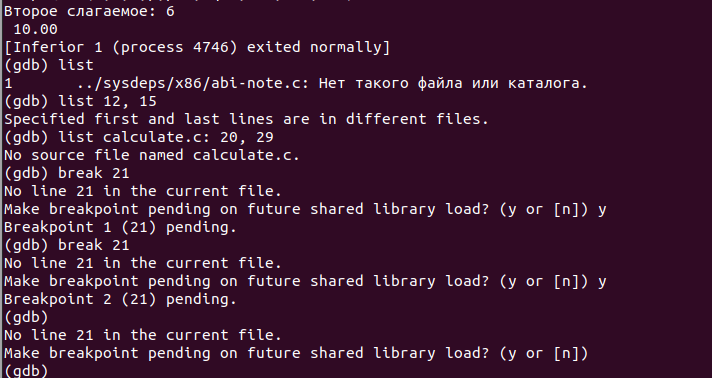

---
## Front matter
title: "Лабораторная работа №13"
subtitle: "Дисциплина: операционные системы"
author: "Пронякова Ольга Максимовна"

## Generic otions
lang: ru-RU
toc-title: "Содержание"

## Bibliography
bibliography: bib/cite.bib
csl: pandoc/csl/gost-r-7-0-5-2008-numeric.csl

## Pdf output format
toc: true # Table of contents
toc-depth: 2
lof: true # List of figures
lot: true # List of tables
fontsize: 12pt
linestretch: 1.5
papersize: a4
documentclass: scrreprt
## I18n polyglossia
polyglossia-lang:
  name: russian
  options:
	- spelling=modern
	- babelshorthands=true
polyglossia-otherlangs:
  name: english
## I18n babel
babel-lang: russian
babel-otherlangs: english
## Fonts
mainfont: PT Serif
romanfont: PT Serif
sansfont: PT Sans
monofont: PT Mono
mainfontoptions: Ligatures=TeX
romanfontoptions: Ligatures=TeX
sansfontoptions: Ligatures=TeX,Scale=MatchLowercase
monofontoptions: Scale=MatchLowercase,Scale=0.9
## Biblatex
biblatex: true
biblio-style: "gost-numeric"
biblatexoptions:
  - parentracker=true
  - backend=biber
  - hyperref=auto
  - language=auto
  - autolang=other*
  - citestyle=gost-numeric
## Pandoc-crossref LaTeX customization
figureTitle: "Рис."
tableTitle: "Таблица"
listingTitle: "Листинг"
lofTitle: "Список иллюстраций"
lotTitle: "Список таблиц"
lolTitle: "Листинги"
## Misc options
indent: true
header-includes:
  - \usepackage{indentfirst}
  - \usepackage{float} # keep figures where there are in the text
  - \floatplacement{figure}{H} # keep figures where there are in the text
---

# Цель работы

Приобрести простейшие навыки разработки, анализа, тестирования и отладки приложений в ОС типа UNIX/Linux на примере создания на языке программирования С калькулятора с простейшими функциями.

# Задание

1. В домашнем каталоге создайте подкаталог ~/work/os/lab_prog.
2. Создайте в нём файлы: calculate.h, calculate.c, main.c.
3. Выполните компиляцию программы посредством gcc
4. При необходимости исправьте синтаксические ошибки.
5. Создайте Makefile
6. С помощью gdb выполните отладку программы calcul (перед использованием gdb
исправьте Makefile):
– Запустите отладчик GDB, загрузив в него программу для отладки
7. С помощью утилиты splint попробуйте проанализировать коды файлов calculate.c
и main.c

# Выполнение лабораторной работы

В домашнем каталоге создаю подкаталог ~/work/os/lab_prog. Создаю в нём файлы: calculate.h, calculate.c, main.c. Это будет примитивнейший калькулятор, способный складывать, вычитать, умножать и делить, возводить число в степень, брать квадратный корень, вычислять sin, cos, tan.
При запуске он будет запрашивать первое число, операцию, второе число. После этого
программа выведет результат и остановится(рис. [-@fig:pic1]).

{ #fig:pic1 width=100% }

Выполняю компиляцию программы посредством gcc. Создаю Makefile(рис. [-@fig:pic2]).

{ #fig:pic2 width=100% }

С помощью gdb выполнияю отладку программы calcul (перед использованием gdb
исправляю Makefile):
– Запускаю отладчик GDB, загрузив в него программу для отладки. ля запуска программы внутри отладчика ввожу команду run(рис. [-@fig:pic3]) (рис. [-@fig:pic4]).

{ #fig:pic3 width=100% }

{ #fig:pic4 width=100% }

Для постраничного (по 9 строк) просмотра исходного код использую команду
list. Для просмотра строк с 12 по 15 основного файла использую list с параметрами. Для просмотра определённых строк не основного файла использую list с параметрами. становлю точку останова в файле calculate.c на строке номер 21. Вывожу информацию об имеющихся в проекте точка останова. Запускаю программу внутри отладчика и убеждаюсь, что программа остановится в момент прохождения точки останова. Команда backtrace покажет весь стек вызываемых функций от начала программы до текущего места. Убераю точки останова. С помощью утилиты splint(рис. [-@fig:pic5]).

{ #fig:pic5 width=100% }

# Выводы

Приобрела простейшие навыки разработки, анализа, тестирования и отладки приложений в ОС типа UNIX/Linux на примере создания на языке программирования С калькулятора с простейшими функциями.

# Список литературы{.unnumbered}

[1. Лабораторная работа №13](https://esystem.rudn.ru/pluginfile.php/1975785/mod_resource/content/5/013-lab_prog.pdf)

::: {#refs}
:::
