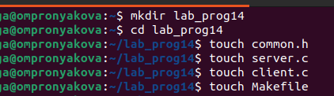
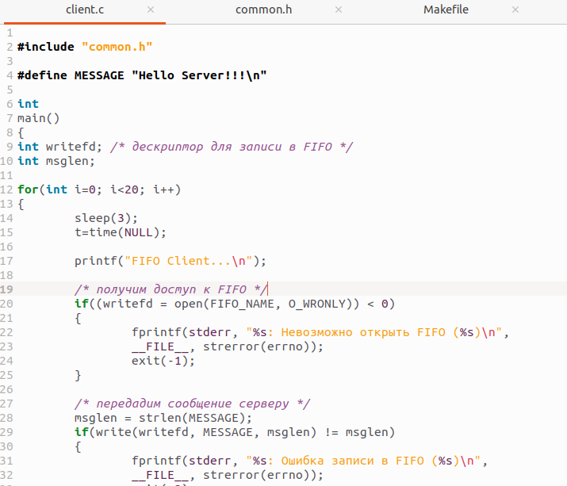
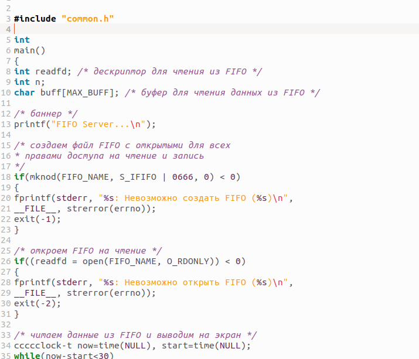

---
## Front matter
lang: ru-RU
title: Лабораторная работа №14
subtitle: Дисциплина - операционные системы
author:
  - Пронякова О.М.
institute:
  - Российский университет дружбы народов, Москва, Россия
date: 9 мая 2023

## i18n babel
babel-lang: russian
babel-otherlangs: english

## Formatting pdf
toc: false
toc-title: Содержание
slide_level: 2
aspectratio: 169
section-titles: true
theme: metropolis
header-includes:
 - \metroset{progressbar=frametitle,sectionpage=progressbar,numbering=fraction}
 - '\makeatletter'
 - '\beamer@ignorenonframefalse'
 - '\makeatother'
---

# Информация

## Докладчик

:::::::::::::: {.columns align=center}
::: {.column width="70%"}

  * Пронякова Ольга Максимовна
  * студент НКАбд-02-22
  * факультет физико-математических и естественных наук
  * Российский университет дружбы народов

:::
::::::::::::::

# Создание презентации

## Цель работы

Приобретение практических навыков работы с именованными каналами.

## Основные задачи

Изучите приведённые в тексте программы server.c и client.c. Взяв данные примеры
за образец, напишите аналогичные программы, внеся следующие изменения:
1. Работает не 1 клиент, а несколько (например, два).
2. Клиенты передают текущее время с некоторой периодичностью (например, раз в пять
секунд). Используйте функцию sleep() для приостановки работы клиента.
3. Сервер работает не бесконечно, а прекращает работу через некоторое время (напри-
мер, 30 сек). Используйте функцию clock() для определения времени работы сервера.
Что будет в случае, если сервер завершит работу, не закрыв канал?

## Выполнение лабораторной работы

В терминале создаю каталог и соответствующие файлы, которые заполняю определенными данными(рис.1).

{ #fig:pic1 width=100% }

## Выполнение лабораторной работы

Пишу аналогичные программы, внеся некоторые изменения - работает не 1 клиент, а несколько, клиенты передают текущее время с некоторой периодичностью(ииспользую функцию sleep() для приостановки работы клиента), сервер работает не бесконечно, а прекращает работу через некоторое время(используйте функцию clock() для определения времени работы сервера)(рис. 2) (рис. 3).

## Выполнение лабораторной работы

{ #fig:pic2 width=100% }

## Выполнение лабораторной работы

{ #fig:pic3 width=100% }

## Выводы

Приобрела практические навыки работы с именованными каналами.
