---
## Front matter
lang: ru-RU
title: Индивидуальный проект 1 этап
subtitle: Дисциплина - операционные системы
author:
  - Пронякова О.М.
institute:
  - Российский университет дружбы народов, Москва, Россия
date: 25 февраля 2023

## i18n babel
babel-lang: russian
babel-otherlangs: english

## Formatting pdf
toc: false
toc-title: Содержание
slide_level: 2
aspectratio: 169
section-titles: true
theme: metropolis
header-includes:
 - \metroset{progressbar=frametitle,sectionpage=progressbar,numbering=fraction}
 - '\makeatletter'
 - '\beamer@ignorenonframefalse'
 - '\makeatother'
---

# Информация

## Докладчик

:::::::::::::: {.columns align=center}
::: {.column width="70%"}

  * Пронякова Ольга Максимовна
  * студент НКАбд-02-22
  * факультет физико-математических и естественных наук
  * Российский университет дружбы народов

:::
::::::::::::::

# Создание презентации

## Цель работы

Размещение на Github pages заготовки для персонального сайта.

## Основные задачи

1. Установить необходимое программное обеспечение.
2. Скачать шаблон темы сайта.
3. Разместить его на хостинге git.
4. Установить параметр для URLs сайта.
5. Разместить заготовку сайта на Github pages.

## Что такое Hugo?

 - Hugo — это конструктор статических веб-сайтов, который позволяет создавать веб-сайты практически без кода. Генераторы статических сайтов обычно позволяют писать контент на простом языке разметки, таком как Markdown.

## Этапы реализации проекта

 - Скачиваем исполняемый файл hugo для того, чтобы генерировать страницы сайта(рис. 1)

{ #fig:pic1 width=100% }

## Этапы реализации проекта

 - Далее создаем новый репозиторий(рис. 2)
 
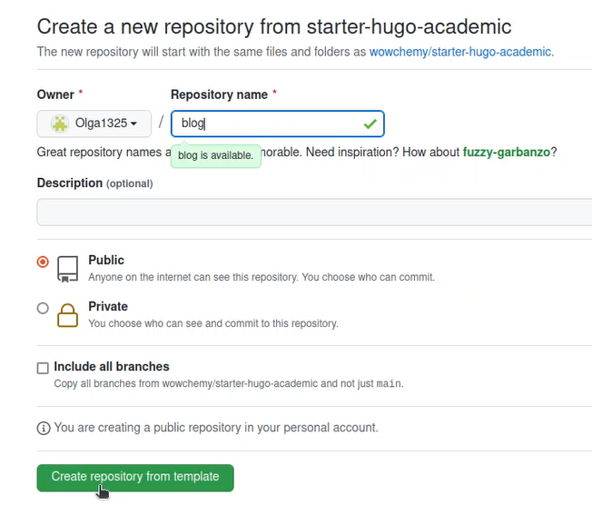{ #fig:pic7 width=100% }

## Этапы реализации проекта

 - Клонируем репозиторий(рис. 3)
 
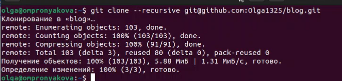{ #fig:pic9 width=100% }

## Этапы реализации проекта

 - Выполняем команду ~/bin/hugo server. В результате работы данной команды мы получили ссылку, по которой перешли на сайт(рис. 4) (рис. 5).
 
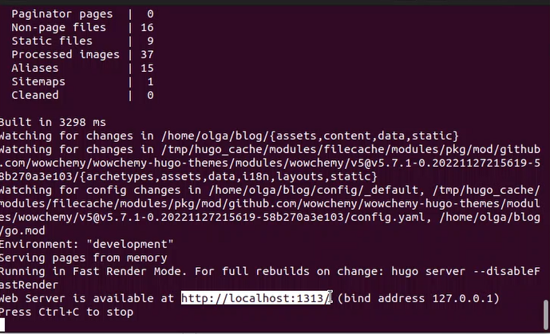{ #fig:pic15 width=100% }

## Этапы реализации проекта

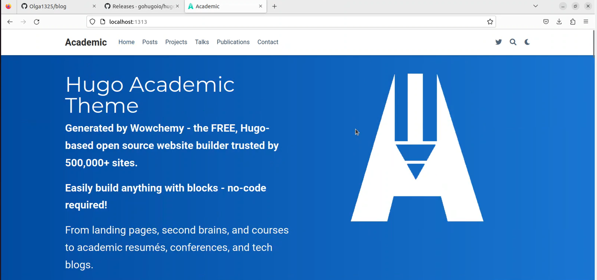{ #fig:pic16 width=100% }

## Этапы реализации проекта

 - Создаем репозиторий с названием моего пользователя на Github(рис. 6)

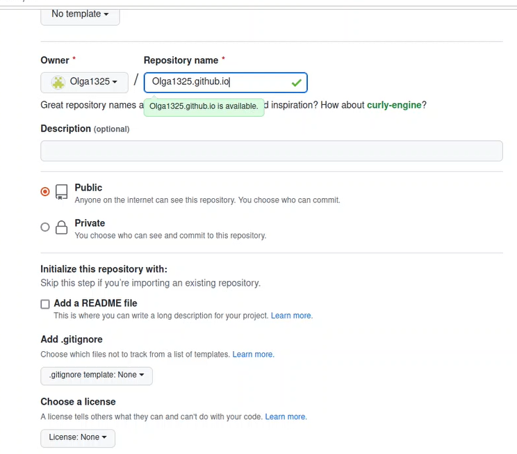{ #fig:pic17 width=100% }

## Этапы реализации проекта

 - Далее клонируем репозиторий и проверяем его наличие(рис. 7) (рис. 8).

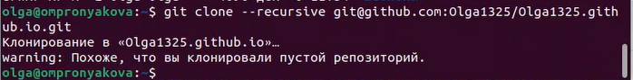{ #fig:pic20 width=100% }

## Этапы реализации проекта

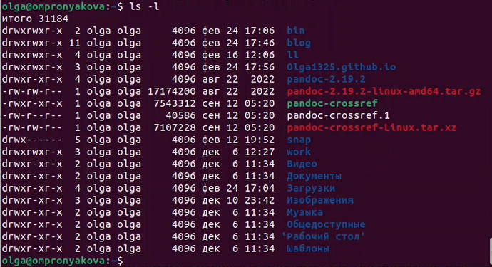{ #fig:pic21 width=100% }

## Этапы реализации проекта

 - Создаем ветку main(рис. 9)

{ #fig:pic22 width=100% }

## Этапы реализации проекта

 - Создаем пустой файл README.md, чтобы активировать репозиторий, и добавляем данный файл на Github(рис. 10)

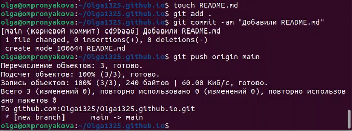{ #fig:pic23 width=100% }

## Этапы реализации проекта

 - Переходим в каталог blog и выполняем команду, которая поможет подключить созданный репозиторий к папке public внутри файла blog. Это нужно сделать, чтобы эффективно генерировать страницы сайта(рис. 11)
 
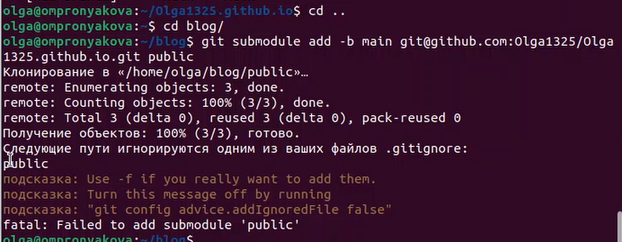{ #fig:pic26 width=100% }

## Этапы реализации проекта

 - Добавляем файлы на Github и проверяем наличие файлов в репозитории(рис. 12)
 
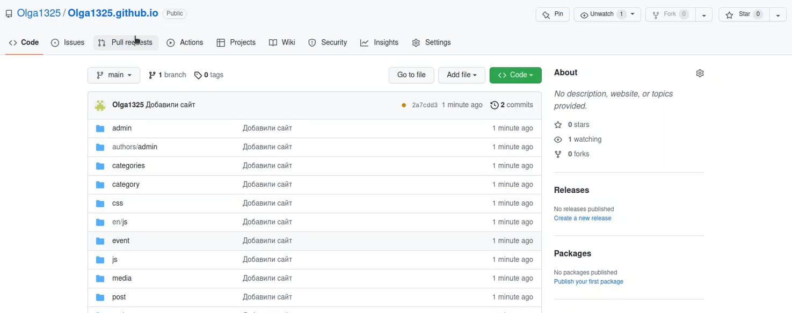{ #fig:pic34 width=100% }

## Этапы реализации проекта

 - Далее копируем ссылку на наш новй сайт и проверяем его наличие(рис. 13) (рис. 14)

{ #fig:pic35 width=100% }

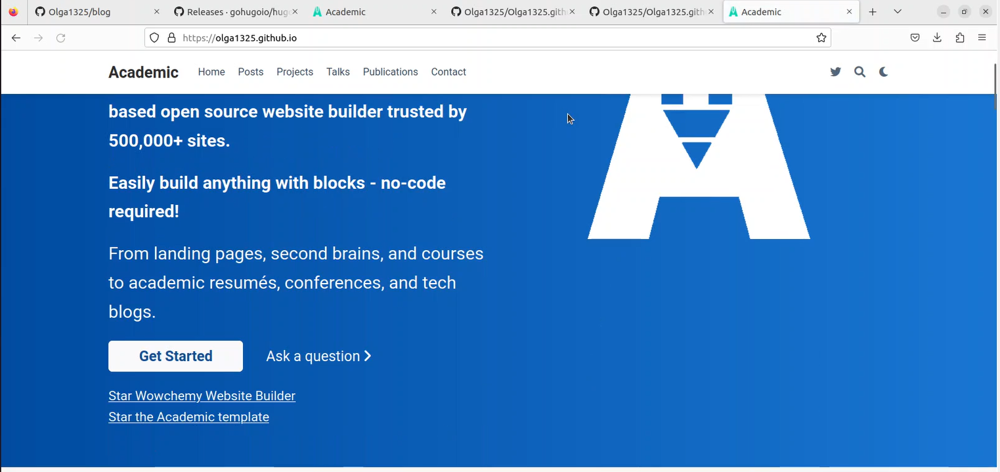{ #fig:pic36 width=100% }

## Выводы

 - Научилась создавать статистические сайты с помощью hugo. Разместила на Github pages заготовки для персонального сайта.

