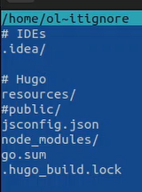

---
## Front matter
title: "Индивидуальный проект 1 этап"
subtitle: "Дисциплина: операционные системы"
author: "Пронякова Ольга Максимовна"

## Generic otions
lang: ru-RU
toc-title: "Содержание"

## Bibliography
bibliography: bib/cite.bib
csl: pandoc/csl/gost-r-7-0-5-2008-numeric.csl

## Pdf output format
toc: true # Table of contents
toc-depth: 2
lof: true # List of figures
lot: true # List of tables
fontsize: 12pt
linestretch: 1.5
papersize: a4
documentclass: scrreprt
## I18n polyglossia
polyglossia-lang:
  name: russian
  options:
	- spelling=modern
	- babelshorthands=true
polyglossia-otherlangs:
  name: english
## I18n babel
babel-lang: russian
babel-otherlangs: english
## Fonts
mainfont: PT Serif
romanfont: PT Serif
sansfont: PT Sans
monofont: PT Mono
mainfontoptions: Ligatures=TeX
romanfontoptions: Ligatures=TeX
sansfontoptions: Ligatures=TeX,Scale=MatchLowercase
monofontoptions: Scale=MatchLowercase,Scale=0.9
## Biblatex
biblatex: true
biblio-style: "gost-numeric"
biblatexoptions:
  - parentracker=true
  - backend=biber
  - hyperref=auto
  - language=auto
  - autolang=other*
  - citestyle=gost-numeric
## Pandoc-crossref LaTeX customization
figureTitle: "Рис."
tableTitle: "Таблица"
listingTitle: "Листинг"
lofTitle: "Список иллюстраций"
lotTitle: "Список таблиц"
lolTitle: "Листинги"
## Misc options
indent: true
header-includes:
  - \usepackage{indentfirst}
  - \usepackage{float} # keep figures where there are in the text
  - \floatplacement{figure}{H} # keep figures where there are in the text
---

# Цель работы

Размещение на Github pages заготовки для персонального сайта.

# Задание

1. Установить необходимое программное обеспечение.
2. Скачать шаблон темы сайта.
3. Разместить его на хостинге git.
4. Установить параметр для URLs сайта.
5. Разместить заготовку сайта на Github pages.

# Выполнение индивидуального пректа

Скачиваем исполняемый файл hugo для того, чтобы генерировать страницы сайта(рис. [-@fig:pic1]).

{ #fig:pic1 width=100% }

Данный файл появляется в папке "Загрузки". Далее его надо разархивировать(рис. [-@fig:pic2]).

{ #fig:pic2 width=100% }

Создаем папку bin с помощью команды mkdir(рис. [-@fig:pic3]).

{ #fig:pic3 width=100% }

Помещаем в папку bin исполняемый файл hugo(рис. [-@fig:pic4]).

{ #fig:pic4 width=100% }

Заходим в ТУИС и находим ссылку на репозиторий шаблона индивидуального сайта(рис. [-@fig:pic5]).

{ #fig:pic5 width=100% }

Далее создаем новый репозиторий(рис. [-@fig:pic6]) (рис. [-@fig:pic7]).

{ #fig:pic6 width=100% }

{ #fig:pic7 width=100% }

Копируем ссылку для клонирования репозитория(рис. [-@fig:pic8]).

{ #fig:pic8 width=100% }

Клонируем репозиторий(рис. [-@fig:pic9]).

{ #fig:pic9 width=100% }

Переходим в каталог blog и просматриваем файлы(рис. [-@fig:pic10]).

{ #fig:pic10 width=100% }

Выполняем команду ~/bin/hugo(рис. [-@fig:pic11]).

{ #fig:pic11 width=100% }

Далее просматриваем файлы. Замечаем, что появился новый файл public. Переходим в mc и удаляем данный файл(рис. [-@fig:pic12]) (рис. [-@fig:pic13]).

{ #fig:pic12 width=100% }

{ #fig:pic13 width=100% }

Выполняем команду ~/bin/hugo server(рис. [-@fig:pic14]).

{ #fig:pic14 width=100% }

В результате работы данной команды мы получили ссылку, по которой перешли на сайт(рис. [-@fig:pic15]) (рис. [-@fig:pic16]).

{ #fig:pic15 width=100% }

{ #fig:pic16 width=100% }

Создаем репозиторий с названием моего пользователя на Github(рис. [-@fig:pic17]).

{ #fig:pic17 width=100% }

Открываем терминал и проверяем наличие файла blog(рис. [-@fig:pic18]).

{ #fig:pic18 width=100% }

Копируем ссылку с Github(рис. [-@fig:pic19]).

{ #fig:pic19 width=100% }

Далее клонируем репозиторий и проверяем его наличие(рис. [-@fig:pic20]) (рис. [-@fig:pic21]).

{ #fig:pic20 width=100% }

{ #fig:pic21 width=100% }

Переходим в него и создаем ветку main(рис. [-@fig:pic22]).

{ #fig:pic22 width=100% }

Создаем пустой файл README.md, чтобы активировать репозиторий, и добавляем данный файл на Github(рис. [-@fig:pic23]). 

{ #fig:pic23 width=100% }

Проверяем наличие данного файла в созданном репозитории на Github(рис. [-@fig:pic24]). 

{ #fig:pic24 width=100% }

Копируем ссылку(рис. [-@fig:pic25]). 

{ #fig:pic25 width=100% }

Переходим в каталог blog и выполняем команду, которая поможет подключить созданный репозиторий к папке public внутри файла blog. Это нужно сделать, чтобы эффективно генерировать страницы сайта(рис. [-@fig:pic26]). 

{ #fig:pic26 width=100% }

Запускаем mc, находим .gitignore. С помощью клавиши f4 открываем его и комментируем public(рис. [-@fig:pic27]). 

{ #fig:pic27 width=100% }

Затем с помощью команды cat проверяем выполнение наших действий(рис. [-@fig:pic28]). 

{ #fig:pic28 width=100% }

Повторяем предыдущую команду и видим, что все добавляется в index. Далее вводим команду ~/bin/hugo(рис. [-@fig:pic29]). 

{ #fig:pic29 width=100% }

Проверяем наличие добавленных файлов в папке public(рис. [-@fig:pic30]). 

{ #fig:pic30 width=100% }

Переходим в public и проверяем, что каталог подключен к созданному репозиторию(рис. [-@fig:pic31]). 

{ #fig:pic31 width=100% }

Добавляем файлы на Github(рис. [-@fig:pic32]) (рис. [-@fig:pic33]). 

{ #fig:pic32 width=100% }

{ #fig:pic33 width=100% }

Проверяем наличие файлов в репозитории на Github(рис. [-@fig:pic34]).

{ #fig:pic34 width=100% }

Далее копируем ссылку на наш новй сайт и проверяем его наличие(рис. [-@fig:pic35]) (рис. [-@fig:pic36]).

{ #fig:pic35 width=100% }

{ #fig:pic36 width=100% }

# Выводы

Разместила на Github pages заготовки для персонального сайта.

# Список литературы{.unnumbered}

[1. Первый этап индивидуального пректа](https://www.youtube.com/watch?v=OpsSv0RE3C4)

::: {#refs}
:::
