---
## Front matter
lang: ru-RU
title: Индивидуальный проект (2 этап)
subtitle: Дисциплина - операционные системы
author:
  - Пронякова О.М.
institute:
  - Российский университет дружбы народов, Москва, Россия
date: 15 марта 2023

## i18n babel
babel-lang: russian
babel-otherlangs: english

## Formatting pdf
toc: false
toc-title: Содержание
slide_level: 2
aspectratio: 169
section-titles: true
theme: metropolis
header-includes:
 - \metroset{progressbar=frametitle,sectionpage=progressbar,numbering=fraction}
 - '\makeatletter'
 - '\beamer@ignorenonframefalse'
 - '\makeatother'
---

# Информация

## Докладчик

:::::::::::::: {.columns align=center}
::: {.column width="70%"}

  * Пронякова Ольга Максимовна
  * студент НКАбд-02-22
  * факультет физико-математических и естественных наук
  * Российский университет дружбы народов

:::
::::::::::::::

# Создание презентации

## Цель работы

 - Добавить на сайт информацию о себе. Написать пост по прошедшей неделе и пост на тему по выбору.

## Основные задачи

1. Разместить фотографию владельца сайта.
2. Разместить краткое описание владельца сайта (Biography).
3. Добавить информацию об интересах (Interests).
4. Добавить информацию от образовании (Education).
5. Сделать пост по прошедшей неделе.
6. Добавить пост на тему по выбору:
 - Управление версиями. Git.
 - Непрерывная интеграция и непрерывное развертывание (CI/CD).

## Этапы реализации проекта

В домашней папке перехожу в папку blog/content/author/admin и перемещаю туда свою фотографию.(рис. 1).

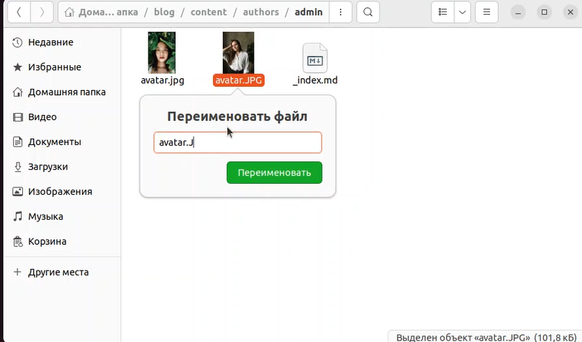{ #fig:pic1 width=100% }

## Этапы реализации проекта

Открываю в папке blog/content/author файл в Markdown и пишу краткое описание о себе(рис. 2).

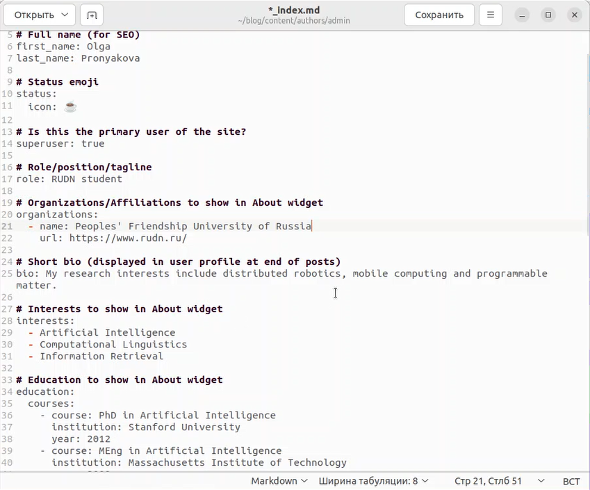{ #fig:pic2 width=100% }

## Этапы реализации проекта

открываю терминал и прописываю сначала команду ~/bin/hugo, а затем команду  ~/bin/hugo server. В результате получаю ссылку, по которой перехожу на свой сайт(рис. 3).

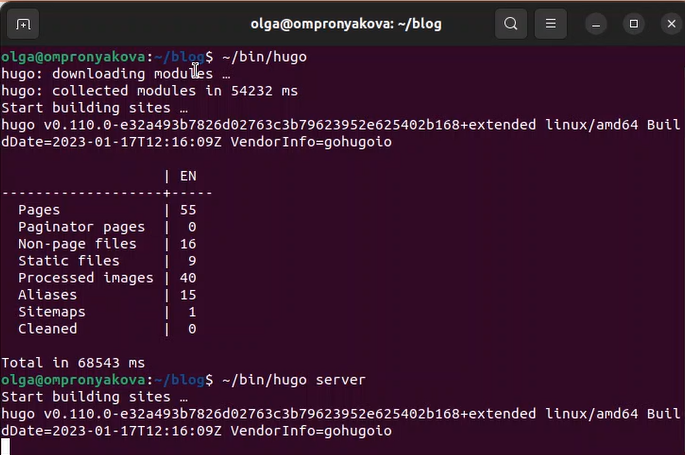{ #fig:pic3 width=100% }

## Этапы реализации проекта

Проверяю изменения на сайте. Вижу, что картинка и описание добавились на сайт(рис. 4).

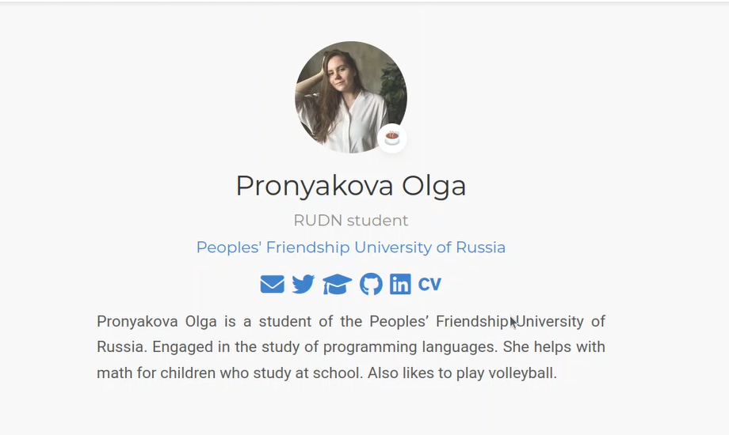{ #fig:pic4 width=100% }

## Этапы реализации проекта

Далее перехожу в папку blog/content/post и создаю там новую папку для того, ччтобы сделать новый пост по прошедшей недели и называю ее 1 week. В нее добавляю скопированные из папки getting-started картинку и файл в Markdown(рис. 5).

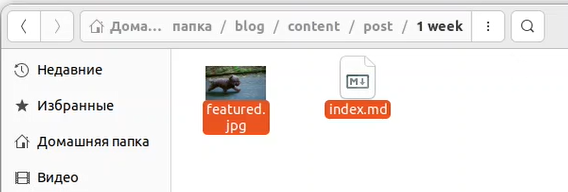{ #fig:pic5 width=100% }

## Этапы реализации проекта

Открываю файл в Markdown и пишу пост по прошедшей неделе(рис. 6) (рис. 7).

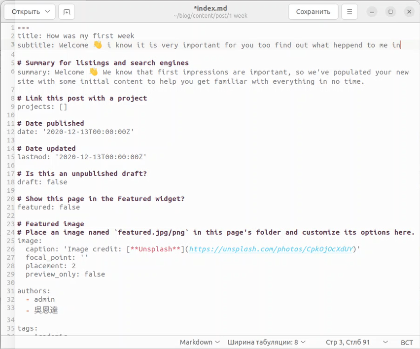{ #fig:pic6 width=100% }

## Этапы реализации проекта

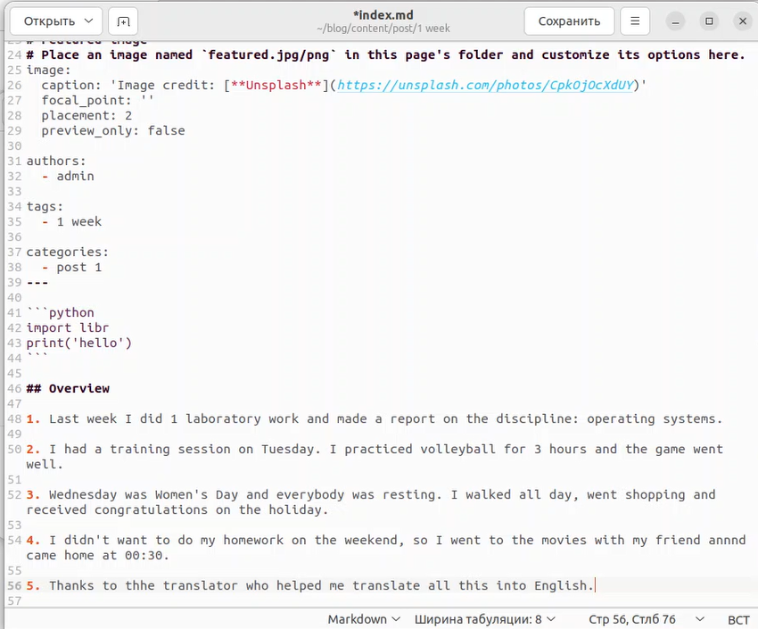{ #fig:pic7 width=100% }

## Этапы реализации проекта

Меняю в папке 1 week картинку на другую(рис. 8).

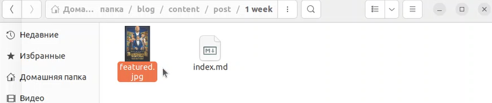{ #fig:pic8 width=100% }

## Этапы реализации проекта

Далее перехожу на свой сайт и проверяю наличие поста(рис. 9).

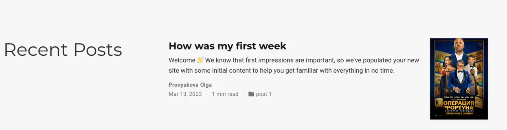{ #fig:pic9 width=100% }

## Этапы реализации проекта

затем создаю в папке blog/content/post еще одну папку, которую называю Git. Эта папка для нового поста об управление версиями. Git(рис. 10).

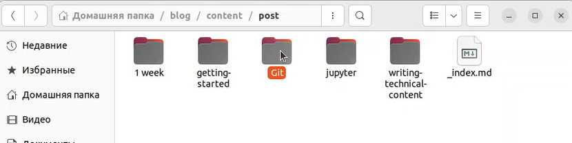{ #fig:pic10 width=100% }

## Этапы реализации проекта

Открываю файл в Markdown и пишу пост на выбранную мною тему(рис. 11).

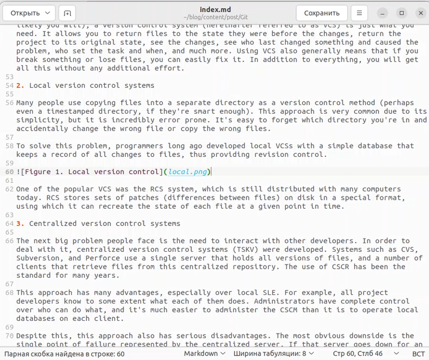{ #fig:pic11 width=100% }

## Этапы реализации проекта

Загружаю в папку Git необходимые для поста картинки(рис. 12).

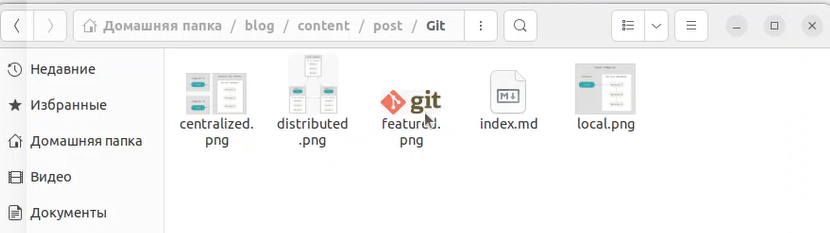{ #fig:pic12 width=100% }

## Этапы реализации проекта

Далее перехожу на свой сайт и проверяю наличие поста(рис. 13) (рис. 14).

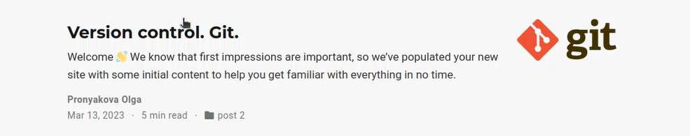{ #fig:pic13 width=100% }

## Этапы реализации проекта

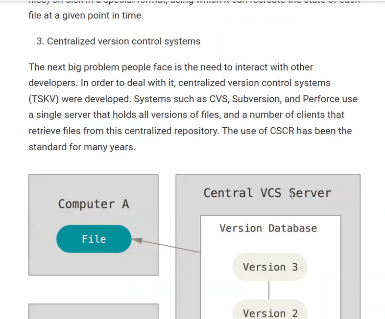{ #fig:pic14 width=100% }

## Этапы реализации проекта

Затем открываю терминал и перехожу в ~/blog. Добавляю все изменения на Github(рис. 15).

{ #fig:pic15 width=100% }

## Этапы реализации проекта

Перехожу в папку public и тоже добавляю все изменения на Github(рис. 16).

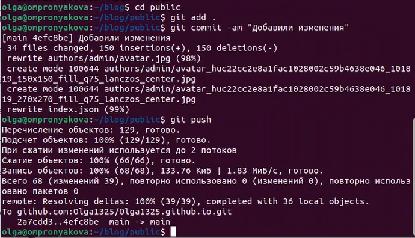{ #fig:pic16 width=100% }

## Этапы реализации проекта

Открываю Github и проверяю наличие добавленных файлов(рис. 17).

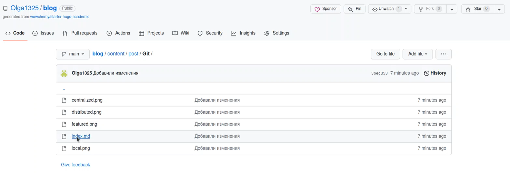{ #fig:pic17 width=100% }

## Выводы

 - Добавила на сайт информацию о себе. Написала пост по прошедшей неделе и пост на тему по выбору.

