---
## Front matter
title: "Индивидуальный проект (2 этап)"
subtitle: "Дисциплина: операционные системы"
author: "Пронякова Ольга Максимовна"

## Generic otions
lang: ru-RU
toc-title: "Содержание"

## Bibliography
bibliography: bib/cite.bib
csl: pandoc/csl/gost-r-7-0-5-2008-numeric.csl

## Pdf output format
toc: true # Table of contents
toc-depth: 2
lof: true # List of figures
lot: true # List of tables
fontsize: 12pt
linestretch: 1.5
papersize: a4
documentclass: scrreprt
## I18n polyglossia
polyglossia-lang:
  name: russian
  options:
	- spelling=modern
	- babelshorthands=true
polyglossia-otherlangs:
  name: english
## I18n babel
babel-lang: russian
babel-otherlangs: english
## Fonts
mainfont: PT Serif
romanfont: PT Serif
sansfont: PT Sans
monofont: PT Mono
mainfontoptions: Ligatures=TeX
romanfontoptions: Ligatures=TeX
sansfontoptions: Ligatures=TeX,Scale=MatchLowercase
monofontoptions: Scale=MatchLowercase,Scale=0.9
## Biblatex
biblatex: true
biblio-style: "gost-numeric"
biblatexoptions:
  - parentracker=true
  - backend=biber
  - hyperref=auto
  - language=auto
  - autolang=other*
  - citestyle=gost-numeric
## Pandoc-crossref LaTeX customization
figureTitle: "Рис."
tableTitle: "Таблица"
listingTitle: "Листинг"
lofTitle: "Список иллюстраций"
lotTitle: "Список таблиц"
lolTitle: "Листинги"
## Misc options
indent: true
header-includes:
  - \usepackage{indentfirst}
  - \usepackage{float} # keep figures where there are in the text
  - \floatplacement{figure}{H} # keep figures where there are in the text
---

# Цель работы

Добавить на сайт информацию о себе. Написать пост по прошедшей неделе и пост на тему по выбору.

# Задание

1. Разместить фотографию владельца сайта.
2. Разместить краткое описание владельца сайта (Biography).
3. Добавить информацию об интересах (Interests).
4. Добавить информацию от образовании (Education).
5. Сделать пост по прошедшей неделе.
6. Добавить пост на тему по выбору:
 - Управление версиями. Git.
 - Непрерывная интеграция и непрерывное развертывание (CI/CD).

# Выполнение лабораторной работы

В домашней папке перехожу в папку blog/content/author/admin и перемещаю туда свою фотографию.(рис. [-@fig:pic1]).

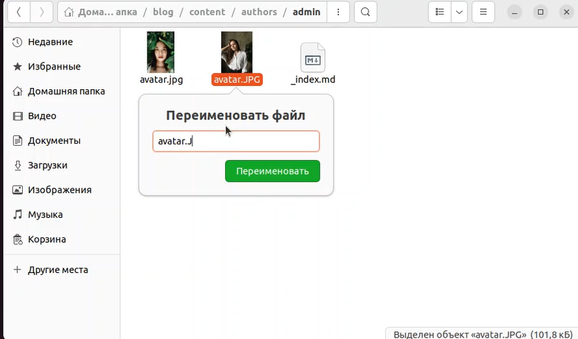{ #fig:pic1 width=100% }

Открываю в папке blog/content/author файл в Markdown и пишу краткое описание о себе(рис. [-@fig:pic2]).

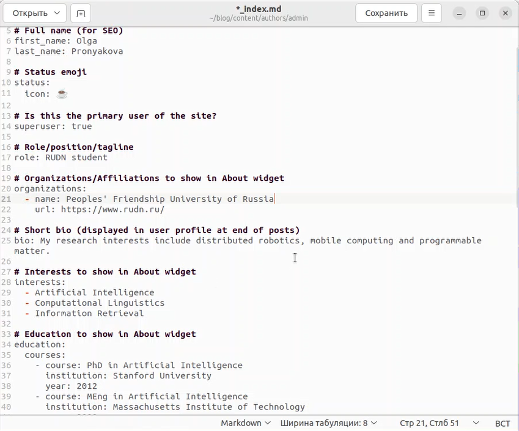{ #fig:pic2 width=100% }

открываю терминал и прописываю сначала команду ~/bin/hugo, а затем команду  ~/bin/hugo server. В результате получаю ссылку, по которой перехожу на свой сайт(рис. [-@fig:pic3]).

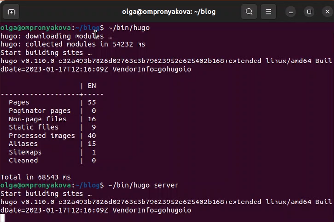{ #fig:pic3 width=100% }

Проверяю изменения на сайте. Вижу, что картинка и описание добавились на сайт(рис. [-@fig:pic4]).

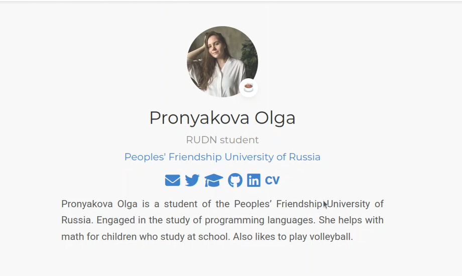{ #fig:pic4 width=100% }

Далее перехожу в папку blog/content/post и создаю там новую папку для того, ччтобы сделать новый пост по прошедшей недели и называю ее 1 week. В нее добавляю скопированные из папки getting-started картинку и файл в Markdown(рис. [-@fig:pic5]).

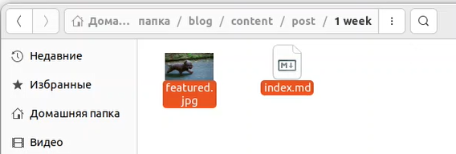{ #fig:pic5 width=100% }

Открываю файл в Markdown и пишу пост по прошедшей неделе(рис. [-@fig:pic6]) (рис. [-@fig:pic7]).

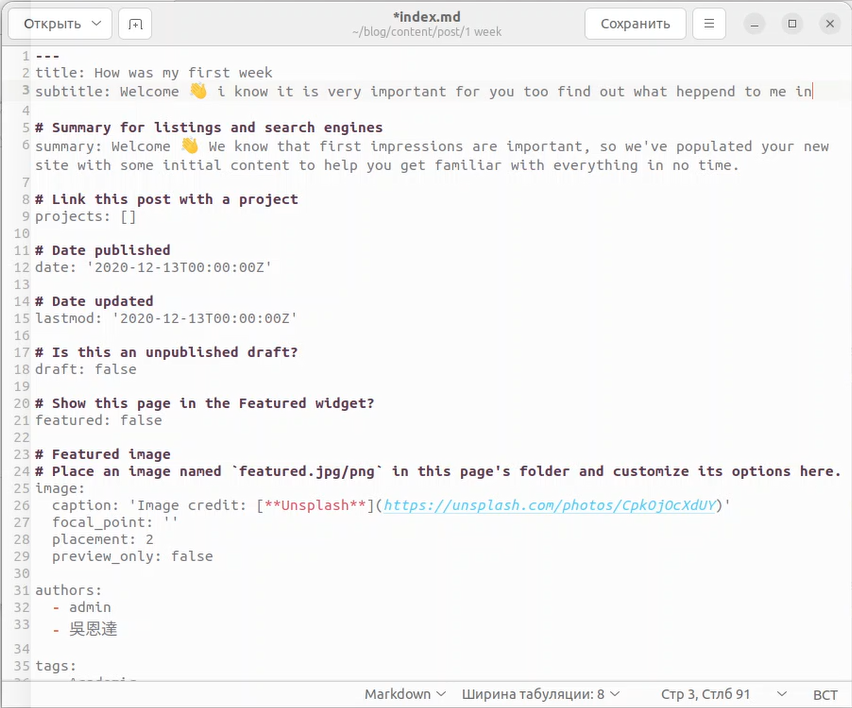{ #fig:pic6 width=100% }

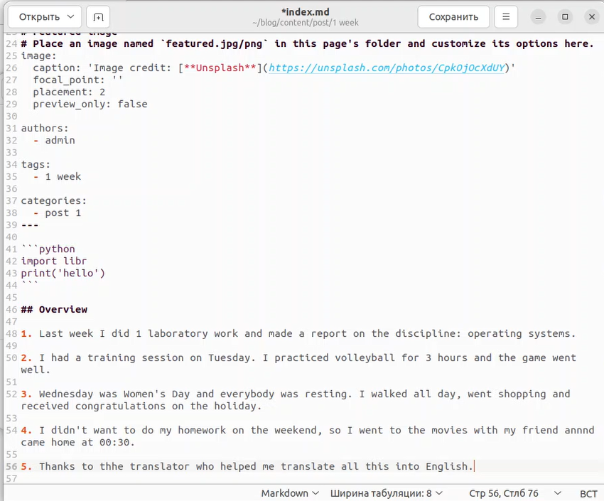{ #fig:pic7 width=100% }

Меняю в папке 1 week картинку на другую(рис. [-@fig:pic8]).

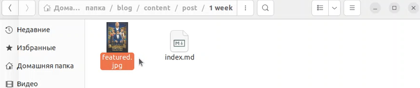{ #fig:pic8 width=100% }

Далее перехожу на свой сайт и проверяю наличие поста(рис. [-@fig:pic9]).

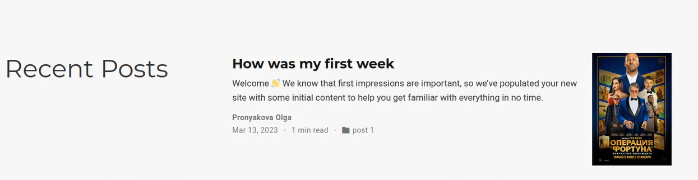{ #fig:pic9 width=100% }

затем создаю в папке blog/content/post еще одну папку, которую называю Git. Эта папка для нового поста об управление версиями. Git(рис. [-@fig:pic10]).

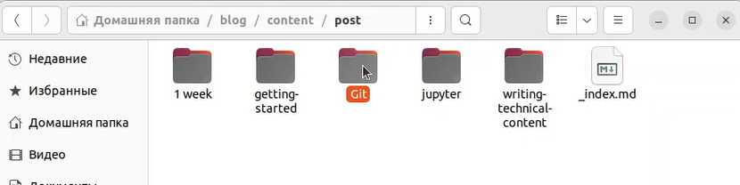{ #fig:pic10 width=100% }

Открываю файл в Markdown и пишу пост на выбранную мною тему(рис. [-@fig:pic11]).

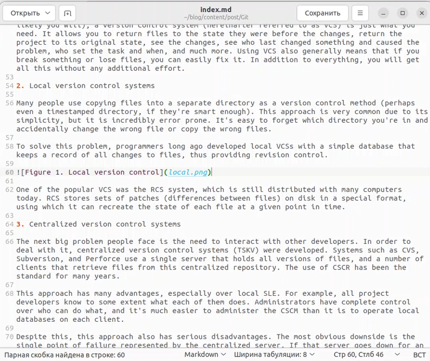{ #fig:pic11 width=100% }

Загружаю в папку Git необходимые для поста картинки(рис. [-@fig:pic12]).

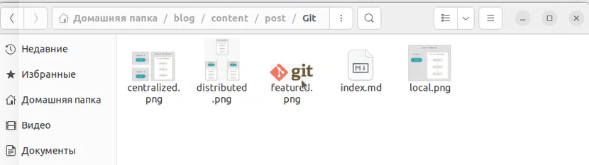{ #fig:pic12 width=100% }

Далее перехожу на свой сайт и проверяю наличие поста(рис. [-@fig:pic13]) (рис. [-@fig:pic14]).

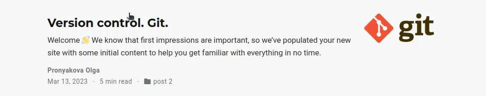{ #fig:pic13 width=100% }

{ #fig:pic14 width=100% }

Затем открываю терминал и перехожу в ~/blog. Добавляю все изменения на Github(рис. [-@fig:pic15]).

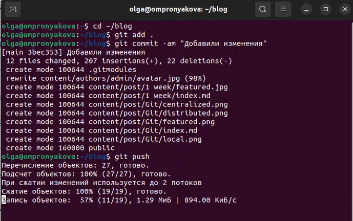{ #fig:pic15 width=100% }

Перехожу в папку public и тоже добавляю все изменения на Github(рис. [-@fig:pic16]).

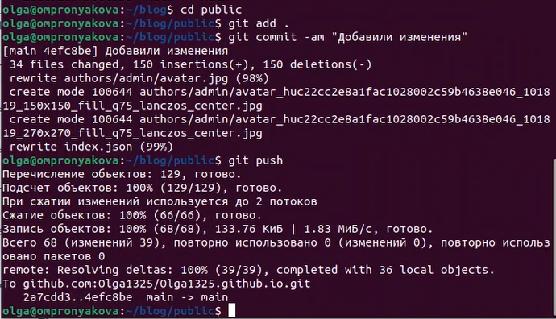{ #fig:pic16 width=100% }

Открываю Github и проверяю наличие добавленных файлов(рис. [-@fig:pic17]).

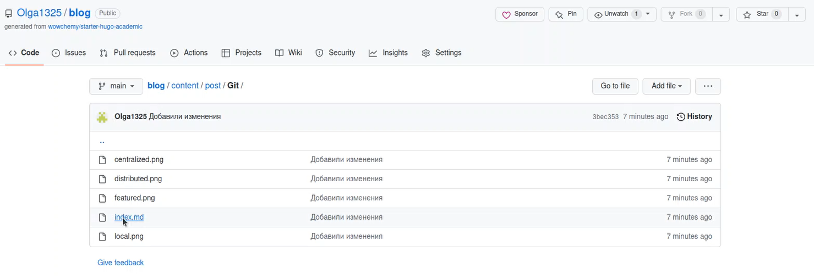{ #fig:pic17 width=100% }

# Выводы

Добавила на сайт информацию о себе. Написала пост по прошедшей неделе и пост на тему по выбору.

# Список литературы{.unnumbered}

[1. Этапв реализации проекта](https://esystem.rudn.ru/mod/page/view.php?id=970806)

::: {#refs}
:::
