---
## Front matter
lang: ru-RU
title: Индивидуальный проект (3 этап)
subtitle: Дисциплина - операционные системы
author:
  - Пронякова О.М.
institute:
  - Российский университет дружбы народов, Москва, Россия
date: 06 апреля 2023

## i18n babel
babel-lang: russian
babel-otherlangs: english

## Formatting pdf
toc: false
toc-title: Содержание
slide_level: 2
aspectratio: 169
section-titles: true
theme: metropolis
header-includes:
 - \metroset{progressbar=frametitle,sectionpage=progressbar,numbering=fraction}
 - '\makeatletter'
 - '\beamer@ignorenonframefalse'
 - '\makeatother'
---

# Информация

## Докладчик

:::::::::::::: {.columns align=center}
::: {.column width="70%"}

  * Пронякова Ольга Максимовна
  * студент НКАбд-02-22
  * факультет физико-математических и естественных наук
  * Российский университет дружбы народов

:::
::::::::::::::

# Создание презентации

## Цель работы

Добавить к сайту данные о себе. Написать пост по прошедшей неделе и научный пост на выбор.

## Основные задачи

Добавить к сайту достижения.

    Список достижений.
        Добавить информацию о навыках (Skills).
        Добавить информацию об опыте (Experience).
        Добавить информацию о достижениях (Accomplishments).
    Сделать пост по прошедшей неделе.
    Добавить пост на тему по выбору:
        Легковесные языки разметки.
        Языки разметки. LaTeX.
        Язык разметки Markdown.
        
## Этапы реализации проекта

В домашней папке перехожу в папку blog/content и открываю файл index.md. Пишу свои навыки(рис. 1) (рис. 2).

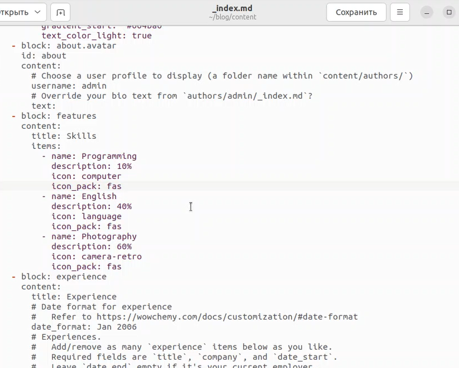{ #fig:pic1 width=100% }

## Этапы реализации проекта

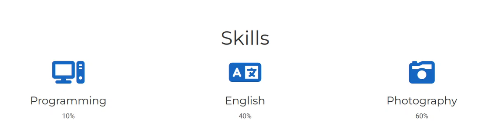{ #fig:pic2 width=100% }

## Этапы реализации проекта

Добавляю информацию об опыте(рис. 3) (рис. 4).

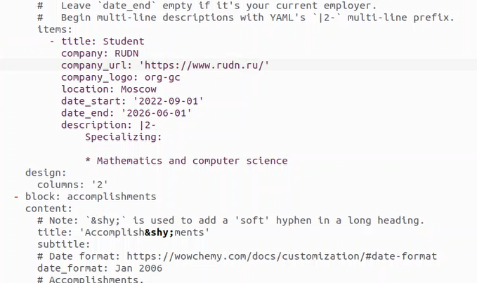{ #fig:pic3 width=100% }

## Этапы реализации проекта

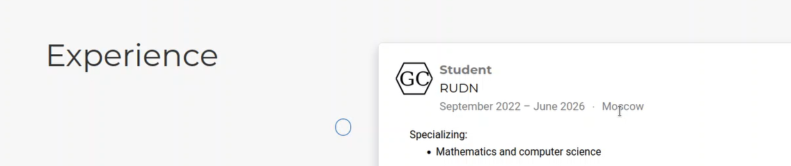{ #fig:pic4 width=100% }

## Этапы реализации проекта

Добавляю информацию о достижениях (рис. 5) (рис. 6).

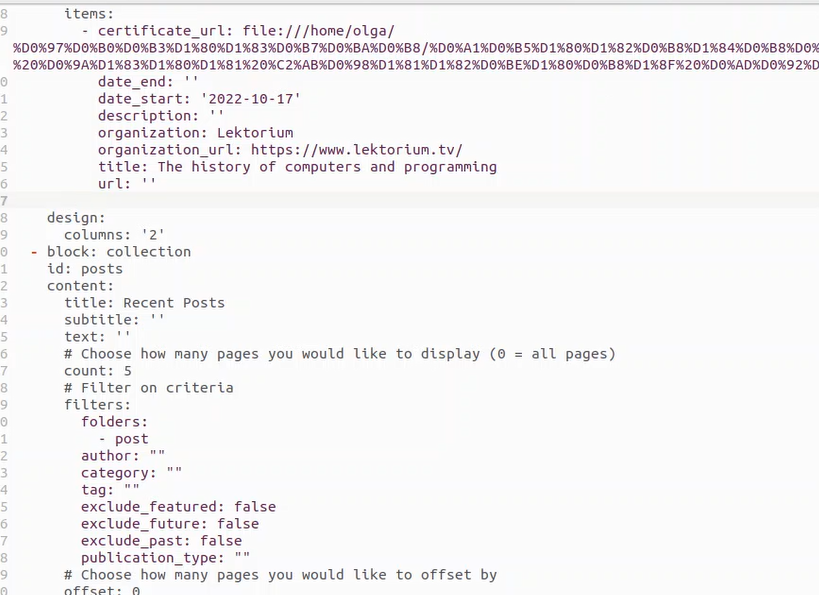{ #fig:pic5 width=100% }

## Этапы реализации проекта

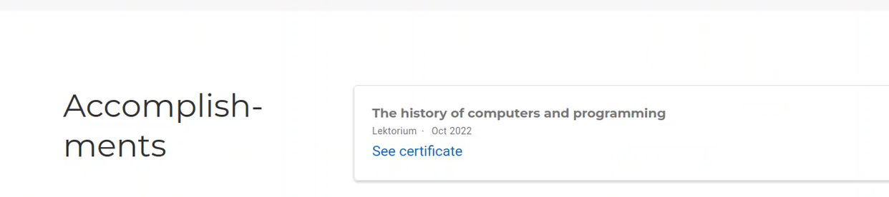{ #fig:pic6 width=100% }

## Этапы реализации проекта

Делаю пост по прошедшей неделе. В папке blog/content/post создаю папку, которую называю 2 week и в ней пишу пост(рис. 7) (рис. 8).

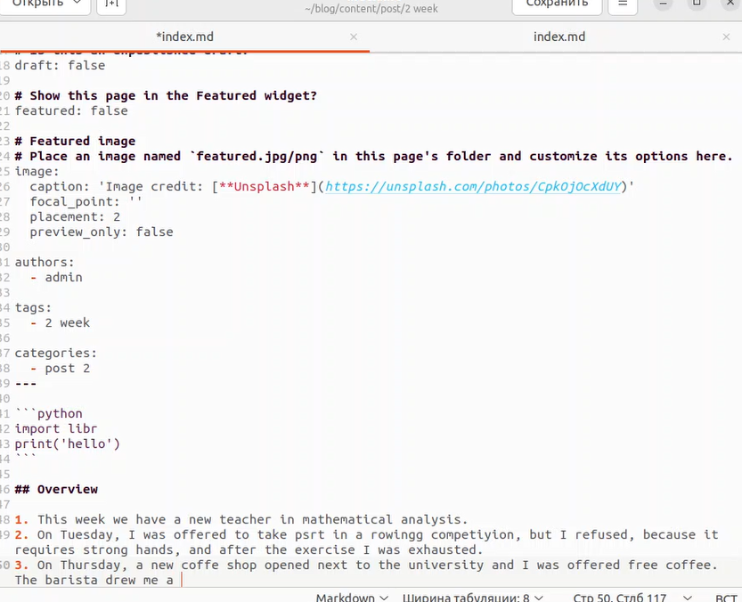{ #fig:pic7 width=100% }

## Этапы реализации проекта

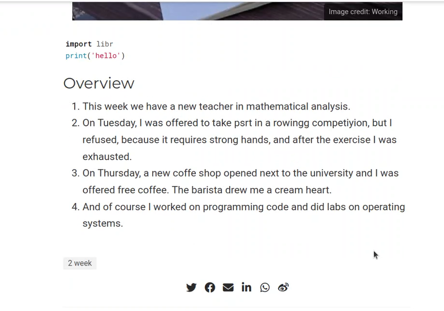{ #fig:pic8 width=100% }

## Этапы реализации проекта

Добавить пост на тему Язык разметки Markdown. В папке blog/content/post создаю папку, которую называю Markdown и в ней пишу пост (рис. 9) (рис. 10).

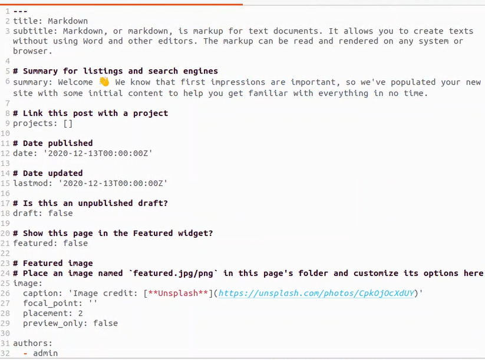{ #fig:pic9 width=100% }

## Этапы реализации проекта

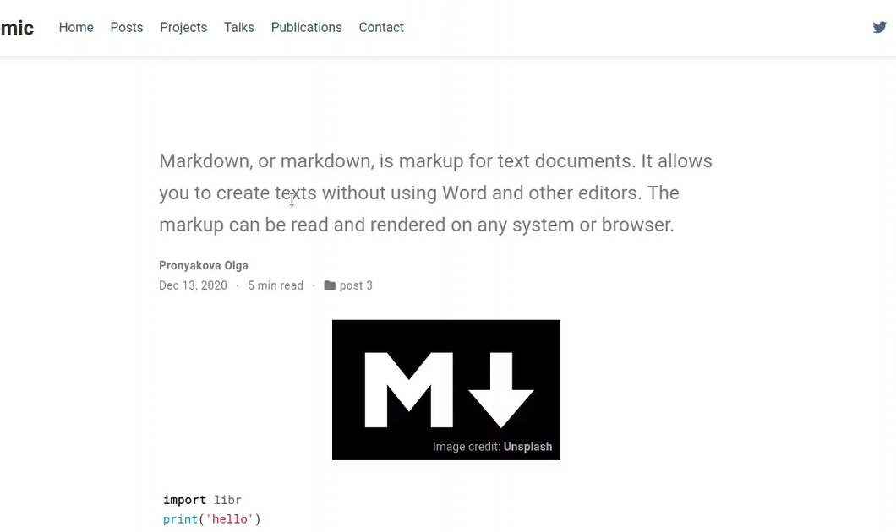{ #fig:pic10 width=100% }

## Этапы реализации проекта

Затем открываю терминал и перехожу в ~/blog. Добавляю все изменения на Github. Перехожу в папку public и тоже добавляю все изменения на Github(рис. 11).

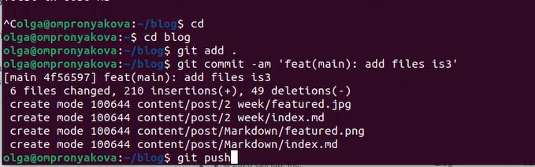{ #fig:pic11 width=100% }
       
## Выводы      
        
Добавила к сайту данные о себе. Написала пост по прошедшей неделе и научный пост на выбор.
        

