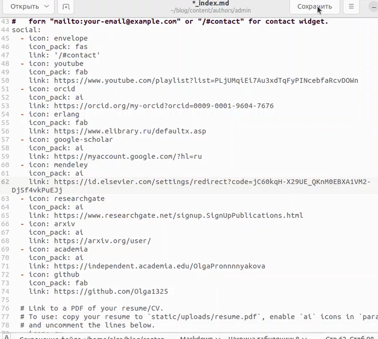
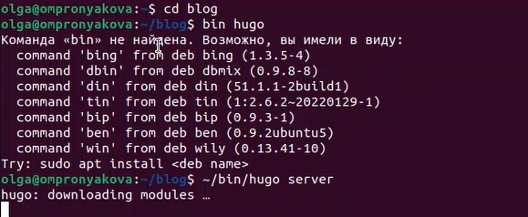
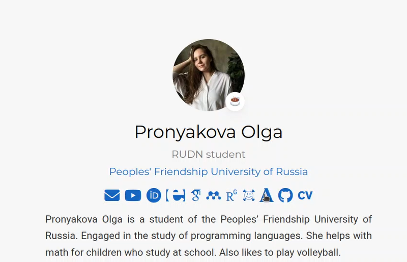
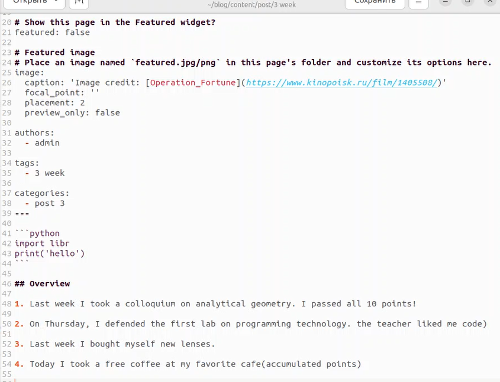
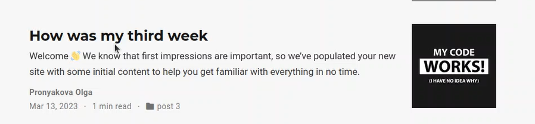
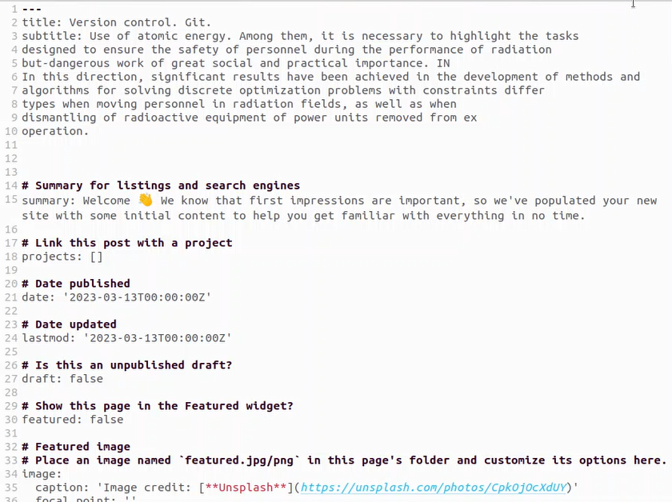
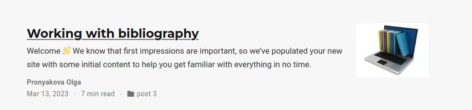

---
## Front matter
lang: ru-RU
title: Индивидуальный проект (4 этап)
subtitle: Дисциплина - операционные системы
author:
  - Пронякова О.М.
institute:
  - Российский университет дружбы народов, Москва, Россия
date: 20 апреля 2023

## i18n babel
babel-lang: russian
babel-otherlangs: english

## Formatting pdf
toc: false
toc-title: Содержание
slide_level: 2
aspectratio: 169
section-titles: true
theme: metropolis
header-includes:
 - \metroset{progressbar=frametitle,sectionpage=progressbar,numbering=fraction}
 - '\makeatletter'
 - '\beamer@ignorenonframefalse'
 - '\makeatother'
---

# Информация

## Докладчик

:::::::::::::: {.columns align=center}
::: {.column width="70%"}

  * Пронякова Ольга Максимовна
  * студент НКАбд-02-22
  * факультет физико-математических и естественных наук
  * Российский университет дружбы народов

:::
::::::::::::::

# Создание презентации

## Цель работы

Зарегистрироваться на соответствующих ресурсах и разместить на них ссылки на сайте. Написать пост по прошедшей неделе и научный пост на выбор.

## Основные задачи

    Зарегистрироваться на соответствующих ресурсах и разместить на них ссылки на сайте:
        eLibrary : https://elibrary.ru/;
        Google Scholar : https://scholar.google.com/;
        ORCID : https://orcid.org/;
        Mendeley : https://www.mendeley.com/;
        ResearchGate : https://www.researchgate.net/;
        Academia.edu : https://www.academia.edu/;
        arXiv : https://arxiv.org/;
        github : https://github.com/.
    Сделать пост по прошедшей неделе.
    Добавить пост на тему по выбору:
        Оформление отчёта.
        Создание презентаций.
        Работа с библиографией.
        
## Этапы реализации проекта

Зарегестрировалась на соответствующих сайтах и разместила на них ссылки на сайте(рис. 1) (рис. 2) (рис. 3).

{ #fig:pic1 width=100% }

## Этапы реализации проекта

{ #fig:pic2 width=100% }

## Этапы реализации проекта

{ #fig:pic3 width=100% }

## Этапы реализации проекта

Делаю пост по прошедшей неделе. В папке blog/content/post создаю папку, которую называю 3 week и в ней пишу пост(рис. 4) (рис. 5).

{ #fig:pic4 width=100% }

## Этапы реализации проекта

{ #fig:pic5 width=100% }

## Этапы реализации проекта

Добавить пост на тему Работа с библиографией. В папке blog/content/post создаю папку и в ней пишу пост (рис. 6) (рис. 7).

{ #fig:pic6 width=100% }

## Этапы реализации проекта

{ #fig:pic7 width=100% }

## Выводы     

Зарегистрировалась на соответствующих ресурсах и разместила на них ссылки на сайте. Написала пост по прошедшей неделе и научный пост на выбор.

